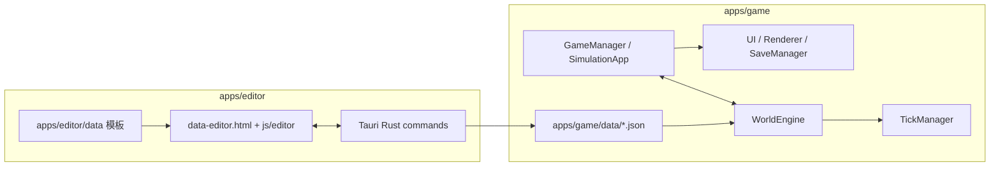
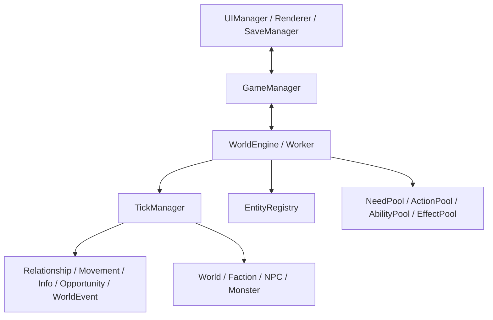
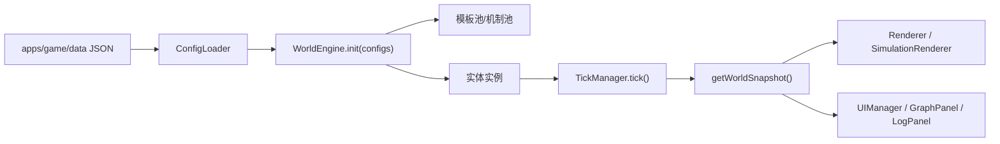

# 系统架构总览

> 最后更新：2026-06-05

## 技术方案

游戏运行时保持纯前端架构，数据编辑器作为独立工具链存在。

| 部分 | 技术 | 职责 |
|------|------|------|
| 游戏 Web 端 | 原生 JavaScript ES Module、Canvas 2D、Web Worker、IndexedDB | 运行世界模拟、渲染地图、管理 UI 和存档 |
| 自动模拟面板 | 同游戏 Web 端 | 长程观察、调参验证、行为报告 |
| 数据编辑器 | Web UI + Tauri 2 + Rust commands | 打开项目、编辑 JSON、保存、备份、校验 |
| 数据层 | `apps/game/data/` JSON | 实体、行为、需求、平衡、GAS 资产、世界事件 |

## 应用边界



编辑器可以读写项目数据，但不参与游戏运行时。游戏本体仍可作为静态网页运行。

## 游戏运行时



### 主线程

- `apps/game/js/main.js`：玩家玩法入口。
- `apps/game/js/simulation-main.js`：自动模拟入口。
- `apps/game/js/renderer/`：Canvas 地图、相机、地形、迷雾、模拟渲染。
- `apps/game/js/ui/`：状态栏、日志、调试、图谱、存档、事件弹窗。
- `apps/game/js/storage/`：IndexedDB 存档与重放记录。

### 引擎线程/引擎层

- `WorldEngine`：加载配置，创建世界、势力、NPC、妖兽和各类系统。
- `TickManager`：按固定步骤推进世界规则、势力、NPC、妖兽、死亡、信息与重生。
- `WorldContextBuilder`：每 tick 装配 `worldContext`，把配置、索引、系统引用和工具函数传给执行器。
- `EntityRegistry`：统一注册和查询世界实体。
- `NeedPool` / `ActionPool` / `EffectPool` / `AbilityPool`：加载数据驱动模板和机制资产。

## AI 架构

当前 NPC 使用四层反应式 AI：

1. **Reaction**：被攻击等刺激进入即时反应，可抢占当前行为。
2. **Utility / Intent**：从需求、执念、关系、机会点、动态事件中选择目标。
3. **GOAP**：为选中目标规划行动链。
4. **Execution**：处理移动、行为耗时、结算、打断与重规划。

相关代码：

- `apps/game/js/engine/abstract/bt/`
- `apps/game/js/engine/abstract/behavior-system.js`
- `apps/game/js/engine/npc/intent-service.js`
- `apps/game/js/engine/npc/dynamic-goals.js`
- `apps/game/js/engine/npc/interrupt-policy.js`

## Tick 主流程

```text
1. 世界规则与动态事件阶段推进
2. 势力需求评估、规划、攻伐/结盟/贸易/治理
3. 实体移动推进
4. NPC 预处理、Reaction、Utility/Intent、GOAP、执行
5. 妖兽行为树推进
6. 人口、晋升、继任、死亡收集
7. 信息传播、机会点、怀璧其罪、动态事件消息
8. 妖兽补充、关系衰减、快照输出
```

## 数据流



## 关键约束

- 运行时数据以 `apps/game/data/` 为单一来源。
- 新机制优先通过数据配置、策略类或独立执行器扩展。
- 文档中的当前事实必须能追溯到代码或数据文件。
- 平衡和行为结论必须来自真实模拟观察，不用摘要值替代行为判断。
