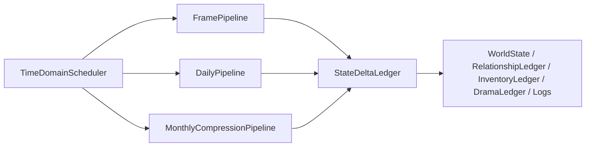
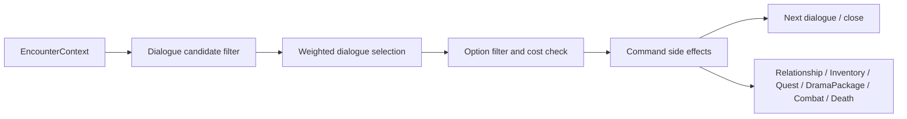

# 鬼谷八荒参考模型

> 最后更新：2026-06-09

## 可迁移原则

本项目只迁移架构思想，不复用第三方代码、资源、文本或具体配置。

| 参考观察 | 可迁移原则 | 本项目落点 |
|---|---|---|
| `WorldMgr` 聚合运行管理器，`DataMgr` 聚合数据域。 | 运行服务和持久数据分层，世界推进通过服务写入实体状态与账本。 | `WorldEngine`、`TickManager`、未来 `SimulationRuntime`、`StateDeltaLedger`。 |
| `WorldRunOrder` 显式列出阶段。 | 时间推进必须是可注册阶段流水线，而不是时间入口直接调用所有系统。 | `PhasePipeline`，同一阶段可有 daily、frame、monthly 三种 executor。 |
| NPC 有 Goal、Action、Condition、Weight。 | 远处压缩不能写固定概率脚本，应复用 Utility、Goal、Job/Toil 的配置语义。 | `MonthlyAgendaResolver` 读取 needs、goals、jobs、toils、utility 配置。 |
| 月日志合并入口存在。 | 月压缩必须生成玩家可追溯的摘要日志，不只改最终 state。 | `MonthLogLedger`、`NpcLifeLog`、`RumorSeed`。 |
| 对话项和选项都有条件、权重、函数、下一对白。 | NPC 遇见玩家用 DSL 选对白和选项，副作用用命令写状态。 | `data/drama/dialogues/`、`DialogueConditionEvaluator`、`DialogueCommandEngine`。 |
| 剧情包有 active、step、actionCount、failCount、cooldown。 | 跨月剧情用包状态机保存，不把剧情链塞进 NPC 行为代码。 | `DramaPackageRuntime` 与 `DramaPackageLedger`。 |

## 时间推进参考

鬼谷八荒分析报告显示可证明结构为：

对本项目的转译：

## NPC 离线模拟参考

参考游戏可以证明“混合模型”存在，但不能证明全部算法。可迁移的不是算法细节，而是边界：

- 调度层决定谁被模拟、模拟多少。
- AI 层决定目标、动作、条件、权重。
- 状态层持久化修为、关系、背包、任务、位置、死亡。
- 日志层合并月内行为。
- 剧情层通过包状态机与对话系统读写世界状态。

本项目月压缩也应保持这五层。远处 NPC 一个月的行为不是一个随机结果，而是由月度 agenda、若干 episode、状态 delta、日志摘要组成。

## 对话参考

参考游戏的对话链路可以抽象为：

本项目的 DSL 必须支持这些上下文：

| 维度 | 示例 |
|---|---|
| 人物 | NPC id、保真等级、role、factionId、性格、执念、当前 Job、近期 episode。 |
| 玩家 | 玩家位置、已知信息、阵营关系、声望、近期选择、背包。 |
| 时间 | 年、月、日、昼夜、事件窗口、月压缩刚结算的近期日志。 |
| 地点 | 地点类型、宗门/坊市/秘境/野外、危险度、归属势力。 |
| 关系 | 好感、仇恨、恩义、同门、师徒、道侣、通缉、欠债。 |
| 境界 | 境界差、小层、战力差、寿元压力、突破状态。 |

## 边界

参考报告明确标注多个待验证点，例如是否逐日循环、是否所有 NPC 完整跑 AI、月度均值如何参与经济补偿。本项目不得把这些写成鬼谷八荒事实。本目录只把已证明的结构转译为原创项目架构。

