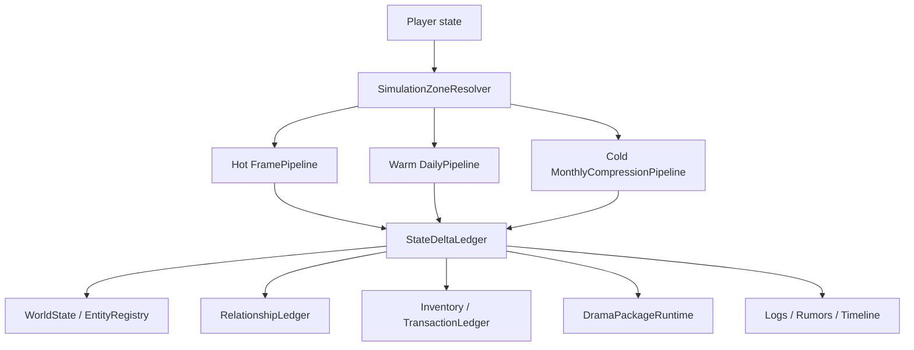

# 分层时间域总架构

> 最后更新：2026-06-09

## 总览

正式运行期采用三层时间域：

| 时间域 | 覆盖对象 | 推进粒度 | 主要职责 |
|---|---|---|---|
| Hot 实时域 | 玩家附近、屏幕内、正在交互或战斗的实体。 | 帧或短步长。 | 移动、碰撞、动画态、即时战斗、相遇检测、对话触发。 |
| Warm 日域 | 玩家一定范围外但近期可能接触、玩家标记、重要 NPC、事件窗口 NPC。 | 游戏日。 | 复用当前 Tick 与 Job/Toil，保证行为连续。 |
| Cold 月压缩域 | 远离玩家、未处于即时交互、普通 NPC 和远方系统。 | 30 天或配置化月长。 | 一次性结算关系、背包、修为、地点、事件、日志、死亡、门派和世界状态。 |

所有时间域写入同一份世界状态。禁止 Hot、Warm、Cold 分别维护独立 NPC 副本。



## 核心组件

| 组件 | 职责 | 模式 |
|---|---|---|
| `TimeDomainScheduler` | 按真实帧、游戏日、游戏月决定要运行哪些 pipeline。 | 模板方法 |
| `SimulationZoneResolver` | 根据玩家位置、神识、镜头、事件、标记、重要度给实体分配 Hot/Warm/Cold。 | 策略 |
| `PhasePipeline` | 执行世界规则、势力、NPC、地图、关系、日志等阶段。 | 责任链 |
| `StateDeltaLedger` | 收集所有状态变化，统一提交和校验。 | 命令、仓储 |
| `NpcFidelityPolicy` | 决定 NPC 使用逐帧、逐日、月内 episode 还是纯聚合。 | 策略 |
| `MonthlyCompressionEngine` | 对 Cold 域按月结算，输出 delta、日志、轨迹和传闻。 | 模板方法 |
| `DialogueResolver` | 玩家相遇时按上下文选择对白、选项和副作用。 | 解释器、命令 |

## 与当前代码的关系

| 当前能力 | 保留方式 |
|---|---|
| `WorldEngine.tick()` 与 `TickManager.tick()` | 作为 Warm 日域的默认 pipeline，也可被 Hot 域在日结算点调用局部阶段。 |
| `TickManager.multiTick(count)` | 不作为正式 Cold 月压缩入口。它只是调试和兼容的“连续日 Tick”。 |
| `BehaviorSystem` 的 traveling、executing、JobAction | 作为 Hot/Warm 行为生命周期，也为 Cold 月压缩提供 action/job 语义。 |
| Job/Toil 配置 | 远处月压缩读取同一套 Job/Toil，但用批量 executor 结算一个月内的 Toil 片段。 |
| 关系、经济、GAS、任务、修为服务 | 不复制逻辑，月压缩通过服务门面提交 delta。 |

## 时间域切换

时间域切换不能丢失当前行为。

| 切换 | 处理 |
|---|---|
| Cold -> Warm | 读取月压缩产生的 `TravelItinerary`、`currentJobSnapshot`、`recentEpisodes`，恢复到日域可继续执行的 Job/Toil 状态。 |
| Warm -> Hot | 若实体进入玩家近处，暂停抽象移动，交给帧移动和相遇检测；当前 Job 仍保留。 |
| Hot -> Warm | 对话、战斗或即时移动结束后，把结果写成 delta，恢复日域推进。 |
| Warm -> Cold | 将当前 Job、剩余天数、目标地点、近期事件写入压缩上下文，月压缩继续结算。 |

## 状态写入规则

所有阶段只产出 `StateDelta`：

```text
StateDelta {
  id,
  source,
  actorId,
  targetId?,
  dayRange,
  domain: "hot" | "warm" | "cold",
  operations: [
    { store: "npc.state", entityId, key, op, value },
    { store: "inventory", ownerId, itemId, op, amount },
    { store: "relationship", fromId, toId, eventType, strengthDelta },
    { store: "drama", packageId, op, patch },
    { store: "log", visibility, payload }
  ]
}
```

提交顺序：

1. 校验引用和实体存活。
2. 合并同类资源与关系 delta。
3. 执行互斥检查，例如死亡后不得继续获得物品。
4. 写入状态域。
5. 生成日志、传闻、玩家可见事件。

## 配置化覆盖

建议新增配置目录，但只有实际新增数据文件时才同步 manifest：

| 配置 | 作用 |
|---|---|
| `data/simulation/time-domains.json` | Hot/Warm/Cold 半径、神识倍率、月长、切换滞后。 |
| `data/simulation/fidelity-rules.json` | 重要 NPC、玩家关系、事件绑定、role 对保真等级的影响。 |
| `data/simulation/monthly-phases.json` | 月压缩阶段顺序和每阶段 executor id。 |
| `data/simulation/monthly-agendas.json` | 修炼、游历、任务、社交、交易、疗伤等月度 agenda 权重。 |
| `data/drama/dialogues/*.json` | 对话候选、节点、选项、条件、权重、副作用命令。 |
| `data/drama/packages/*.json` | 跨月剧情包状态机。 |

这些配置必须由解释器读取，不允许在 `TickManager` 或 `NPCEntity` 中写固定 NPC、固定地点、固定境界对白。

## 质量属性

| 场景 | 机制 | 风险 |
|---|---|---|
| 玩家闭关一年 | Cold 域每月压缩，重要 NPC episode，高层事件日志。 | 若只写最终数值，会丢失关系和地点因果。 |
| 玩家追踪仇人 | 标记 NPC 升为 Warm 或 Important Cold，保留 itinerary。 | 若切回 Hot 时没有轨迹，会出现瞬移感。 |
| 月压缩期间 NPC 死亡 | 死亡 delta 中断后续 episode，并写死亡快照。 | 若 delta 无顺序，死后仍交易或突破。 |
| 大量普通 NPC | 普通 NPC 走聚合 agenda，重要 NPC 走 episode。 | 若全部高保真，性能失控。 |

