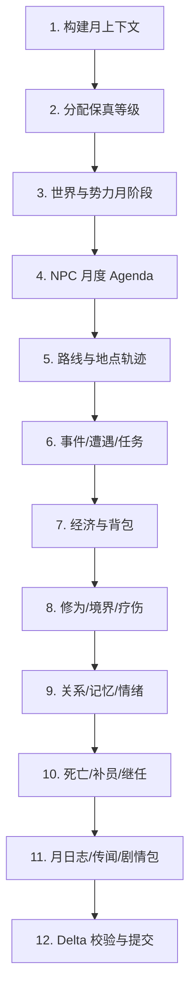

# 远处月压缩模拟

> 最后更新：2026-06-09

## 一个月如何一次算完

月压缩不是把 30 个日 Tick 简单循环，也不是只改修为数值。它是一次阶段化批处理：

本页说明主流程；每一类状态的具体事件、delta 和当前代码复用点见 `07-月压缩关键状态结算细节.md`。项目接口和代码改造点见 `08-项目落地接口与改造路线.md`。



每个阶段都只通过 `StateDeltaLedger` 写入状态。

## 关键状态入口

| 状态变化 | 入口处理器 | 输出 |
|---|---|---|
| 修为、真气、灵石消耗 | `MonthlyCultivationExecutor` | `npc.cultivated`、`npc.qi_changed`、`inventory.item_consumed` |
| 境界突破 | `MonthlyBreakthroughExecutor` | `npc.breakthrough_attempted`、`npc.breakthrough_succeeded/failed` |
| 背包、交易、丹药 | `MonthlyEconomyExecutor`、`MonthlyItemUseExecutor` | `economy.transaction_settled`、`inventory.item_acquired/used`、Effect delta |
| 关系、记忆、传闻 | `MonthlyRelationshipExecutor` | `relationship.event_applied`、memory、rumorSeed |
| 任务和斩妖 | `MonthlyQuestExecutor`、`MonthlyCombatExecutor` | quest transition、combat result、reward、injury/death |
| 去过地点 | `MonthlyItineraryExecutor` | `visitedPlaces`、最终坐标、episode |
| 剧情包 | `MonthlyDramaExecutor` | `drama.package_triggered/advanced/blocked` |

## 月上下文

```text
MonthlySimulationContext {
  startDay,
  endDay,
  monthIndex,
  rngStream,
  worldSnapshot,
  playerSnapshot,
  activeEvents,
  factionSnapshots,
  marketSnapshots,
  knownRumors,
  configRefs
}
```

`rngStream` 必须确定性派生，例如 `seed + monthIndex + phaseId + entityId`，以便复现。

## NPC 月度 Agenda

每个 Cold NPC 先生成本月 agenda，而不是每天重新规划。

```text
MonthlyAgenda {
  npcId,
  fidelity,
  allocations: [
    { kind: "cultivate", days: 12, locationIntent: "sect_cave" },
    { kind: "quest", days: 8, targetId: "quest_x" },
    { kind: "commerce", days: 3, locationIntent: "market" },
    { kind: "social", days: 2, targetNpcId: "npc_y" },
    { kind: "recovery", days: 5 }
  ],
  carryOverJob,
  riskBudget,
  valueBudget
}
```

Agenda 权重来自配置：

| 输入 | 影响 |
|---|---|
| Need/Utility | 决定修炼、任务、疗伤、社交、复仇等方向权重。 |
| role | 掌门、长老、核心弟子、散修的职责不同。 |
| realm/rank | 高境界更重视突破、秘境、资源争夺，低境界更重视任务和资源。 |
| faction state | 战争、缺资源、月贡献压力会提高任务和捐献权重。 |
| relationship | 仇人、师徒、道侣、恩人提升对应 agenda。 |
| recent ledger | 上月受伤、欠债、得到线索会改变本月计划。 |

## 状态结算清单

| 状态 | 月内结算方式 | 必须输出 |
|---|---|---|
| 位置和去过地点 | 按 agenda 与地点偏好生成 itinerary，重要 NPC 保留 3 到 8 个 episode，普通 NPC 保留摘要。 | `visitedPlaces`、最终坐标、可见传闻。 |
| 关系 | 用关系事件解释器处理拜访、冲突、援助、交易、师徒、道侣、仇杀。 | 关系 delta、记忆、可传播事件。 |
| 背包和物品 | 通过交易底座或物品服务结算购买、出售、任务奖励、消耗丹药、装备更换。 | inventory delta、transaction ledger、财富暴露。 |
| 修为和真气 | 按修炼 agenda、地点加成、物品效果、历练收益结算。 | cultivation/qi/experienceCultivation delta、突破尝试。 |
| 境界突破 | 使用同一突破判定服务，不在月压缩中另写阈值。 | 成功/失败、伤势、日志、剧情触发。 |
| 任务 | 任务实例推进，斩妖必须绑定真实或月内生成的目标结果。 | quest state、目标死亡、奖励、失败原因。 |
| 战斗和死亡 | 风险服务决定遭遇，战斗管线结算胜负；死亡中断后续 episode。 | death snapshot、killer/cause、关系冲击。 |
| 剧情包 | 触发、step、actionCount、cooldown 按月更新。 | drama package patch、绑定 NPC、可见节点。 |
| 日志 | 合并成月志、个人生涯日志、玩家传闻。 | `MonthLog`、`NpcLifeLog`、`RumorSeed`。 |

## 压缩阶段接口

```js
class MonthlyPhaseExecutor {
  run(context, cohort, ledger) {
    return {
      phaseId,
      entityCount,
      deltas,
      logs,
      diagnostics
    };
  }
}
```

阶段 executor 必须可注册，不在核心调度器写固定分支。

## 单个 NPC 的月内流程

```text
for npc in coldCohort:
  profile = NpcFidelityPolicy.resolve(npc, context)
  agenda = MonthlyAgendaResolver.resolve(npc, context, profile)
  itinerary = TravelItineraryResolver.resolve(npc, agenda, context)
  episodes = EpisodeSampler.sample(npc, agenda, itinerary, profile)

  for episode in episodes:
    if npc.dead: break
    applyJobOrAggregateOutcome(npc, episode, context, ledger)
    resolveEncountersAndRisks(npc, episode, context, ledger)
    resolveRelationshipAndMemory(npc, episode, context, ledger)

  finalizeMonthlyResources(npc, agenda, context, ledger)
  finalizeCultivationAndBreakthrough(npc, agenda, context, ledger)
  writeNpcMonthLog(npc, agenda, episodes, ledger)
```

## 示例：普通 NPC 一个月

| 日段 | 行为 | 结算 |
|---|---|---|
| 第 1 到 10 天 | 宗门修炼 | 修为和真气增加，消耗少量灵石或贡献。 |
| 第 11 到 16 天 | 接取巡山/斩妖任务 | 生成任务实例，移动到目标区域，风险判定。 |
| 第 17 天 | 遭遇低阶妖兽 | 战斗成功则获得材料和历练修为，失败则受伤并缩短后续 agenda。 |
| 第 18 到 22 天 | 回宗门交任务 | 奖励进入背包或宗门库，月贡献增加。 |
| 第 23 到 25 天 | 拜访同门 | 关系边增加，可能产生求援或结伴记录。 |
| 第 26 到 30 天 | 疗伤或继续修炼 | 恢复 HP、伤势下降，写月志。 |

最终产出不只是一组数值，而是：

- 最终坐标和去过的主要地点。
- 背包变化。
- 关系变化。
- 修为、真气、境界和伤势变化。
- 任务状态和奖励。
- 重要事件日志和传闻。

## 失败与一致性

| 问题 | 处理 |
|---|---|
| NPC 月中死亡 | 立即停止后续 episode，撤销未提交的未来 delta，写死亡快照。 |
| 物品不足 | 交易或使用失败，触发替代 agenda，不能凭空获得。 |
| 目标已死或失联 | 任务重定向、失败或转为追查，必须写原因。 |
| 玩家进入区域 | 当前月压缩可在下一个安全点切回 Warm/Hot，并把已提交 episode 作为历史。 |
| 剧情包占用 NPC | 该 NPC agenda 被剧情包锁定或加权，不允许被普通聚合吞掉。 |

## 验证指标

真实长程模拟应观察这些指标：

- 月压缩后 NPC 的修为、境界、背包、关系、位置和日志均有合理变化。
- 重要 NPC 的月内 episode 可解释最终状态。
- 玩家靠近月压缩 NPC 时，状态能平滑恢复到日域或实时域。
- 远处压缩不会绕过交易底座、关系底座、修为和战斗服务。
- 多种子长程模拟中死亡、突破、任务完成、交易、关系事件均自然出现。
