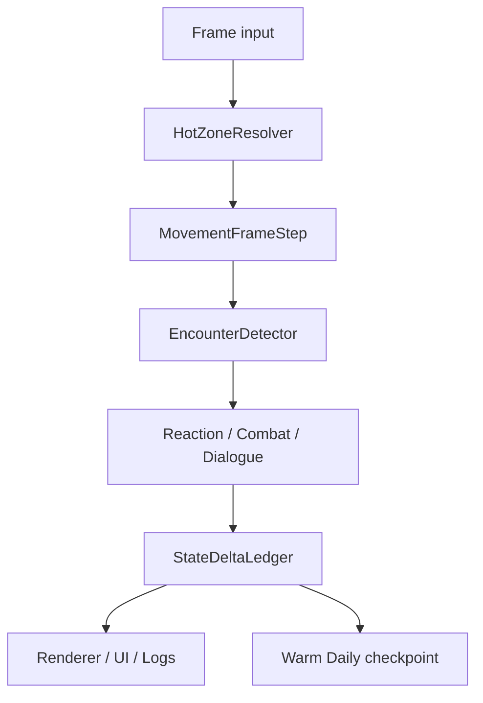

# 近处实时模拟

> 最后更新：2026-06-09

## 定义

近处实时模拟只覆盖玩家可直接感知或即将交互的范围，不代表全世界逐帧运行。

Hot 实时域对象：

- 玩家神识范围内的 NPC、妖兽、可交互地点和事件入口。
- 与玩家战斗、对话、交易、跟随、追逐或碰撞的实体。
- 正在进入玩家镜头、相遇触发半径或剧情包强制展示的实体。

## 帧管线



Hot 域每帧只处理即时体验：

| 阶段 | 职责 |
|---|---|
| 移动帧步 | 位置插值、路径跟随、碰撞、到达判定。 |
| 相遇检测 | 判断 NPC 与玩家是否进入对话、战斗、交易、传闻触发距离。 |
| 即时反应 | 被攻击、濒死、仇人贴脸、玩家拦截等高优先事件。 |
| 对话/交互 | 调用 `DialogueResolver`，不在移动系统里写对白逻辑。 |
| 状态提交 | 把对话、战斗、交易结果写成 delta。 |

## 与每日 Tick 的衔接

当前 `BehaviorSystem` 已有三段行为生命周期：

```text
TRAVELING -> EXECUTING(duration days) -> DONE
```

Hot 域扩展为：

```text
FRAME_MOVING -> ENCOUNTER_PENDING -> INTERACTION_LOCKED -> RESOLVE_DELTA -> DAILY_CHECKPOINT
```

两者的关系：

| 当前日域字段 | Hot 域解释 |
|---|---|
| `traveling` | 帧移动期间仍是 traveling，但位置按帧更新。 |
| `executing` | 玩家可观察的动作进入可打断状态。 |
| `remaining` | 日域剩余天数，Hot 域只消耗当前交互片段。 |
| `currentJobId/currentToilId` | 对话、战斗或玩家拦截可暂停当前 Job。 |

## 玩家靠近远处 NPC

当玩家接近 Cold 或 Warm NPC：

1. `SimulationZoneResolver` 把目标升为 Warm 或 Hot。
2. 如果来自 Cold，读取月压缩的 `currentJobSnapshot`、`visitedPlaces`、`recentEpisodes`。
3. 用 `HydrationPolicy` 生成当前可执行的空间状态，例如当前位置、目标地点、正在做什么。
4. 如果存在未展示给玩家的重要事件，转为传闻、对话记忆或可触发剧情。
5. 后续帧由 Hot 管线接管。

## 玩家离开

当 NPC 离开 Hot：

- 若仍在神识范围或玩家标记，进入 Warm。
- 若远离且无重要剧情约束，进入 Cold。
- 当前对话、交易、战斗必须先收束，不能半个命令留在 UI。
- 当前 Job/Toil 快照写入 `carryOverJob`，供月压缩继续。

## 配置项

| 配置 | 说明 |
|---|---|
| `hot.radiusTiles` | 逐帧实体半径。 |
| `hot.dialogueTriggerRadius` | 自动相遇对白半径。 |
| `hot.combatTriggerRadius` | 敌意或妖兽进入即时战斗半径。 |
| `hot.interactionLockTimeoutMs` | 对话、交易、战斗锁定超时。 |
| `warm.radiusTiles` | 日域实体半径。 |
| `zone.hysteresisTiles` | 防止实体在边界反复切域。 |
| `zone.promoteMarkedNpc` | 玩家标记 NPC 是否提升保真度。 |

## 不变量

- 渲染状态不是真相源，真相源仍是实体状态和 ledger。
- Hot 域不能直接绕过 `RelationshipSystem`、交易底座、战斗管线、GAS 和剧情命令。
- 对话只锁定参与者，不暂停全世界。
- 重要 NPC 从 Cold 升 Hot 时必须带着月内历史，而不是重置成初始行为。

