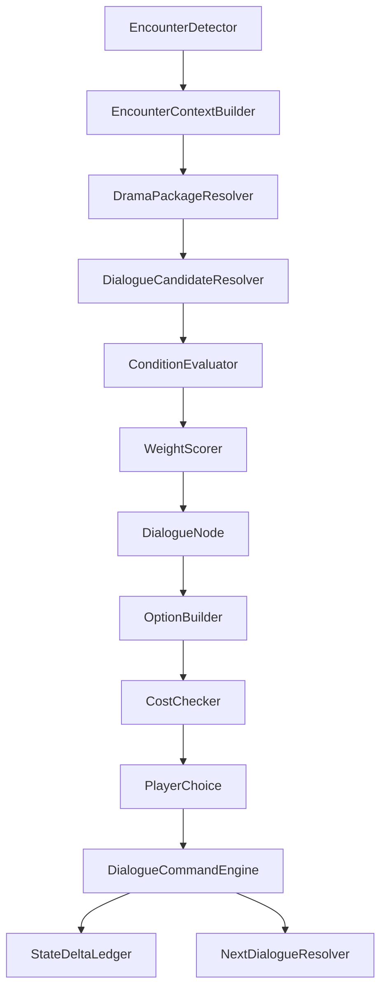
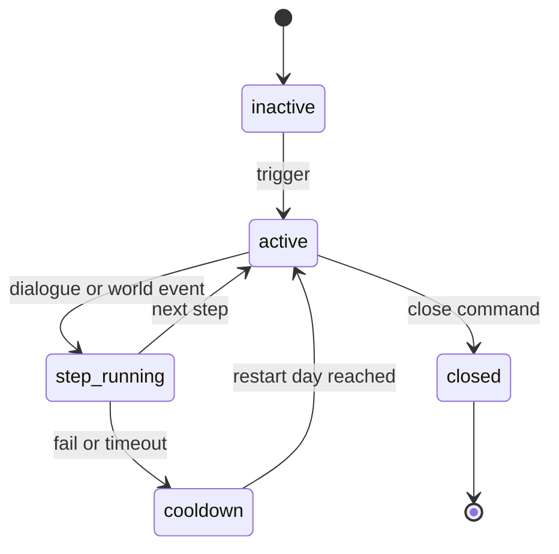

# NPC 遇见玩家剧情对话架构

> 最后更新：2026-06-09

## 目标

NPC 遇见玩家时，对话必须随境界、时间、地点、关系、阵营、当前行为、近期经历和世界事件变化。实现方式是配置化对话 DSL 与命令副作用，不在代码里写固定对白分支。

## 总流程



## 相遇上下文

```text
EncounterContext {
  player,
  npc,
  day,
  month,
  timeOfDay,
  location,
  distance,
  realmGap,
  combatPowerGap,
  relationship,
  factionRelation,
  npcCurrentJob,
  npcRecentEpisodes,
  playerKnownInfo,
  activeDramaPackages,
  worldEventWindow,
  rng
}
```

`npcRecentEpisodes` 来自 Warm 日志或 Cold 月压缩日志，确保远处一个月发生的事能进入对白。

## 对话数据结构

```json
{
  "id": "dlg_meet_high_realm_elder_at_sect",
  "packageId": "pkg_sect_daily_meet",
  "priority": 40,
  "weight": 10,
  "conditions": [
    { "source": "location", "key": "kind", "op": "eq", "value": "sect" },
    { "source": "npc", "key": "role", "op": "in", "value": ["elder", "leader"] },
    { "source": "context", "key": "realmGap", "op": "gte", "value": 2 },
    { "source": "relationship", "key": "attitude", "op": "gte", "value": 20 }
  ],
  "nodes": [
    {
      "id": "start",
      "textKey": "sect_elder_greeting_high_realm",
      "commands": [],
      "options": [
        {
          "id": "ask_guidance",
          "textKey": "ask_guidance",
          "conditions": [
            { "source": "player", "key": "dailyGuidanceUsed", "op": "eq", "value": false }
          ],
          "cost": [{ "itemId": "low_spirit_stone", "amount": 5 }],
          "commands": [
            { "type": "relationship.add", "target": "npc", "eventType": "respect" },
            { "type": "player.buff", "effectId": "ge_add_qi", "magnitude": 10 }
          ],
          "next": "guidance_result"
        }
      ]
    }
  ]
}
```

正文建议使用 `textKey` 指向本地化或文本表，避免逻辑配置和文本散在一起。

## 条件维度

| 维度 | 示例条件 |
|---|---|
| 境界 | 玩家高于 NPC、NPC 高于玩家、同境界、小层差距、突破前夜。 |
| 时间 | 白天、夜晚、月初、月末、宗门大比前、秘境开启期。 |
| 地点 | 宗门、坊市、野外、秘境入口、战场、洞府、拍卖会。 |
| 关系 | 陌生、同门、师徒、道侣、仇敌、恩人、欠债、通缉。 |
| 当前行为 | NPC 正在疗伤、赶路、闭关、交任务、追杀、参加事件。 |
| 近期经历 | 月内突破、受伤、亲友死亡、获得宝物、任务失败、被玩家救过。 |
| 玩家状态 | 玩家声望、阵营、携带物、已知情报、近期选择。 |
| 剧情包 | 包是否 active、step、绑定 NPC、冷却、失败次数。 |

## 副作用命令

对话不能直接改任意对象，只能提交命令：

| 命令类型 | 写入 |
|---|---|
| `relationship.applyEvent` | 关系账本。 |
| `inventory.transfer` | 交易底座或物品交易。 |
| `quest.start/update/complete` | 任务系统。 |
| `drama.patchPackage` | 剧情包状态机。 |
| `npc.pauseJob/resumeJob/abortJob` | NPC 当前 Job 快照。 |
| `combat.startEncounter` | 战斗管线。 |
| `memory.record` | NPC 或玩家记忆。 |
| `log.emit` | 玩家日志、月志、传闻。 |

命令执行顺序由配置声明，但提交前统一校验。扣物品、给奖励、改关系、跳下一对白不能分散在 UI 代码中。

## 剧情包状态机



剧情包配置字段：

| 字段 | 说明 |
|---|---|
| `id` | `pkg_` 前缀。 |
| `trigger` | 相遇、月结算、世界事件、NPC 死亡、玩家选择等。 |
| `npcSelectors` | 绑定重要 NPC、关系 NPC、同门、仇人或地点 NPC。 |
| `steps` | 每步条件、对白入口、动作计数、失败条件。 |
| `cooldownDays` | 重启间隔。 |
| `closeConditions` | 关闭条件。 |
| `memoryPolicy` | 是否写入玩家和 NPC 记忆。 |

## 与月压缩的关系

月压缩期间如果剧情包触发但玩家不在场：

- 只推进世界事实和 NPC 状态。
- 生成 `dramaSummary` 和 `rumorSeed`。
- 若玩家之后遇到相关 NPC，对话可读取该摘要，出现“听说你上月在某地...”这类上下文。
- 如果剧情必须玩家选择，则状态停在 `await_player_contact` 或生成可被玩家触发的入口，不自动代替玩家选择。

## 验收标准

- 同一个 NPC 在不同地点、境界差、关系、时间和近期经历下能选出不同对白。
- 对话选项能配置成本和可见条件。
- 对话副作用进入统一 delta，不直接在 UI 中改背包或关系。
- 剧情包能跨月保存 step、绑定 NPC、失败次数和冷却。
- 远处月压缩产生的 NPC 经历能被相遇对白读取。

