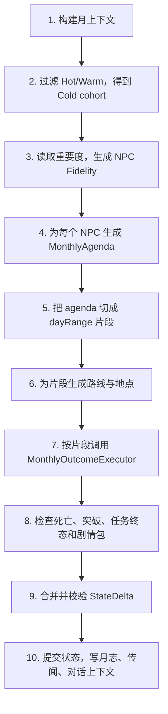
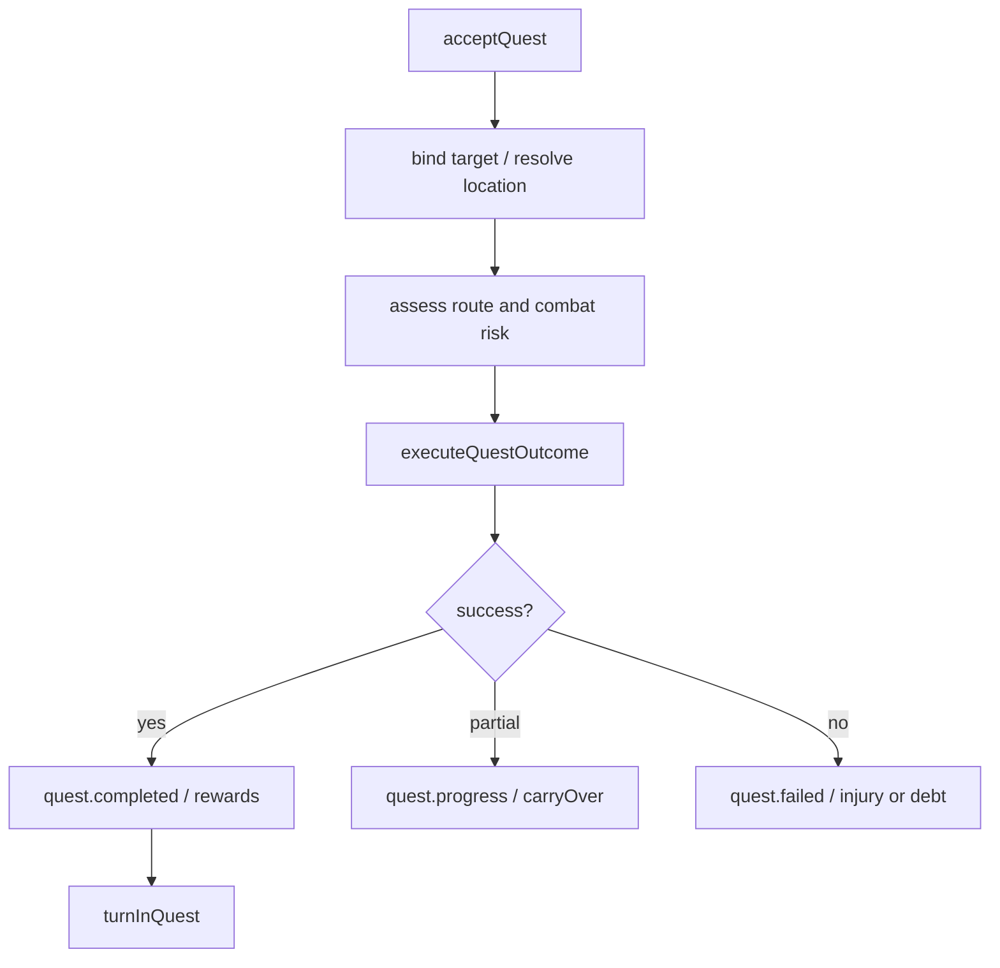

# 月压缩关键状态结算细节

> 最后更新：2026-06-09

## 本文定位

本文回答“远处一个月一次算完时，每个关键变化到底怎么处理”的问题。它不是鬼谷八荒总结，而是 `CultivationWorld` 正式架构的结算契约。

当前项目已有日 Tick、GOBT、`BehaviorSystem`、`JobSystem`、`Toil`、关系账本、经济交易、修为服务和任务板。月压缩不重写这些规则，而是把一个月拆成若干月内片段，用批量 executor 复用同一套规则语义，最后统一提交 `StateDelta`、`CompressedEventRecord` 和日志。

证据锚点：

- `apps/game/js/engine/world/tick-manager.js:211`：当前 `TickManager.tick()` 按世界、势力、移动、NPC、妖兽、死亡、信息、关系、月度门派活动顺序推进。
- `apps/game/js/engine/abstract/behavior-system.js:334`：当前 NPC 行为按 `traveling`、`executing`、结算三段执行。
- `apps/game/js/engine/abstract/job-system.js:20`：Job/Toil 每步调用 Toil executor 并处理 `success`、`running`、`replan`、`failed` 等结果。
- `apps/game/js/engine/npc/services/cultivation-service.js:9`：修炼收益、真气、灵石消耗已收敛在 `runCultivation`。
- `apps/game/js/engine/npc/toils/economy-toils.js:91`：购买、兑换优先走 `worldContext.settleTransaction`。
- `apps/game/js/engine/world/relationship-system.js:358`：关系变化可经 `applyEvent` 或 `addEdge` 进入关系系统。

## 月压缩输入与输出

月压缩输入：

```text
MonthlySimulationContext {
  startDay,
  endDay,
  monthIndex,
  coldNpcIds,
  warmNpcIds,
  hotNpcIds,
  worldContextFacade,
  playerSnapshot,
  activeWorldEvents,
  activeDramaPackages,
  configRefs,
  rngFactory
}
```

月压缩输出：

```text
MonthlyCompressionResult {
  dayRange,
  changedEntityIds,
  deltas,
  events,
  npcMonthLogs,
  rumorSeeds,
  diagnostics
}
```

其中 `deltas` 是真正改状态的命令集合，`events` 是事实记录，`npcMonthLogs` 是生涯回放和对白上下文，`rumorSeeds` 是玩家之后可能听到的传闻来源。

## 月内主流程



月压缩的关键不是“少跑 30 次 tick”，而是把 30 天压成“几段有因果的生活片段”。例如一个普通弟子本月可能只有 5 段：闭关 12 天、买丹 1 天、斩妖任务 8 天、拜访师傅 2 天、疗伤 7 天。每段都产生可解释的状态变化。

## 月度 Agenda 如何生成

`MonthlyAgendaResolver` 使用同一批 Need、Utility、关系信号、当前 Job 快照和配置权重，输出本月时间分配。

```text
MonthlyAgenda {
  npcId,
  fidelityTier,
  reason,
  carryOverJobSnapshot,
  allocations: [
    { kind: "cultivate", dayRange: [1, 12], locationIntent: "sect_cave" },
    { kind: "commerce", dayRange: [13, 13], itemIntent: "qi_pill" },
    { kind: "quest", dayRange: [14, 21], questIntent: "monster_hunt" },
    { kind: "social", dayRange: [22, 23], relationIntent: "visit_master" },
    { kind: "recovery", dayRange: [24, 30] }
  ]
}
```

时间分配规则：

| 输入 | 处理方式 | 结果 |
|---|---|---|
| `NeedSystem` 评估 | 读取当前生存、修炼、职责、野心、突破需求分数。 | 决定本月主目标。 |
| `BehaviorSystem` 当前 Job | 若有未完成 Job，优先转成 `carryOverJobSnapshot`。 | Cold 域继续结算，不丢任务进度。 |
| `relationshipSystem` 信号 | 仇人、恩人、师徒、道侣、同门求援提高对应 agenda 权重。 | 触发复仇、拜访、护徒、探望。 |
| `dynamicEvents` | 秘境、拍卖、门派大比等事件窗口提高参与权重。 | 生成事件参与片段。 |
| NPC 角色和境界 | 掌门、长老、弟子、散修使用不同职责权重。 | 不同身份有不同生活节奏。 |
| 上月 episode | 受伤、欠债、获得线索、任务失败会改变本月分配。 | 让月与月之间连续。 |

## 状态结算总表

| 关键变化 | 月压缩处理器 | 复用的当前项目语义 | 触发事件 | 写入 delta |
|---|---|---|---|---|
| 修为增加 | `MonthlyCultivationExecutor` | `runCultivation`、`addCultivation`、`computeCultivationGain` | `npc.cultivated` | `npc.state.cultivation`、`totalCultivation`、`rankStage` |
| 真气增加 | `MonthlyCultivationExecutor`、`MonthlyExploreExecutor`、物品 Effect | `runCultivation`、游历 Toil、`applyItemEffects` | `npc.qi_changed` | `npc.state.qi` |
| 灵石消耗 | `MonthlyCultivationExecutor`、`MonthlyEconomyExecutor` | `Inventory.remove`、`EconomicSystem.settle` | `inventory.item_consumed`、`economy.transaction_settled` | `inventory.low_spirit_stone` |
| 背包获得物品 | `MonthlyQuestExecutor`、`MonthlyExploreExecutor`、`MonthlyEconomyExecutor` | 任务奖励、掉落、交易底座 | `inventory.item_acquired` | `inventory` |
| 使用丹药 | `MonthlyItemUseExecutor` | `applyItemEffects` | `inventory.item_used`、`npc.effect_applied` | `inventory`、`npc.state/attributes` |
| 境界突破 | `MonthlyBreakthroughExecutor` | `canAttemptBreakthrough`、`tryBreakthrough`、`applyBreakthroughSuccess/Failure` | `npc.breakthrough_attempted`、`npc.breakthrough_succeeded/failed` | `rankId`、`rankName`、`qi`、`cultivation`、`injuryLevel` |
| 关系变化 | `MonthlyRelationshipExecutor` | `relationshipSystem.applyEvent/addEdge/handleEvent` | `relationship.event_applied` | 关系账本、旧边投影、记忆 |
| 任务推进 | `MonthlyQuestExecutor` | `QuestBoard` 状态机、`quest-service`、Quest Toil | `quest.accepted/progress/completed/turned_in/failed` | 任务实例、贡献、奖励、状态 |
| 战斗死亡 | `MonthlyCombatExecutor` | `resolveCombatEncounter`、`killNPCByPvP`、死亡收集 | `combat.encounter_resolved`、`npc.died` | `alive`、HP、死亡快照、关系冲击 |
| 去过地点 | `MonthlyItineraryExecutor` | 当前空间组件、寻路目标语义 | `npc.location_visited` | `spatial`、`visitedPlaces`、`recentEpisodes` |
| 剧情包推进 | `MonthlyDramaExecutor` | 对话/剧情包状态机 | `drama.package_triggered/advanced/blocked` | `dramaPackageState`、相遇入口 |

## 修为和真气如何增加

月压缩修炼片段必须和 `runCultivation` 共享公式口径：

```text
rankId = npc.rankId
required = getCultivationRequired(npc, ranks)
baseSpeed = cultivation.cultivationSpeed[rankId]
variance = rng(min, max)
techniqueMultiplier = technique.effects.cultivationSpeedMultiplier
traitMultiplier = readTraitSpeedMult(npc)
locationMultiplier = location.cultivationMultiplier
speed = baseSpeed * variance * techniqueMultiplier * traitMultiplier * locationMultiplier
progressGain = speed * days
baseCultivationGain = progressGain * required
cultivationGain = computeCultivationGain(npc, ranks, baseCultivationGain, cultivationConfig)
```

然后写入：

```text
StateDelta {
  source: "monthly.cultivation",
  actorId: npcId,
  dayRange,
  operations: [
    { store: "npc.state", key: "cultivation", op: "add", value: cultivationGain },
    { store: "npc.state", key: "totalCultivation", op: "recompute" },
    { store: "npc.state", key: "rankStage", op: "set", value: computedStage }
  ],
  events: [
    { type: "npc.cultivated", value: cultivationGain, days, locationId }
  ]
}
```

真气口径：

```text
baseQi = cultivation.qiBaseGain[rankId] * days
progressQi = cultivation.qiPerProgress[rankId] * (cultivationGain / required)
stoneCost = cultivation.spiritStoneCost[rankId] * days
stoneConsumed = min(npc.inventory.low_spirit_stone, stoneCost)
stoneQi = stoneConsumed
daoCompanionMultiplier = hasAliveCompanion ? daoCompanionBonus.qiMultiplier : 1
qiGain = (baseQi + progressQi + stoneQi) * daoCompanionMultiplier
```

对应背包也必须扣：

```text
operations: [
  { store: "inventory", ownerId: npcId, itemId: "low_spirit_stone", op: "remove", amount: stoneConsumed },
  { store: "npc.state", key: "qi", op: "add", value: qiGain }
]
events: [
  { type: "inventory.item_consumed", itemId: "low_spirit_stone", amount: stoneConsumed },
  { type: "npc.qi_changed", delta: qiGain }
]
```

如果是修炼场片段，先扣贡献，再套速度倍率：

```text
contributionSpent = min(requiredContribution, npc.contribution)
speed *= trainChamber.speedBonusMultiplier
```

若贡献不足，不凭空进入修炼场，而是降级为普通闭关或转入交易/任务片段，事件写 `npc.agenda_replanned`。

## 境界突破如何处理

每个会增加修为或真气的片段结束后，执行突破检查：

```text
if canAttemptBreakthrough(npc, ranks, cultivationConfig):
  emit npc.breakthrough_attempted
  roll finalRate
  if success:
    applyBreakthroughSuccess
    extend lifespan
    refresh combat attributes
    emit npc.breakthrough_succeeded
  else:
    applyBreakthroughFailure
    emit npc.breakthrough_failed
```

成功 delta：

```text
operations: [
  { store: "npc.state", key: "rankId", op: "set", value: nextRank.id },
  { store: "npc.state", key: "rankName", op: "set", value: nextRank.name },
  { store: "npc.state", key: "cultivation", op: "set", value: 0 },
  { store: "npc.state", key: "experienceCultivation", op: "set", value: 0 },
  { store: "npc.state", key: "totalCultivation", op: "set", value: 0 },
  { store: "npc.state", key: "qi", op: "add", value: -qiRequired },
  { store: "npc.state", key: "rankStage", op: "set", value: "early" }
]
```

失败 delta：

```text
operations: [
  { store: "npc.state", key: "qi", op: "multiply", value: failureQiRetention },
  { store: "npc.state", key: "cultivation", op: "multiply", value: failureCultivationRetention },
  { store: "npc.state", key: "experienceCultivation", op: "multiply", value: failureCultivationRetention },
  { store: "npc.state", key: "injuryLevel", op: "max", value: failureInjuryLevel },
  { store: "npc.state", key: "totalCultivation", op: "recompute" },
  { store: "npc.state", key: "rankStage", op: "recompute" }
]
```

突破事件还要进入关系和信息系统：

| 情况 | 额外处理 |
|---|---|
| 同门突破 | 生成门派传闻，可能提升门派声望。 |
| 仇人突破 | 对相关 NPC 写恐惧、压力或复仇目标权重。 |
| 玩家认识的 NPC 突破 | 写入玩家可感知传闻，不直接全知展示。 |
| 重要 NPC 突破 | 写入 `recentEpisodes`，相遇对白读取。 |

## 背包如何变化

背包变化只有四种合法来源：消耗、获得、交易、转移。

| 来源 | 处理器 | 规则 |
|---|---|---|
| 修炼消耗灵石 | `MonthlyCultivationExecutor` | 按 `spiritStoneCost[rankId] * days` 扣，最多扣已有量。 |
| 买东西 | `MonthlyEconomyExecutor` | 走 `EconomicSystem.settle`，没有交易底座则失败。 |
| 门派兑换 | `MonthlyFactionExchangeExecutor` | 扣贡献、扣灵石或材料，获得目标物。 |
| 任务奖励 | `MonthlyQuestExecutor` | 任务终态为 completed/turned_in 后发奖励。 |
| 丹药使用 | `MonthlyItemUseExecutor` | 先检查数量，再 `applyItemEffects`，成功后扣 1。 |
| 战利品 | `MonthlyCombatExecutor` | 战斗成功后按 rewardSource 或妖兽资源规则发放。 |

交易 delta 示例：

```text
operations: [
  { store: "inventory", ownerId: npcId, itemId: "low_spirit_stone", op: "remove", amount: 12 },
  { store: "inventory", ownerId: "org_market", itemId: "low_spirit_stone", op: "add", amount: 12 },
  { store: "inventory", ownerId: "org_market", itemId: "item_qi_pill", op: "remove", amount: 1 },
  { store: "inventory", ownerId: npcId, itemId: "item_qi_pill", op: "add", amount: 1 },
  { store: "economy.ledger", op: "append", recordType: "direct_purchase" }
]
events: [
  { type: "economy.transaction_settled", scenarioId: "formal_market", transactionId },
  { type: "inventory.item_acquired", ownerId: npcId, itemId: "item_qi_pill", amount: 1 }
]
```

使用丹药 delta 示例：

```text
operations: [
  { store: "inventory", ownerId: npcId, itemId: "item_qi_pill", op: "remove", amount: 1 },
  { store: "effect", targetId: npcId, effectId: "ge_add_qi", op: "apply", spec },
  { store: "npc.state", key: "totalCultivation", op: "recompute" },
  { store: "npc.state", key: "rankStage", op: "recompute" }
]
events: [
  { type: "inventory.item_used", itemId: "item_qi_pill" },
  { type: "npc.effect_applied", effectId: "ge_add_qi", deltas }
]
```

禁止月压缩为了“让剧情成立”直接给 NPC 塞物品。物品不足时只能转为购买、求援、任务失败或 agenda 重排。

## 关系如何变化

关系变化来自“事实事件”，不是直接把好感加 5。

正式流程：

```text
MonthlyRelationshipExecutor
  -> emit RelationshipFactEvent
  -> relationshipSystem.handleEvent/applyEvent/addEdge
  -> relationship ledger writes marks/tags/standing/reputation
  -> legacy edge projection updates old relationship view
  -> memory.record
  -> rumorSeed if visible
```

关系事件类型：

| 月内事实 | 关系事件 | 典型结果 |
|---|---|---|
| 拜访恩人 | `social.visit_benefactor` | 恩义 mark 增加，记忆写“携礼探望”。 |
| 师傅传功 | `social.teach_disciple` | master/disciple 强度增加，徒弟历练修为增加。 |
| 探望恩师 | `social.visit_master` | disciple/master 强度增加。 |
| 驰援同门 | `combat.assist_ally` | same_sect、grateful、battle_bond 增加。 |
| 抢夺机缘 | `conflict.contest_opportunity` | rival、grudge 或 faction reputation 变化。 |
| 交易欠债 | `economy.debt_created` | debt mark、trust 变化。 |
| 击杀仇人 | `combat.kill_enemy` | grudge 关闭、亲友仇恨扩散。 |
| 见死不救 | `social.refuse_help` | trust 降低，怨恨 mark 增加。 |

关系 delta 示例：

```text
operations: [
  {
    store: "relationship",
    op: "applyEvent",
    event: {
      type: "social.teach_disciple",
      actorId: "npc_master",
      targetId: "npc_disciple",
      day: 128,
      visibility: "private",
      payload: { experienceCultivationGain: 12 }
    }
  },
  {
    store: "memory",
    ownerId: "npc_disciple",
    op: "record",
    memoryType: "taught_by_master",
    strength: 0.7
  }
]
events: [
  { type: "relationship.event_applied", eventType: "social.teach_disciple" }
]
```

如果事件可被旁观者、门派或玩家获知，额外生成 `rumorSeed`：

```text
RumorSeed {
  sourceEventId,
  visibility: "sect" | "region" | "player_known",
  subjectIds,
  locationId,
  day,
  credibility,
  textKey
}
```

## 任务如何推进

任务片段分四步：接取、准备、执行、交付。



月压缩不能把任务简化为“经验 + 奖励”。它必须至少输出：

- 任务状态：accepted、in_progress、completed、turned_in、failed。
- 任务目标：地点、妖兽、资源或 NPC。
- 执行结果：成功、失败、部分推进、放弃。
- 奖励变化：背包、贡献、修为、历练修为。
- 风险后果：受伤、死亡、结仇、同行 NPC 关系。

任务成功 delta 示例：

```text
operations: [
  { store: "quest", questId, op: "transition", state: "completed" },
  { store: "quest", questId, op: "transition", state: "turned_in" },
  { store: "inventory", ownerId: npcId, itemId: "low_spirit_stone", op: "add", amount: rewardStones },
  { store: "npc.state", entityId: npcId, key: "contribution", op: "add", value: rewardContribution },
  { store: "npc.state", entityId: npcId, key: "experienceCultivation", op: "add", value: experienceGain }
]
events: [
  { type: "quest.accepted", questId, actorId: npcId },
  { type: "quest.completed", questId, actorId: npcId },
  { type: "quest.turned_in", questId, actorId: npcId }
]
```

任务失败 delta 示例：

```text
operations: [
  { store: "quest", questId, op: "transition", state: "failed" },
  { store: "npc.state", key: "injuryLevel", op: "max", value: 2 },
  { store: "memory", ownerId: npcId, op: "record", memoryType: "quest_failed" }
]
events: [
  { type: "quest.failed", questId, reason: "monster_too_dangerous" }
]
```

## 游历和机缘如何处理

游历片段输出“路线、遭遇、收益、风险”四件事。

| 内容 | 处理 |
|---|---|
| 路线 | 根据 locationIntent 生成 1 到 3 个地点，写入 `visitedPlaces`。 |
| 遭遇 | 从 `fortuneEvents`、机会点、动态事件和区域风险中抽样。 |
| 收益 | 历练修为、真气、物品、情报、关系。 |
| 风险 | 受伤、被抢、结仇、死亡、错过任务。 |

游历 delta 示例：

```text
operations: [
  { store: "npc.state", key: "experienceCultivation", op: "add", value: 2.6 },
  { store: "npc.state", key: "qi", op: "add", value: 14 },
  { store: "npc.runtime", key: "visitedPlaces", op: "appendUnique", value: "loc_black_forest" },
  { store: "npc.runtime", key: "recentEpisodes", op: "append", value: episode }
]
events: [
  { type: "npc.location_visited", locationId: "loc_black_forest" },
  { type: "npc.explored", fortuneEvent: "ancient_cave", qiGain: 14 }
]
```

重要 NPC 的游历 episode 必须保留可解释文本和关键地点；普通 NPC 只保留摘要和最终坐标。

## 战斗和死亡如何处理

战斗片段先评估风险，再结算遭遇：

```text
risk = assessCombatRisk(npc, context)
if risk requires supply:
  insert commerce/recovery segment
if risk too high:
  replan to easier target or retreat
else:
  encounter = resolveCombatEncounter(...)
```

战斗成功：

- 目标死亡或逃脱。
- 任务目标进度增加。
- 获得历练修为。
- 获得战利品或任务材料。
- 关系系统处理仇恨、恩义、同门协助。
- 信息系统生成攻击、死亡或财富暴露事件。

战斗失败：

- HP 降低或伤势增加。
- 物品消耗。
- 任务失败或延期。
- 严重失败进入死亡流程。

死亡 delta：

```text
operations: [
  { store: "npc.state", entityId: deadNpcId, key: "alive", op: "set", value: false },
  { store: "npc.entity", entityId: deadNpcId, key: "alive", op: "set", value: false },
  { store: "deathLog", op: "append", snapshot },
  { store: "relationship", op: "applyEvent", event: deathRelationEvent }
]
events: [
  { type: "npc.died", npcId: deadNpcId, cause, killerNpcId, locationId, day }
]
```

如果死者是掌门或关键职位，立刻触发继任或势力衰退：

```text
events: [
  { type: "faction.leader_death", factionId, npcId },
  { type: "faction.leader_succession", factionId, successorNpcId }
]
```

死亡发生后，同一个 NPC 的后续片段全部取消。已经提交的早期片段保留，死亡日之后的未提交 delta 丢弃或转为失败日志。

## 位置和去过地点如何处理

月压缩不是让 NPC 瞬移到月末位置。它生成 `TravelItinerary`：

```text
TravelItinerary {
  npcId,
  startPoint,
  segments: [
    { dayRange: [1, 12], locationId: "sect_cave", mode: "stay" },
    { dayRange: [13, 14], from: "sect", to: "market", mode: "travel" },
    { dayRange: [15, 20], locationId: "monster_area_03", mode: "quest" }
  ],
  finalPoint,
  visitedPlaces
}
```

位置 delta：

```text
operations: [
  { store: "spatial", entityId: npcId, op: "setTile", x: finalPoint.x, y: finalPoint.y },
  { store: "npc.runtime", key: "visitedPlaces", op: "appendManyUnique", value: visitedPlaces }
]
events: [
  { type: "npc.location_visited", locationId, dayRange }
]
```

玩家之后遇到这个 NPC，对话系统读取 `visitedPlaces` 和 `recentEpisodes`，因此可以出现“我上月去过黑松林”的对白，而不是只看到一个月末坐标。

## 剧情包如何处理

剧情包分两种：

| 类型 | 月压缩处理 |
|---|---|
| 不需要玩家选择 | 可以在月内推进，写 `drama.package_advanced`。 |
| 需要玩家选择 | 只推进到 `await_player_contact`，保留相遇入口，不替玩家做选择。 |

剧情包 delta：

```text
operations: [
  { store: "drama", packageId, op: "patch", patch: { stepId, boundNpcIds, state } },
  { store: "npc.runtime", entityId: npcId, key: "recentEpisodes", op: "append", value: dramaEpisode }
]
events: [
  { type: "drama.package_triggered", packageId },
  { type: "drama.package_blocked", reason: "await_player_contact" }
]
```

相遇对白读取这些状态后，才决定 NPC 会说任务、求援、试探、报恩、追杀还是普通寒暄。

## 单个 NPC 的完整月例子

初始：

```text
npc_a
rankId = qi_refining
cultivation = 180
experienceCultivation = 40
qi = 80
inventory.low_spirit_stone = 25
relationship: master -> npc_b strength 30
currentJob = null
location = sect_hq
```

生成 agenda：

```text
1-10 天：闭关修炼
11 天：坊市购买聚气丹
12 天：服用聚气丹
13-21 天：接取并执行斩妖任务
22-23 天：探望师傅
24-30 天：疗伤和低强度修炼
```

月内结算：

| 日段 | 处理器 | 状态变化 | 事件 |
|---|---|---|---|
| 1-10 | `MonthlyCultivationExecutor` | `cultivation +42.3`、`qi +18.6`、`low_spirit_stone -10`、`rankStage` 重算 | `npc.cultivated`、`inventory.item_consumed` |
| 11 | `MonthlyEconomyExecutor` | `low_spirit_stone -8`、`item_qi_pill +1`、交易账本新增 | `economy.transaction_settled`、`inventory.item_acquired` |
| 12 | `MonthlyItemUseExecutor` | `item_qi_pill -1`、`qi +30` | `inventory.item_used`、`npc.effect_applied` |
| 13-21 | `MonthlyQuestExecutor` + `MonthlyCombatExecutor` | 任务 completed/turned_in、`experienceCultivation +7.5`、`low_spirit_stone +12`、`contribution +4`、获得材料 | `quest.accepted`、`combat.encounter_resolved`、`quest.turned_in` |
| 22-23 | `MonthlyRelationshipExecutor` | master/disciple 关系强度增加、写记忆、本人历练修为少量增加 | `relationship.event_applied` |
| 24-30 | `MonthlyRecoveryExecutor` + `MonthlyCultivationExecutor` | `injuryLevel -1`、`cultivation +12.8`、`qi +5.2` | `npc.recovered`、`npc.cultivated` |

月末输出：

```text
npc_a
cultivation = 235.1
experienceCultivation = 47.5
totalCultivation = 282.6
qi = 133.8
inventory.low_spirit_stone = 19
inventory.item_qi_pill = 0
contribution = +4
visitedPlaces = [sect_cave, market, monster_area_03, master_residence]
recentEpisodes = [
  "闭关十日，修为小进",
  "坊市购得聚气丹并服用",
  "完成斩妖任务，带伤归宗",
  "探望恩师，得其指点"
]
```

如果 `totalCultivation` 和 `qi` 达到下一境界要求，月末或片段末触发突破尝试。成功则境界提升并清空本境界修为；失败则修为和真气折损，伤势上升，后续片段改为疗伤。

## 月压缩提交顺序

同一个 NPC 的 delta 不能随意并发提交。提交顺序如下：

1. 位置和片段开始事件。
2. 消耗类资源，例如灵石、贡献、丹药。
3. 行为收益，例如修为、真气、物品。
4. 战斗、任务和关系事实。
5. 突破和死亡检查。
6. 剧情包、日志、传闻。
7. 最终坐标、`visitedPlaces`、`recentEpisodes`。

校验规则：

| 规则 | 失败处理 |
|---|---|
| 背包不能扣成负数 | 当前片段失败或降级，写 `inventory.insufficient`。 |
| 死亡后不能继续获得物品或修为 | 丢弃死亡日之后未提交 delta。 |
| 任务终态不能重复提交 | 后续任务片段转为失败或新任务。 |
| 同一物品不能双重消费 | 交易、使用、任务扣除在 ledger 合并时检测。 |
| 对话等待玩家选择不能自动推进 | 写 `drama.package_blocked`。 |
| Hot/Warm NPC 不进入 Cold cohort | 交给实时或日域处理。 |

## 与玩家相遇的衔接

玩家遇见月压缩 NPC 时，Hydration 读取：

- `spatial.finalPoint`
- `visitedPlaces`
- `recentEpisodes`
- `currentJobSnapshot`
- `activeDramaPackages`
- `relationship` 和 `memory`

然后生成 `EncounterContext`。所以 NPC 的对白可以依据月内事实变化：

| 月内事实 | 相遇对白上下文 |
|---|---|
| 月内突破成功 | NPC 可表现自信、邀战、感谢、炫耀或闭关后虚弱。 |
| 月内任务失败 | NPC 可求助玩家、隐瞒失败、迁怒或出售情报。 |
| 月内被玩家相关势力救助 | 关系态度和选项成本变化。 |
| 月内获得宝物 | 可触发怀璧、交易、抢夺或护送剧情。 |
| 月内亲友死亡 | 对白转为吊唁、复仇、迁怒或求援。 |

这也是为什么月压缩必须保留事件和 episode，而不能只保存最终数值。
