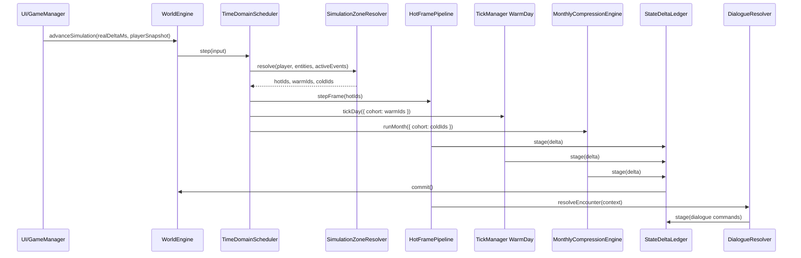

# 项目落地接口与改造路线

> 最后更新：2026-06-09

## 本文定位

本文回答“当前项目要怎么改，关键接口是什么”的问题。它以当前代码为基础，目标是把现有日 Tick 架构升级为：

- 玩家附近 Hot 实时域；
- 玩家周边 Warm 日域；
- 远处 Cold 月压缩域；
- NPC 遇见玩家时的剧情对话系统；
- 同一套状态、关系、经济、修为、任务和剧情包真相源。

## 当前项目真实入口

| 当前文件 | 当前职责 | 改造方式 |
|---|---|---|
| `apps/game/js/engine/world-engine.js` | 初始化配置、实体、关系系统、经济系统、TickManager；暴露 `tick()` 和 `multiTick()`。 | 保留 `tick()`，新增 `advanceSimulation()` 和 `compressMonth()`；初始化分层模拟系统和对话系统。 |
| `apps/game/js/engine/world/tick-manager.js` | 一次日 Tick 的总编排。 | 抽出可复用日阶段；支持只推进 Warm cohort；Cold 不调用 `multiTick(30)`。 |
| `apps/game/js/engine/abstract/base-entity.js` | 实体 Tick 模板方法，调用 GOBT 或旧四段式。 | Hot/Warm 继续使用；Cold 只读取实体状态和行为语义，不直接逐实体 tick 30 次。 |
| `apps/game/js/engine/abstract/behavior-system.js` | GOAP 规划、Action 生命周期、JobAction 执行。 | 增加完整运行快照，用于 Warm/Cold/Hot 切换。 |
| `apps/game/js/engine/abstract/job-system.js` | 当前 Job 和 Toil 的执行与 snapshot。 | 增加 restore/hydrate 接口，Cold 月压缩可恢复或写回 Job 快照。 |
| `apps/game/js/engine/world/services/world-context-builder.js` | 装配日 Tick 的 `worldContext`，提供交易、关系、任务、寻路等服务。 | 新增月压缩用 `buildMonthlyContext()`，复用同一批服务门面。 |
| `apps/game/data/config/data-manifest.json` | 运行时配置加载清单。 | 新增真实 simulation/drama JSON 后同步 manifest、validator 和数据规则。 |

## 总体调用链



## 新增模块目录

```text
apps/game/js/engine/
├── simulation/
│   ├── time-domain-scheduler.js
│   ├── simulation-zone-resolver.js
│   ├── npc-fidelity-policy.js
│   ├── monthly-compression-engine.js
│   ├── monthly-agenda-resolver.js
│   ├── monthly-itinerary-resolver.js
│   ├── monthly-outcome-executors.js
│   ├── monthly-outcome-registry.js
│   ├── state-delta-ledger.js
│   ├── compressed-event-bus.js
│   └── hydration-policy.js
├── dialogue/
│   ├── encounter-detector.js
│   ├── encounter-context-builder.js
│   ├── dialogue-resolver.js
│   ├── dialogue-condition-evaluator.js
│   ├── dialogue-command-engine.js
│   └── drama-package-runtime.js
```

这些模块都通过 registry、strategy 和配置读取扩展，不在 `WorldEngine`、`TickManager` 或 UI 中写具体 NPC、地点、境界和对白分支。

## WorldEngine 接口

保留现有接口：

```js
tick()          // 兼容当前日推进和工具脚本
multiTick(n)    // 调试和批量日模拟工具可继续用
```

新增正式运行期接口：

```js
advanceSimulation({
  realDeltaMs,
  playerSnapshot,
  interactionInput,
}) {
  if (!this._initialized) throw new Error('WorldEngine not initialized');
  return this.timeDomainScheduler.step({
    realDeltaMs,
    playerSnapshot,
    interactionInput,
  });
}

compressMonth({
  startDay = this.worldEntity.currentDay + 1,
  monthLength = 30,
  reason = 'manual',
} = {}) {
  return this.monthlyCompressionEngine.runMonth({
    startDay,
    endDay: startDay + monthLength - 1,
    reason,
  });
}
```

初始化中新增：

```js
this.stateDeltaLedger = new StateDeltaLedger({ entityRegistry, relationshipSystem, economicSystem });
this.simulationZoneResolver = new SimulationZoneResolver({ config: configs.simulationTimeDomains });
this.npcFidelityPolicy = new NpcFidelityPolicy({ config: configs.npcFidelityRules });
this.monthlyCompressionEngine = new MonthlyCompressionEngine({
  entityRegistry,
  worldContextBuilder: this.tickManagerContextBuilder,
  fidelityPolicy: this.npcFidelityPolicy,
  ledger: this.stateDeltaLedger,
  outcomeRegistry,
});
this.timeDomainScheduler = new TimeDomainScheduler({
  zoneResolver: this.simulationZoneResolver,
  tickManager: this.tickManager,
  monthlyCompressionEngine: this.monthlyCompressionEngine,
  ledger: this.stateDeltaLedger,
});
```

## TimeDomainScheduler

职责：决定本次真实帧、游戏日、游戏月分别推进什么。

```js
export class TimeDomainScheduler {
  constructor({
    zoneResolver,
    tickManager,
    hotFramePipeline,
    monthlyCompressionEngine,
    ledger,
    config,
  }) {}

  step({
    realDeltaMs,
    playerSnapshot,
    interactionInput,
  }) {
    const zones = this.zoneResolver.resolve({ playerSnapshot });

    const hotResult = this.hotFramePipeline.step({
      realDeltaMs,
      entityIds: zones.hotIds,
      playerSnapshot,
      interactionInput,
    });

    const warmResult = this._shouldAdvanceGameDay(realDeltaMs)
      ? this.tickManager.tickDay({ cohort: zones.warmIds, domain: 'warm' })
      : null;

    const coldResult = this._shouldCompressMonth()
      ? this.monthlyCompressionEngine.runMonth({ cohort: zones.coldIds })
      : null;

    const commit = this.ledger.commit();
    return { zones, hotResult, warmResult, coldResult, commit };
  }
}
```

调度器不直接改 NPC。所有状态变化必须经 pipeline 或 ledger。

## SimulationZoneResolver

职责：把实体分到 Hot/Warm/Cold。

```js
resolve({ playerSnapshot, activeEvents, markedNpcIds }) {
  return {
    hotIds,
    warmIds,
    coldIds,
    reasonsByEntityId,
  };
}
```

判定来源：

| 输入 | 影响 |
|---|---|
| 玩家坐标和镜头 | 半径内实体进入 Hot。 |
| 神识、追踪、锁定目标 | 扩大 Hot/Warm 范围。 |
| 正在对话、战斗、交易 | 强制 Hot。 |
| 玩家标记 NPC、仇人、道侣、师徒 | 至少 Warm，或 Important Cold。 |
| 动态事件窗口 | 相关 NPC 至少 Warm。 |
| NPC 重要度 | 远处也可升为高保真 Cold。 |

配置示例：

```json
{
  "hotRadiusTiles": 24,
  "warmRadiusTiles": 96,
  "hysteresisTiles": 8,
  "markedNpcMinDomain": "warm",
  "activeInteractionDomain": "hot"
}
```

## TickManager 改造点

当前 `TickManager.tick()` 一次推进所有 NPC。正式改造后保留兼容入口，同时拆出可组合阶段：

```js
tick() {
  return this.tickDay({ cohort: null, domain: 'warm' });
}

tickDay({ cohort = null, domain = 'warm' } = {}) {
  const tickLog = this._createTickLog(domain);
  const worldContext = this._contextBuilder.build({ domain, cohort });

  this._tickWorldRules(tickLog, worldContext);
  this._tickFactions(tickLog, worldContext);
  this._tickMovement(tickLog, worldContext, { cohort });
  this._tickNPCs(tickLog, worldContext, { cohort });
  this._tickMonsters(tickLog, worldContext, { cohort });
  this._collectDeaths(tickLog, worldContext);
  this._tickInfoAndRelations(tickLog, worldContext);
  this._tickMonthlyServicesIfDue(tickLog, worldContext);

  return tickLog;
}
```

关键变化：

| 当前行为 | 改造后 |
|---|---|
| `getAliveByType('npc')` 全量循环 | `cohort == null` 时全量；传入 cohort 时只跑 Warm NPC。 |
| 世界规则每 tick 固定推进 | 日域照旧；Cold 月域由月阶段处理器推进世界月效果。 |
| `multiTick(30)` 可用于跑 30 天 | 正式 Cold 月压缩不用它。 |
| `economicSystem.advanceDay(currentDay)` 每日调用 | Warm 逐日调用；Cold 使用 `advanceRange(startDay,endDay)` 或月阶段批处理债务和到期事务。 |

## BehaviorSystem 和 JobSystem 快照

当前 `BehaviorSystem.toJSON()` 只输出计划长度和剩余 action。正式切换时间域需要完整快照：

```js
BehaviorSnapshot {
  currentNeedId,
  currentActionIds,
  currentActionIndex,
  lifecycle: {
    phase,
    actionId,
    remaining,
    traveled
  },
  suspendedPlanForReaction,
  job: JobSystem.snapshot()
}
```

`JobSystem` 增加恢复接口：

```js
restore(snapshot) {
  if (!snapshot?.currentJobId) {
    this.currentJob = null;
    this.jobRemaining = 0;
    return;
  }
  this.currentJob = JobPool.create(snapshot.currentJobId, snapshot.jobContext || {});
  this.currentJob.id = snapshot.currentJobInstanceId;
  this.currentJob.currentToilIndex = snapshot.currentToilIndex;
  this.currentJob.status = snapshot.jobStatus;
  this.jobRemaining = snapshot.jobRemaining || 0;
}
```

用途：

| 切换 | 行为 |
|---|---|
| Warm -> Cold | 把当前行为、Job、Toil、剩余天数写入 `carryOverJobSnapshot`。 |
| Cold -> Warm | 从月压缩结果恢复 Job 快照，继续日域执行。 |
| Warm -> Hot | 暂停抽象移动或 Job，实时域接管交互。 |
| Hot -> Warm | 对话、战斗、交易结束后恢复或中止 Job。 |

## MonthlyCompressionEngine

核心接口：

```js
export class MonthlyCompressionEngine {
  constructor({
    entityRegistry,
    worldContextBuilder,
    agendaResolver,
    itineraryResolver,
    fidelityPolicy,
    outcomeRegistry,
    ledger,
    eventBus,
    config,
  }) {}

  runMonth({ startDay, endDay, cohort = null, reason = 'scheduled' }) {
    const context = this._buildContext({ startDay, endDay, cohort, reason });
    const coldNpcs = this._resolveColdCohort(context, cohort);

    this._runWorldAndFactionPhases(context);

    for (const npc of coldNpcs) {
      const profile = this.fidelityPolicy.resolve(npc, context);
      const agenda = this.agendaResolver.resolve(npc, context, profile);
      const itinerary = this.itineraryResolver.resolve(npc, agenda, context);
      this._runNpcMonth(npc, agenda, itinerary, profile, context);
    }

    this._runGlobalFinalizers(context);
    return this.ledger.commit({ domain: 'cold', dayRange: [startDay, endDay] });
  }
}
```

NPC 月内执行：

```js
_runNpcMonth(npc, agenda, itinerary, profile, context) {
  for (const segment of agenda.segments) {
    if (context.deathIndex.isDead(npc.id)) break;
    const executor = this.outcomeRegistry.get(segment.kind);
    const result = executor.execute({ npc, segment, itinerary, profile, context, ledger: this.ledger });
    this.eventBus.emitMany(result.events);
    this._checkBreakthroughAndDeath(npc, segment, context);
  }
  this._writeMonthLog(npc, agenda, itinerary, profile, context);
}
```

## MonthlyOutcomeExecutor

所有月内片段都实现同一个接口：

```js
export class MonthlyOutcomeExecutor {
  execute({ npc, segment, itinerary, profile, context, ledger }) {
    return {
      events: [],
      diagnostics: [],
    };
  }
}
```

注册表：

```js
registry.register('cultivate', new MonthlyCultivationExecutor());
registry.register('train_chamber', new MonthlyTrainChamberExecutor());
registry.register('explore', new MonthlyExploreExecutor());
registry.register('quest', new MonthlyQuestExecutor());
registry.register('commerce', new MonthlyEconomyExecutor());
registry.register('social', new MonthlyRelationshipExecutor());
registry.register('recovery', new MonthlyRecoveryExecutor());
registry.register('drama', new MonthlyDramaExecutor());
```

这让新增“炼器月片段”“丹道闭关”“宗门押镖”等内容时，只增加配置和 executor，不改核心月压缩流程。

## StateDeltaLedger

接口：

```js
export class StateDeltaLedger {
  stage(delta) {}
  stageMany(deltas) {}
  validate() {}
  commit({ domain, dayRange } = {}) {}
  discard(predicate) {}
}
```

Delta 格式：

```js
{
  id,
  source: 'monthly.cultivation',
  domain: 'cold',
  actorId: npc.id,
  dayRange: [startDay, endDay],
  operations: [
    { store: 'npc.state', entityId: npc.id, key: 'cultivation', op: 'add', value: 42.3 },
    { store: 'inventory', ownerId: npc.id, itemId: 'low_spirit_stone', op: 'remove', amount: 10 },
    { store: 'event', op: 'emit', event: { type: 'npc.cultivated' } }
  ],
  metadata: {
    agendaKind: 'cultivate',
    locationId: 'sect_cave'
  }
}
```

Ledger 负责：

- 引用校验：NPC、物品、任务、关系对象存在。
- 存活校验：死亡日之后不提交收益。
- 背包校验：不能扣成负数。
- 顺序校验：任务、剧情包、Job 状态机不跳非法状态。
- 合并：同类数值可合并，事件和日志保留顺序。
- 提交：统一写 `entity.state`、`inventory`、`relationshipSystem`、`economicSystem`、`questBoard`、`dramaPackageRuntime`。

## CompressedEventBus

事件是“发生过的事实”，不是 UI 文本。

```js
emit({
  type,
  day,
  actorId,
  targetId,
  locationId,
  visibility,
  payload,
})
```

核心事件族：

```text
world.month_started
world.month_closed
npc.agenda_selected
npc.location_visited
npc.cultivated
npc.explored
npc.recovered
npc.breakthrough_attempted
npc.breakthrough_succeeded
npc.breakthrough_failed
inventory.item_acquired
inventory.item_consumed
inventory.item_used
economy.transaction_settled
relationship.event_applied
quest.accepted
quest.progressed
quest.completed
quest.turned_in
quest.failed
combat.encounter_resolved
npc.died
faction.leader_succession
drama.package_triggered
drama.package_advanced
drama.package_blocked
```

事件输出到三处：

| 去向 | 用途 |
|---|---|
| `CompressedEventRecord` | 存档、调试、月志和回放。 |
| `RumorSeed` | 信息传播和玩家感知。 |
| `EncounterContext` | NPC 遇见玩家时选择对白。 |

## DialogueResolver 接口

相遇时不从 UI 里写对白分支，而是走对话解析器。

```js
export class DialogueResolver {
  resolve({ playerId, npcId, trigger, worldContext }) {
    const context = this.contextBuilder.build({ playerId, npcId, trigger, worldContext });
    const candidates = this.candidateResolver.find(context);
    const passed = candidates.filter(dlg => this.conditionEvaluator.testAll(dlg.conditions, context));
    const selected = this.weightScorer.pick(passed, context);
    return this.nodeBuilder.build(selected, context);
  }
}
```

玩家选择：

```js
applyChoice({ dialogueSessionId, optionId }) {
  const commands = this.optionResolver.commands(dialogueSessionId, optionId);
  return this.commandEngine.execute(commands);
}
```

命令必须进入 `StateDeltaLedger`：

```js
{ type: 'relationship.applyEvent', eventType: 'player_guided_by_elder' }
{ type: 'inventory.transfer', from: 'player', to: 'npc', itemId: 'low_spirit_stone', amount: 5 }
{ type: 'drama.patchPackage', packageId, patch }
{ type: 'npc.pauseJob', npcId, reason: 'dialogue' }
{ type: 'combat.startEncounter', scene: 'player_vs_npc' }
```

## 数据配置接入

真实新增 JSON 时同步三处：

1. `apps/game/data/config/data-manifest.json`
2. `apps/game/js/core/game-data-validator.js`
3. `docs/data/data-config-rules.md`

建议目录：

```text
apps/game/data/
├── simulation/
│   ├── time-domains.json
│   ├── fidelity-rules.json
│   ├── monthly-phases.json
│   └── monthly-agendas.json
└── drama/
    ├── packages/
    ├── dialogues/
    └── text/
```

配置覆盖：

| 配置 | 控制内容 |
|---|---|
| `time-domains.json` | Hot/Warm/Cold 半径、月长、切换滞后、真实帧与游戏日换算。 |
| `fidelity-rules.json` | 重要 NPC、玩家关系、事件绑定、职位、境界、标记对保真度的影响。 |
| `monthly-phases.json` | 世界、势力、NPC、关系、经济、剧情包、日志阶段顺序。 |
| `monthly-agendas.json` | 修炼、任务、交易、社交、疗伤、复仇、游历等权重和天数。 |
| `drama/packages/*.json` | 剧情包状态机、绑定 NPC、触发器、冷却。 |
| `drama/dialogues/*.json` | 对话条件、权重、节点、选项、成本、副作用命令。 |

## 落地顺序

1. **抽出 TickManager 日阶段**
   - 保留 `tick()` 行为。
   - 新增 `tickDay({ cohort, domain })`。
   - NPC 和妖兽循环支持 cohort。

2. **补行为快照和恢复**
   - 扩展 `BehaviorSystem.toJSON()`。
   - 给 `JobSystem` 增加 `restore(snapshot)`。
   - NPC snapshot 增加 `simulationDomain`、`visitedPlaces`、`recentEpisodes`、`currentJobSnapshot`。

3. **接入 StateDeltaLedger**
   - 先让月压缩写 ledger，再统一提交。
   - 对背包、状态、关系、任务、经济、剧情包建立 operation adapter。

4. **实现月压缩最小闭环**
   - 先接 `cultivate`、`commerce`、`quest`、`social`、`recovery` 五类 executor。
   - 用真实长程模拟观察修为、背包、任务、关系、死亡、突破是否自然出现。

5. **接入分层调度**
   - 增加 `SimulationZoneResolver`。
   - `WorldEngine.advanceSimulation()` 按 Hot/Warm/Cold 调度。
   - 保证 Hot/Warm NPC 不被 Cold 重复处理。

6. **接入玩家相遇对话**
   - 增加 EncounterDetector、EncounterContextBuilder、DialogueResolver。
   - 对话选择只产生命令，不直接改 UI 状态。
   - 月压缩的 `recentEpisodes` 进入对白上下文。

7. **补存档和 UI**
   - 存档保存 simulation domains、monthly compression state、compressed events、drama packages、dialogue history。
   - UI 展示月志、传闻、NPC 生涯片段和相遇对话。

## 验收用真实行为指标

| 场景 | 应观察到的行为 |
|---|---|
| 玩家远离宗门 1 个月 | 宗门 NPC 有修炼、任务、交易、社交、疗伤和关系变化。 |
| 玩家闭关 12 个月 | 重要 NPC 有可追溯 episode，普通 NPC 有合理摘要和最终状态。 |
| 玩家突然靠近远处 NPC | NPC 坐标、Job、背包、关系、近期经历能恢复到 Hot/Warm。 |
| NPC 月内突破 | 境界、真气、修为、伤势、寿元、日志和传闻同时合理变化。 |
| NPC 月内死亡 | 死亡后收益停止，关系冲击、继任和传闻产生。 |
| 玩家与 NPC 相遇 | 同一 NPC 因地点、时间、关系、境界、月内经历不同而出现不同对白。 |

## 关键边界

- `multiTick(30)` 只适合调试和兼容，不作为 Cold 月压缩。
- Cold 月压缩不能绕过经济交易、关系账本、任务状态机、修为服务和物品 Effect。
- 玩家正在交互、战斗、对话、交易的 NPC 不进入 Cold cohort。
- 重要 NPC 可以远处高保真，但不能拥有免死、锁血、无限资源或固定成功率。
- 对话和剧情包使用配置化条件和命令，不按 NPC id、地点、境界在 UI 或 TickManager 中硬编码。
