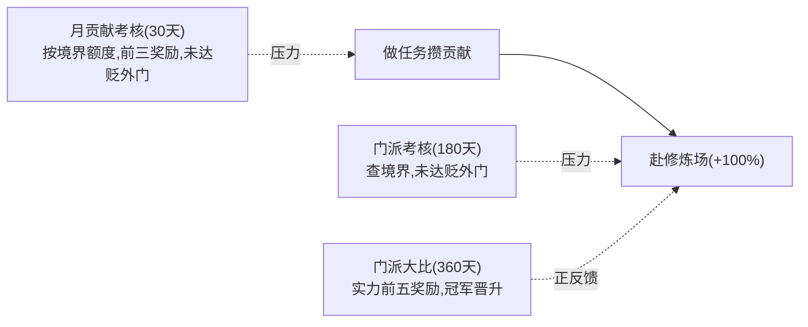

# ADR-011：修炼激励系统（需求重构 + GOAP 经济链 + 势力定时活动）

> 日期：2026-05-29
> 状态：已接受 · 已实现并验证（无头模拟）
> 关联：ADR-010（修炼场修炼行为）、ADR-005（需求驱动 GOAP 架构）、ADR-008（建筑功能化）

## 背景

ADR-010 新增了"赴修炼场修炼"（消耗贡献换加速），但实跑中修炼场执行次数为 0。根因有三层：

1. **架构错误——"任务"被当成需求**：`need_npc_quest` 把"完成任务"（`questTurnedIn`）当作目的。但任务本是获取贡献/灵石的**手段**，不应是需求。这导致一直在调"修炼需求 vs 任务需求"优先级，越调越拧巴。
2. **GOAP 经济链断裂**：`act_npc_turn_in_quest` 的 JSON `effects` 不含 `contribution`，规划层看不到"交任务涨贡献"，永远推不出"为进修炼场先做任务"。
3. **缺乏修炼紧迫性**：修炼速度设计成修满一境界仅约寿元 10%，NPC 没有"必须尽快变强"的外部压力，修炼场加速无吸引力。

## 决策

### 1. 需求精简为 4 个真实动机

NPC 只保留底层动机需求（`npc-needs.json`），删除"手段型/派生型"伪需求：

| 保留 | goalState | 说明 |
| --- | --- | --- |
| `need_npc_cultivation`（修炼） | `cultivationProgress >= 1.0` | 本业，和平期主导（base 30） |
| `need_npc_survival`（长寿） | `lifeRatio < 0.8` | 寿元将尽时飙升 |
| `need_npc_heal`（回血） | `injuryLevel < 1` | 受伤后疗伤，伤愈前压过修炼 |
| `need_npc_loyalty_duty`（职责） | `questTurnedIn == true`（手段链），`satisfiedCondition: monthlyQuotaMet` | 绑定月度贡献考核，未达额度时优先级飙升驱动做任务 |

删除：`need_npc_quest`、`need_npc_ambition`、`need_npc_breakthrough`（突破改由 `_tryBreakthrough` 在进度满时自动判定，不再作需求）。

### 2. 打通 GOAP 经济链（做任务成为修炼的可推导手段）

给 `act_npc_turn_in_quest.effects` 增加 `contribution: { op: "add", value: 5 }`，使规划层可见"交任务涨贡献"。于是当修炼需求目标为 `cultivationProgress >= 1.0`、而贡献 < 10 时，A\* 会**自动推导出**：`接→做→交（×N 攒够贡献）→赴修炼场`。修炼场行为（weight 0.5）比普通闭关代价低，贡献足时直接被选。

> 真实贡献增量仍由 `NPCTurnInQuestExecutor` 按任务难度发放（2~500），effects 里的 5 仅为规划估算。

### 3. 拉长修炼耗时，使修炼场成刚需

`cultivation.json → cultivationSpeed` 各境界下调约 12 倍：**普通闭关**修满一境界 ≈ 该境界寿元的 **120%**（几乎耗尽一生）；**赴修炼场**（`speedBonusMultiplier: 2.0`，+100%）加速后 ≈ **60%** 寿元。正常晋升几乎必须进修炼场，激励极强。

### 4. 三层压力驱动修炼主循环（`tick-manager.js`）

- **月度贡献考核**（`monthlyContribution`，每 30 天）：弟子当月贡献需达 `quotaByRank[境界]`，否则贬为外门弟子；各势力当月贡献前三名额外奖励灵石 = 该弟子月俸 ×5/×3/×2；结算后清零 `monthlyContribution`、刷新 `monthlyQuotaMet`。
- **门派考核**（`sectEvents.sect_exam`，每 180 天）：境界低于 `minRankOrder` 的成年弟子贬为外门。
- **门派大比**（`sectEvents.grandCompetition`，每 360 天）：按实力（境界 order × 大权重 + qi）排名，**仅奖前五**（灵石 5000/1500/800/400/200 + 贡献，梯度拉开），冠军晋升职位。

掌门/长老/继承人豁免贬谪（治理层稳定）。

### 5. 新增外门弟子职位

`npc-state.js` `ROLE_RANKS` 增加 `outer_disciple: 0`；贬谪设 `currentRole='outer_disciple'`、`roleRank=0`。`economy.json` 月俸表加 `outer_disciple: 2`。大比冠军可沿 `outer_disciple → disciple → core_disciple` 晋升。

### 6. 决策门控不再写死修炼

（承接上一轮）`npc-entity.js` 决策门控去掉写死的 `act_npc_cultivate`，周期内静候、到期走 GOAP；GOAP planner 增量折叠 + 弹出时判达标，使 `cultivationProgress >= 1.0` 这类增量目标可规划。

## 后果

### 正面
- 概念正确：任务回归"手段"，需求只剩真实动机；GOAP 自动串起"做任务→进修炼场→升境界"经济链。
- 修炼场成为晋升刚需，三层压力（月考核/门派考核/大比）持续驱动 NPC 修炼，世界更有"修仙宗门"的运转感。
- 全部数据驱动（`cultivation.json` 的 `monthlyContribution`/`sectEvents`、`npc-needs.json`），可调。

### 负面/风险
- 修炼速度下调 12 倍是大幅数值变动，可能连带影响突破率、人口、经济，需在模拟中持续观察。
- 月度/活动遍历全 NPC 有一定开销（仅在周期日触发，可接受）。
- `turn_in_quest` 的 contribution effect 用固定值 5 估算，与真实发放（按难度）存在偏差，仅影响规划倾向不影响结算。

## 涉及文件
- 改 `apps/game/data/needs/npc-needs.json`（精简为 4 需求、回血、职责绑定月考核）
- 改 `apps/game/data/actions/npc-actions.json`（turn_in 加 contribution effect、新增 act_npc_heal、train_chamber 描述/effect 改 100%）
- 改 `apps/game/data/balance/cultivation.json`（cultivationSpeed 下调、新增 monthlyContribution/sectEvents）
- 改 `apps/game/data/balance/economy.json`（月俸加 outer_disciple）
- 改 `apps/game/js/engine/npc/npc-state.js`（outer_disciple、monthlyContribution、monthlyQuotaMet、injuryLevel）
- 改 `apps/game/js/engine/npc/npc-actions.js`（NPCHealExecutor、受伤累加 injuryLevel、turn_in 累加 monthlyContribution）
- 改 `apps/game/js/engine/npc/npc-entity.js`（needIds/actionIds）
- 改 `apps/game/js/engine/world/tick-manager.js`（_processMonthlyContribution/_processSectEvents/_demoteToOuter/_promoteRole/sectEventLog）
