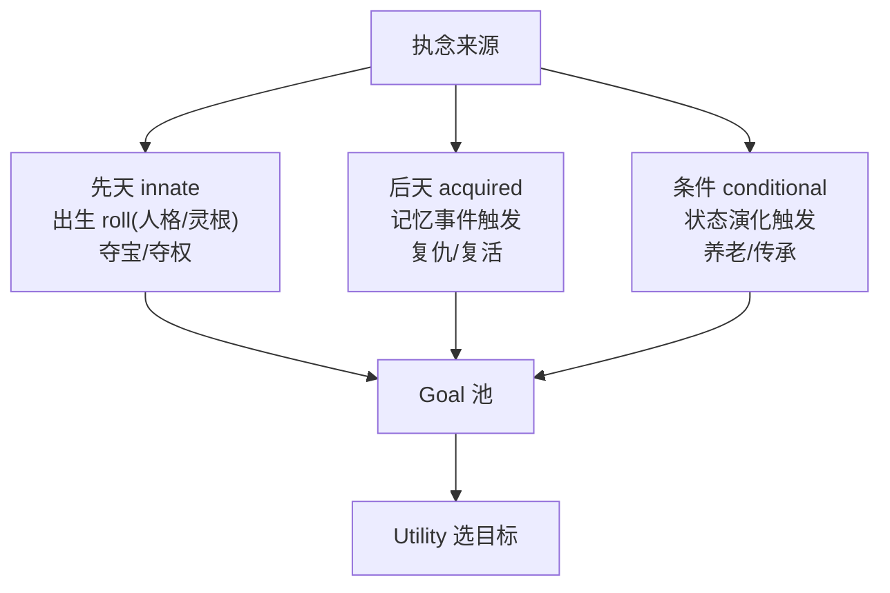

# ADR-023：流派目标体系（夺宝/养老/传承/夺权）

最后更新：2026-05-30

## 背景

ADR-019 引入执念系统，ADR-021/022 完善了 Utility 选目标层（风险厌恶、情绪修正、上头、期望收益）。但此前执念只有五种（supremacy/longevity/revenge/protect_dao/resurrection），且 goalState 几乎都是 `totalProgress>=X`——最终都收敛到"闭关变强"。这导致同境界 NPC 即使 Utility 激活，可选目标仍然趋同，难以产生"同一局面、不同选择"的修仙故事（参考用户诉求：寿元剩 20 年，有人冲元婴、有人抢天材地宝、有人回宗养老、有人收徒传承）。

根本原因：**Utility 能把目标分化，前提是目标池里先有足够多"行为终点不同"的目标。**

## 决策

新增四种流派执念，每种有**专属 goalState**（指向不同的世界状态键，而非都指向 totalProgress），并配套专属行为，使 GOAP 能规划出截然不同的行为终点。

| 流派 | 执念类型 | goalState 键 | 终点行为 | 触发方式 | 世界观依据 |
|------|---------|-------------|---------|---------|-----------|
| 夺宝流 | `plunder` | `treasureObtained` | `act_npc_raid_treasure` | 先天 roll（高 courage） | 凡人修仙传 杀人夺宝/闯秘境 ✅ |
| 养老流 | `retire` | `atPeace` | `act_npc_seclude` | 条件触发（高龄+低野心） | 项目推演设定（无直接原著原型）⚠ |
| 传承流 | `legacy` | `discipleRaised` | `act_npc_take_disciple` | 条件触发（高龄+高阶职位） | 大道争锋 传承道统 / 遮天 大帝收徒 ✅ |
| 夺权流 | `power` | `isFactionLeader` | `act_npc_seize_power` | 先天 roll（高 ambition） | 凡人修仙传/大道争锋 掌门继任 ✅ |

### 世界观诚实标注（遵循 AGENTS.md 世界观规则）

查证 `docs/世界观参考/` 后：

- **夺宝/传承/夺权** 有明确原著依据，已在数据注释中标注来源。
- **养老流** 在世界观参考中**未找到**"高龄修士主动放弃突破、安享余生"的直接原型；仅有"太上长老闭关、五灵根炼气终老"等间接片段。故养老流标注为**项目推演设定**，在代码注释、数据 `_comment` 与本 ADR 中明示，不声称有原著依据。

### 执念触发机制扩展

此前执念只有两种触发：
- **先天**（`_rollInnateObsession`）：出生时按人格/灵根 roll。
- **后天/记忆**（`_checkAcquiredObsession`）：高强度记忆事件触发。

夺宝/夺权适合先天 roll（性格驱动），但**养老/传承是"随年龄/境界演化"自然萌生**，两种现有机制都不贴合。故新增第三类触发：

- **条件触发**（`_checkConditionalObsession`，obsession.json `conditional` 段）：在 `onPreTick` 每日检查，按 `requireState`（寿元/境界等状态条件）+ `requireTrait` + `chance` 概率生成。

### GOAP 可达性保证

每个新 goalState 键都有唯一终点行为可推进，且行为前置可在日常状态下满足（夺宝/养老无特殊前置；传承需 roleRank>=3；夺权需 roleRank>=4，须先经 `act_npc_challenge` 阶梯晋升）。避免 GOAP 规划失败。

## 影响

### 修改的文件

- `apps/game/js/engine/abstract/obsession-system.js`：`ObsessionType` 增 PLUNDER/RETIRE/LEGACY/POWER。
- `apps/game/js/engine/npc/npc-entity.js`：新增 `_checkConditionalObsession` / `_matchStateCondition`，onPreTick 调用；`_initActions` 默认行为列表增四种流派行为。
- `apps/game/js/engine/npc/npc-state.js`：新增状态键 treasureObtained/atPeace/discipleRaised/isFactionLeader。
- `apps/game/js/engine/npc/npc-actions.js`：新增 4 个 Executor 并注册。
- `apps/game/js/engine/npc/npc-utility.js`：`DEFAULT_GOAL_RISK_KEYS` 增 plunder/power 风险映射。
- `apps/game/data/balance/obsession.json`：innate 增夺宝/夺权；新增 conditional 段（养老/传承）；goalMult 增四类。
- `apps/game/data/balance/utility.json`：considerationsBySource 增四种流派目标的 consideration 曲线。
- `apps/game/data/balance/risk.json`：新增 plunder/power 风险键。
- `apps/game/data/actions/npc-actions.json`：新增 4 个行为定义。

### 旧摘要回归变更

GOAP 固定场景回归摘要由 `c4ac92da` 变为 `3c1d45df`。**原因**：`test-goal-equivalence.mjs` 的摘要包含 `NPC[行为数量]` 及行为键集合，新增 4 个行为使键集合变化、确定性 PRNG 的状态采样序列错位，导致摘要变化。**这不代表现有目标的规划逻辑改变**——`test-goal-equivalence.mjs`（验证 GOAP 主路径行为链）仍通过，且新行为的 effects 均为新键（treasureObtained 等），不贡献于现有目标（cultivation/heal/contribution），不会被现有目标的规划选中。属于"新增行为数据后应重新基线"的预期变更，新基线 `3c1d45df` 已记录。

### 默认关闭不改变既有行为边界

- 关闭态（utility.json/reward.json/obsession.json 各 enabled=false）下，执念 goalMult 与所有 consideration 不生效，未持新执念的 NPC 行为与改造前一致。
- 新执念默认无人持有；仅当 NPC roll/触发到对应执念，其 Goal 才进入 Utility 选择。

## 权衡

| 方面 | 改造前 | 改造后 |
|------|--------|--------|
| 执念种类 | 5 种，多数 goalState=totalProgress | 9 种，4 种有专属 goalState/终点行为 |
| 行为终点多样性 | 收敛到"变强" | 夺宝/养老/传承/夺权各有独立终点 |
| 执念触发机制 | 先天 + 记忆 | 先天 + 记忆 + 条件（状态演化） |
| 故事生成 | 同境界趋同 | 同局面可分化出多种人生取向 |

## 平衡验证（2026-05-30）

为确认高风险流派（夺宝/夺权）激活后不会引发人口崩溃，用 `tools/simulate-analysis.mjs` 在**激活态**（环境变量 `UTILITY_ACTIVE=1` 在内存中把 utility/reward/obsession.goalMult 的 `enabled` 覆盖为 true，不写回 JSON，保护默认默认关闭不改变既有行为）下跑世界模拟。

- **分化测试**：`tools/test-utility-divergence.mjs` 全部通过——同境界 6 个人格/执念各异的 NPC 选出 6 种不同 top 目标（养老/复仇/夺权/修炼/传承/证道），证明流派分化机制生效；期望收益（ADR-022）对夺宝目标提供吸引力，关闭后分数明显下降。
- **默认关闭不改变既有行为**：`test-goal-equivalence.mjs` 摘要 `3c1d45df`、`test-goal-equivalence.mjs` 400 用例均通过，新增行为数据未改变现有目标规划路径。
- **人口曲线（激活态 1500 天）**：存活 NPC 151 → 261，全程单调增长，仅 2 例死亡，112 个新生；执念分布出现 supremacy/power/retire/resurrection/longevity，养老流（retire）随 NPC 老化经条件触发自然萌生。
- **结论**：现有 risk.json 风险参数 + 决策冷却 + 实力/职位门槛足以约束高风险流派，激活态下**未观测到人口崩溃**，无需额外下调收益或上调风险。夺宝流（先天高 courage）与传承流（高龄高职位）在固定核心 NPC 池 + 短期模拟下样本偏少，属随机性格分布与时长所致，非机制缺陷；后续可在更大世界/更长周期复测占比。

