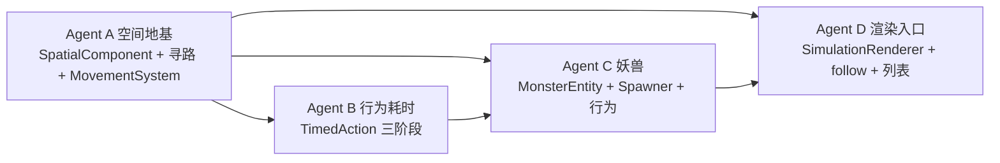

# 多 Agent 实施计划：空间移动 / 行为耗时 / 妖兽分布 / 实时渲染

> 最后更新：2026-05-29
> 关联设计：`docs/superpowers/specs/2026-05-29-空间移动行为耗时与实时渲染设计.md`
> 关联 ADR：`docs/decisions/adr-006-spatial-movement-and-timed-actions.md`

## 依赖关系与执行顺序



**关键结论**：Agent A 是地基，**必须先单独完成并合入**，其余 agent 依赖它定义的接口。Agent B 和 Agent D 在 A 完成后可**并行**；Agent C 依赖 A + B（妖兽行为用到耗时/移动）。

因此采用 **两批** 执行：
- **第 1 批（串行）**：Agent A 独立完成（定义共享接口）。
- **第 2 批（并行）**：Agent B、Agent C、Agent D 基于 A 的接口并行。其中 C 依赖 B 的 TimedAction，安排 C 在 B 之后或让 C 复用 B 已落地的接口。

---

## 共享接口契约（所有 Agent 必须遵守，由 Agent A 落地）

### SpatialComponent（`js/engine/abstract/spatial-component.js`）
```js
class SpatialComponent {
  constructor({ x, y, speed }) {}
  get tileX() {}          // Math.round(x)
  get tileY() {}          // Math.round(y)
  setDestination(x, y) {} // 设置目标，标记 moving
  clearDestination() {}
  setPath(pathArray) {}   // [{x,y}, ...]
  isMoving() {}
  snapshot() {}           // { x, y, speed, moving, destination }
}
```

### BaseEntity 扩展（`js/engine/abstract/base-entity.js`）
```js
this.spatial = null;
initSpatial({ x, y, speed }) {}   // 创建 SpatialComponent
hasSpatial() {}                    // boolean
// snapshot() 增加 spatial 字段
```

### Pathfinding 工具（`js/engine/world/pathfinding.js`）
```js
// 纯函数，避开 passable:false 地形，沼泽按 moveCost 加权
export function computePath(from, to, tileIndex, options) {} // 返回 [{x,y}] 或 null
```

### MovementSystem（`js/engine/world/movement-system.js`）
```js
class MovementSystem {
  constructor({ tileIndex }) {}
  // 推进单个实体一 tick 的移动；返回是否已到达 destination
  tickMove(entity) {} // boolean arrivedThisTick
}
```

### worldContext 新增（由 TickManager 注入，A 落地，B/C 使用）
```js
worldContext.movementSystem      // MovementSystem 实例
worldContext.computePath(from,to) // 便捷寻路
worldContext.resolveTarget(entity, targetResolver) // 解析行为目标地点 → {x,y}
```

### 实体状态新增字段（约定 key）
- `actionStatus`: `'idle' | 'traveling' | 'executing' | 'busy'`
- `actionProgress`: 当前行为已执行天数
- `actionRemaining`: 当前行为剩余天数

---

## Agent A —— 空间地基（第 1 批，串行先行）

**目标**：让 NPC 拥有坐标并能在地图上按速度移动，提供寻路与移动系统，定义全部共享接口。

**改动文件**：
- 新增 `js/engine/abstract/spatial-component.js`
- 新增 `js/engine/world/pathfinding.js`（可抽取 `game-manager.js` 第 186–238 行 BFS 逻辑为通用版）
- 新增 `js/engine/world/movement-system.js`
- 改 `js/engine/abstract/base-entity.js`：加 `spatial`、`initSpatial`、`hasSpatial`、`snapshot` 含 spatial
- 改 `js/engine/npc/npc-entity.js` / `npc-state.js`：NPC 创建时 `initSpatial`，初始坐标=势力 HQ（散修随机合法格）
- 改 `js/engine/world/tick-manager.js`：构造 `MovementSystem`，在 NPC tick 阶段前推进移动；`_buildWorldContext` 注入 `movementSystem`/`computePath`/`resolveTarget`
- 新增 `data/balance/movement.json`：境界→速度 映射
- 改 `js/core/config-loader.js`：加载 `movement.json`
- 更新 `docs/data/data-config-rules.md`：登记 `movement.json` 与 spatial 字段

**验收**：
- NPC snapshot 含合法坐标。
- 给某 NPC 设 destination，多 tick 后坐标逐步逼近并到达，绕开 river。
- 纯数据模式（不渲染）下引擎照常运行，无报错。
- 旧存档读入不崩（spatial 缺省为 null）。

**不做**：行为耗时改造、妖兽、渲染。

---

## Agent B —— 行为耗时与移动阶段（第 2 批，依赖 A）

**目标**：让行为有 `duration` 与"先移动后执行"的三阶段语义，跨多 tick 完成。

**改动文件**：
- 改 `js/engine/abstract/action.js`：解析 `duration`/`requiresTravel`/`targetResolver`/`distanceCostPerTile`；`weight` 计入 duration
- 改 `js/engine/abstract/behavior-system.js`：`executeStep` 引入阶段机（TRAVELING→EXECUTING→DONE），未完成时返回"进行中"不推进 actionIndex
- 改 `js/engine/abstract/base-entity.js`：维护 `actionStatus`/`actionProgress`/`actionRemaining`，busy 时不重新规划
- 改 `data/actions/npc-actions.json` / `faction-actions.json`：为合适行为补 `duration`/`requiresTravel`/`targetResolver`（如游历、交任务、攻伐需要移动；修炼/履职原地）
- 改 `js/engine/world/tick-manager.js`：修复 `checkAdjacentEnemy`（基于 territory 几何/距离）；攻伐设为 requiresTravel
- 提供 `resolveTarget` 的具体实现（按 targetResolver 返回坐标：`self`/`faction_hq`/`market`/`nearest_*`）

**验收**：
- NPC 执行带 `requiresTravel` 的行为时，先移动数 tick 再结算 effects。
- `duration>1` 的行为占用对应天数后才生效。
- 未加新字段的旧行为表现不变（瞬时）。
- GOAP 仍能规划成功（weight 含 duration 不破坏 A*）。

**与 A 的接口边界**：只通过 `worldContext.movementSystem` / `entity.spatial` / `resolveTarget` 交互，不重新实现移动。

---

## Agent C —— 妖兽分布与活实体（第 2 批，依赖 A + B）

**目标**：妖兽实例化到地图，分布合理（境界梯度），具备最小行为。

**改动文件**：
- 新增 `js/engine/monster/monster-entity.js`（继承 BaseEntity，有 spatial）
- 新增 `js/engine/monster/monster-static-data.js` / `monster-state.js`
- 新增 `js/engine/monster/monster-spawner.js`：分布算法（地形 habitat 过滤 + 区域境界梯度 + 灵脉加权 + 邻河判定）
- 新增 `js/engine/monster/monster-actions.js`：`monster_wander`/`monster_hunt`/`monster_rest` 执行器（复用 Action/TimedAction）
- 新增 `data/actions/monster-actions.json`、`data/balance/monster-spawn.json`
- 改 `js/core/config-loader.js`：加载 `monsters.json` + `monster-actions.json` + `monster-spawn.json`
- 改 `js/engine/abstract/entity-registry.js`：支持 type `'monster'`（如有类型白名单）
- 改 `js/engine/world-engine.js`：init 时 spawn 妖兽并注册
- 改 `js/engine/world/tick-manager.js`：新增妖兽 tick 阶段（移动+行为）
- 更新 `docs/data/data-config-rules.md` 与 `docs/worldbuilding/wiki/`（妖兽分布规则，标注数据来源）

**验收**：
- 初始化后地图上有妖兽实例，snapshot 可见其坐标与境界。
- 分布呈梯度：近势力/边缘以 1–3 阶为主，深山/远处出现 4–9 阶。
- 妖兽会游荡；遇到境界更低的 NPC 会追击攻击。
- 河流不可通行处无妖兽站位（用邻河判定）。

**与 A/B 边界**：妖兽移动用 A 的 MovementSystem；妖兽行为用 B 的 TimedAction。

---

## Agent D —— 实时渲染入口与跟随视角（第 2 批，依赖 A，集成期对接 C）

**目标**：simulation 页面可按需开启渲染，调速、平滑移动、实体列表点选跟随。

**改动文件**：
- 改 `apps/game/simulation.html`：加 `<canvas>` 容器（默认隐藏）、"开启渲染"开关、实体列表面板容器；引入 Pixi CDN
- 新增 `js/renderer/simulation-renderer.js`：复用 `tile-renderer`/`camera`，按 snapshot 绘制地图+NPC+妖兽+势力领地（实体用不同颜色/形状区分类型与境界）
- 改 `js/renderer/camera.js`：新增 `follow(getPosFn)` / `stopFollow()`，ticker 内跟随
- 改 `apps/game/js/simulation-main.js`：
  - "开启渲染"开关 → 懒加载并挂载 `SimulationRenderer`
  - 渲染开启时用 rAF 做坐标插值平滑移动
  - 渲染实体列表（NPC/妖兽分组），点项 → `camera.follow` + 显示该实体状态面板
  - "取消跟随"恢复自由拖拽
- 改 `apps/game/css/simulation.css`：渲染区与列表面板样式
- 更新 `docs/systems/renderer.md` 与 `docs/systems/ui.md`

**验收**：
- 默认纯数据模式不变（不加载 Pixi、最快）。
- 开关开启后显示地图，能看到 NPC/妖兽按坐标移动（平滑）。
- 速度滑条调节生效。
- 点实体列表项相机跟随该实体，显示其状态；可切换/取消。

**与 A/C 边界**：只读 `engine.getWorldSnapshot()`（含 spatial）。集成期确认 snapshot 含妖兽（C 完成后）。在 C 未合入前可用 NPC 先行联调。

---

## 集成验证（所有 agent 合入后）

1. 端到端：`simulation.html` 纯数据跑 100 天无异常；开启渲染看到移动与妖兽分布。
2. 一致性：同 seed 下纯数据模式与渲染模式演化结果一致。
3. 跟随：分别跟随一个 NPC 和一个妖兽，观察其移动+行为+耗时。
4. 回归：`index.html` 仍可打开；旧存档可读。
5. 文档：spec/ADR/data-config-rules/renderer/ui 均已更新且注明日期。

## 风险与缓解
- **接口漂移**：Agent A 先合入并冻结接口；B/C/D 严格按契约。集成期出现不一致由集成步骤统一修。
- **性能**：限制妖兽总量、缓存路径、低频重算寻路；渲染只画视口内实体。
- **并行冲突**：B/C/D 改动文件有少量重叠（主要是 `tick-manager.js`、`config-loader.js`、`data-config-rules.md`）。约定：A 先定好这些文件的插入点与注释锚，B/C/D 各自只在指定区段追加，集成期审查合并。
