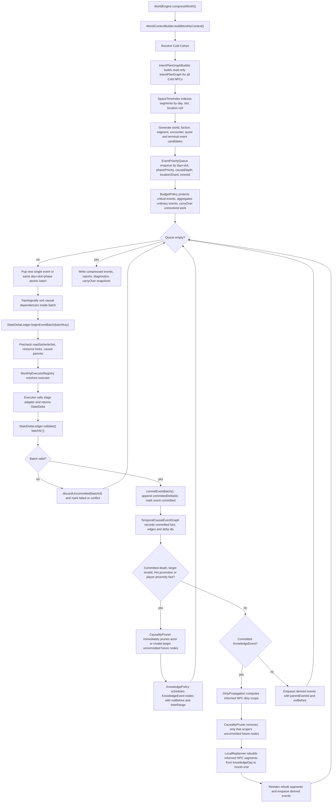

# 月压缩事件因果图实施计划

> **执行要求：** 后续执行本文档时必须使用 `superpowers:subagent-driven-development`（推荐）或 `superpowers:executing-plans`，并按任务复选框逐项推进。

**目标:** 建立“远处 Cold NPC 一个月一次压缩模拟”的可执行架构：先生成全体 IntentPlanGraph，建立 SpaceTimeIndex，把关键事件放入全局 EventPriorityQueue，再按时间、阶段、优先级、因果关系执行，并在死亡、知情、玩家靠近等重大变化后局部重规划。

**架构:** 采用 Builder、Facade/Adapter、Registry、Strategy、Repository、Unit of Work、Policy Object、Specification 与 Event Sourcing 风格记录组合。`MonthlyCompressionEngine` 只负责编排 `IntentPlanGraphBuilder`、`SpaceTimeIndex`、`EventPriorityQueue`、`TemporalCausalEventGraph`、`DirtyPropagation`、`LocalReplanner` 和 `StateDeltaLedger`，业务状态变更全部通过现有服务门面与 domain adapter 提交。

**技术栈:** JavaScript ES modules、JSON 数据配置、Node.js 工具测试、现有 WorldEngine / TickManager / WorldContextBuilder / BehaviorSystem / JobSystem / Toil / 修为服务 / 经济交易 / RelationshipPlatform / QuestBoard / GAS / EventBus。

**最后更新:** 2026-06-09

---

## 任务契约与验收目标

本计划只描述实施路径，不修改运行时代码。执行者需要在实施时按任务顺序提交小步变更，并在每个任务的命令输出中确认实际行为。

验收目标：

- Cold 月压缩不得调用 `multiTick(30)`，也不得按 NPC 顺序让每个 NPC 独立跑完整月。
- 月初先为全体 Cold NPC 生成只读 `IntentPlanGraph`，再建立 `SpaceTimeIndex`，再把关键事件写入 `EventPriorityQueue`。
- 第一片段超过月末时，本月只产生一个 `carryOver` 片段；第一片段为 5 天时，继续规划下一个片段，直到片段越过月末。
- 规划阶段只读快照，不提交真实状态；提交只能发生在事件出队后的 `StateDeltaLedger.commitEventBatch()`，粒度为单事件或同 `day+slot+phase` 的因果原子批次。
- 同一天可有多个事件，同地点可有多人；同日同地点先 group scene，再按配置化候选规则筛选，不做全量两两检测。
- 死亡事实与知情事件分离：`DeathEvent` 是事实，`KnowledgeEvent` 由 `KnowledgePolicy`、`WorldEventSystem/EventAwareness/InfoPropagation` 传播。
- 死亡、目标失效、资源冲突、玩家靠近、Hot 晋升等重大事件发生后，先截断事实主体或失效目标的未提交未来事件；直接关联 NPC 或命中 dirty 规则的 NPC 只有在对应 KnowledgeEvent 到时提交后才局部重规划。
- `MonthlyCompressionEngine` 不直接写修为、经济、关系、任务、背包、死亡或剧情业务状态；所有写入经 stage/commit adapter 和 `StateDeltaLedger` 工作单元。
- 事件优先级、预算、保真规则、`KnowledgePolicy`、`ImpactGraph` 边类型、phase 顺序、executor id、索引粒度、玩家相遇对白条件、剧情条件、文本 key、权重、副作用命令和 Hot 打断响应全部配置到 `apps/game/data/simulation/*.json`，并同步 `data-manifest`、strict validator、`docs/data/data-config-rules.md`。
- 性能目标：设 P 为计划片段数、E 为入队事件数、D 为 dirty NPC 数，整体目标为 `O(P log P + E log E + D*局部重规划成本)`；`EventPriorityQueue` 使用 binary heap 或批量 heapify，`SpaceTimeIndex` 查询只处理命中的候选 k，并通过操作计数证明没有全量两两扫描。

---

## 架构原则与非目标

### 通用架构

- 月压缩是正式时间域，不是兼容分支。Cold、Warm、Hot 共享同一套实体状态、经济账本、关系平台、任务板、GAS、事件总线和存档记录。
- 事件因果图是通用机制，可承载修炼、交易、任务、战斗、死亡、知情、剧情包和玩家靠近，不为某个 NPC、某个门派、某种丹药写专用路径。
- `IntentPlanGraphBuilder` 只读规划；`SpaceTimeIndex` 只做时空查询；`EventPriorityQueue` 只做调度；`TemporalCausalEventGraph/CausalGraphRepository` 只存事件节点与依赖；`DirtyPropagation/CausalityPruner` 只产出失效范围；`StateDeltaLedger/Unit of Work` 按事件批次提交状态。
- 月压缩 adapter 必须拆成 `stage` 与 `commit` 两层：executor 只能调用纯预演的 `stage` adapter 产出 `StateDelta`、派生事件和 diagnostics；真实写入只能由 `StateDeltaLedger.commitEventBatch()` 调用 `commit` adapter。
- 派生事件必须携带 `parentEventId`、`notBefore` 和 `causalDepth + 1`，只能排到父事件之后，不能修改已经提交的过去。

### DAG 与拓扑排序边界

Dependency Graph、DAG 与拓扑排序适合表达属性更新、read/write set、资源锁、局部派生链等静态或局部依赖；同一 atomic batch 内可以先按因果边做拓扑排序，再执行 batch 内事件。月内事件不是单次静态 DAG：它带有 day/slot/phase 时间排序，会在死亡、知情、玩家靠近、资源冲突后派生新事件、截断未来事件并触发局部重规划。因此总体架构必须升级为 `TemporalCausalEventGraph + EventPriorityQueue`，用队列处理时间推进，用事件图记录依赖和提交事实，用 pruner/replanner 处理动态图变化。

### 设计模式适配

- Facade/Adapter：`WorldContextBuilder.buildMonthlyContext()` 作为月压缩服务门面，复用 `settleTransaction`、关系事件、QuestBoard、动态事件、目标解析、修为服务、GAS、路径查询等窄接口。
- Strategy/Registry：agenda 规则、phase executor、domain executor、KnowledgePolicy、ImpactGraph 边类型、候选筛选规则、队列溢出策略全部通过配置和注册表扩展。
- Repository：`CausalGraphRepository` 负责事件节点、边、状态和可查询投影；业务 executor 不持有图存储细节。
- Unit of Work：`StateDeltaLedger` 收集、校验、合并并按事件批次提交状态变化；失败或未提交未来片段可以丢弃，已提交过去不可被未来事件回写。
- Policy Object：`KnowledgePolicy`、`NpcFidelityPolicy`、`QueueOverflowPolicy`、`DirtyScopePolicy`、`HydrationPolicy` 独立表达规则，避免把判断塞进编排器。
- Specification：资源锁、read/write set 冲突、同日同地候选筛选、任务终态合法性、死亡后收益禁止等校验以可组合规格实现。

### 配置化覆盖范围

以下内容必须进入 `apps/game/data/simulation/*.json`，不得写死在 `MonthlyCompressionEngine`：

- 事件 priority、phase 顺序、phasePriority、executor id、locationShard 算法、slot 粒度。
- 预算字段：`maxEventsPerNpcPerMonth`、`maxGeneratedEventsPerEvent`、`maxCausalDepth`、`maxDirtyFanout`、`maxReplansPerNpcPerMonth`、`maxSameCellParticipants`、`maxEncounterCandidatesPerCellDay`、`maxQueueSize`、`maxRelationshipFanout`、`maxColdMonthWallMs`。
- 保真规则、NPC 重要度、玩家相关剧情保护、不可丢事件类别、普通事件聚合规则、diagnostics 字段。
- `KnowledgePolicy` 的可见范围、传播延迟、Hot 打断规则、Cold 知情重规划窗口。
- `ImpactGraph` 边类型：`enables`、`blocks`、`consumes`、`replaces`、`knowledge_of`、`resource_conflict`、`spatial_conflict`。
- `SpaceTimeIndex` cell 大小、day/slot 粒度、地点归并规则、同日同地 group scene 候选筛选规则。
- 配置文件 `monthly-dialogue-conditions.json` 与 `monthly-drama-conditions.json` 中的玩家相遇对白候选、条件 DSL、权重、文本 key、副作用命令、Hot 打断响应、剧情保护条件和 protected event 分类。
- 配置文件 `monthly-command-registry.json` 中的 sideEffectCommands 命令登记、参数 schema、允许执行阶段和对应 commit adapter。
- `ImpactGraph` 只把命中配置的直接关系、直接场景、直接职责和直接信息通道纳入影响范围；`witnesses`、`same scene`、`office holders`、`explicit info channels` 不得扩展成全局知情或全量 NPC 重规划。

### 非目标

- 不重写现有修为、经济、关系、任务、GAS、战斗和 Job/Toil 业务规则。
- 不新增旧流程回退开关，不以关闭新机制作为常规验收方式。
- 不为关键 NPC 增加免死、锁血、无限资源或固定成功率。
- 不用固定输出完全相等作为功能正确证据；验证以真实模拟中的行为数据和场景断言为准。

---

## 目标文件结构

### 新增运行时文件

- `apps/game/js/engine/simulation/monthly-compression-engine.js`：全局月压缩编排器，只协调上下文、规划、索引、队列、因果图、重规划和 ledger。
- `apps/game/js/engine/simulation/monthly-batch-planner.js`：根据队列头、因果边、readSet/writeSet 和 phase 封闭性生成 atomic batch，并执行 batch 内拓扑排序。
- `apps/game/js/engine/simulation/monthly-intent-planner.js`：面向单个 NPC 的月内片段规划策略，读取 Need/Utility/Job/关系/事件信号。
- `apps/game/js/engine/simulation/intent-plan-graph-builder.js`：面向全体 Cold cohort 的只读规划 Builder，输出 `IntentPlanGraph`。
- `apps/game/js/engine/simulation/intent-plan-graph.js`：存储 NPC IntentSegment 节点、carryOver、依赖和只读查询。
- `apps/game/js/engine/simulation/space-time-index.js`：按 day/slot/location cell 索引计划片段和事件候选。
- `apps/game/js/engine/simulation/event-node-types.js`：集中定义 `MonthlyEventNode`、`CausalEdge`、`IntentSegment`、`StateDelta`、`KnowledgeEvent` 等结构校验。
- `apps/game/js/engine/simulation/event-priority-queue.js`：按 day+slot、phasePriority、causalDepth、locationShard、eventId 稳定排序。
- `apps/game/js/engine/simulation/monthly-budget-policy.js`：处理 queue/wall-time 预算、保护事件、普通事件聚合、carryOver 和 diagnostics。
- `apps/game/js/engine/simulation/temporal-causal-event-graph.js`：维护事件节点、因果边、readSet/writeSet、状态和派生事件关系。
- `apps/game/js/engine/simulation/causal-graph-repository.js`：持久化和查询月内事件图，给存档、报告、诊断和重规划使用。
- `apps/game/js/engine/simulation/dirty-propagation.js`：根据 ImpactGraph、read/write set、KnowledgeEvent 与空间冲突计算 dirty NPC 和 dirty event。
- `apps/game/js/engine/simulation/causality-pruner.js`：剪除失效未来事件，保留已提交过去，输出可重规划边界。
- `apps/game/js/engine/simulation/local-replanner.js`：从 dirty 起点到月末重建局部 IntentSegment 和事件节点。
- `apps/game/js/engine/simulation/state-delta-ledger.js`：Unit of Work，收集、校验、合并和提交 `StateDelta`。
- `apps/game/js/engine/simulation/monthly-context-facade.js`：`buildMonthlyContext()` 的返回对象类型，隔离业务服务入口。
- `apps/game/js/engine/simulation/monthly-stage-adapters.js`：纯预演 adapter，把现有业务语义转换为 `StateDelta`，不得真实写状态。
- `apps/game/js/engine/simulation/monthly-commit-adapters.js`：提交 adapter，只由 `StateDeltaLedger.commitEventBatch()` 调用，负责把已校验 delta 写入真实服务。
- `apps/game/js/engine/simulation/monthly-executor-registry.js`：通过 executor id 注册和获取 domain executor。
- `apps/game/js/engine/simulation/monthly-executors/cultivation-executor.js`：通过 stage adapter 产出修炼、真气、突破候选 deltas。
- `apps/game/js/engine/simulation/monthly-executors/economy-executor.js`：通过 stage adapter 产出交易、库存、资源锁 deltas。
- `apps/game/js/engine/simulation/monthly-executors/item-executor.js`：通过 stage adapter 产出物品效果和 GAS effect deltas。
- `apps/game/js/engine/simulation/monthly-executors/quest-executor.js`：通过 stage adapter 产出任务状态、奖励与失败原因 deltas。
- `apps/game/js/engine/simulation/monthly-executors/combat-executor.js`：通过 stage adapter 产出遭遇、伤害和死亡事实事件。
- `apps/game/js/engine/simulation/monthly-executors/relationship-executor.js`：通过 stage adapter 产出 RelationshipPlatform、记忆和传闻 deltas。
- `apps/game/js/engine/simulation/impact-graph.js`：加载配置化影响边和 fanout 限制。
- `apps/game/js/engine/simulation/knowledge-policy.js`：把事实事件转成可传播的 KnowledgeEvent。
- `apps/game/js/engine/simulation/monthly-diagnostics.js`：记录队列溢出、预算截断、重规划次数、group scene 候选数量。
- `apps/game/js/engine/simulation/monthly-report-builder.js`：生成机器可读观察数据、月志和调试报告。
- `apps/game/js/engine/simulation/hot-cold-transition-service.js`：处理 Hot/Warm/Cold 切换、Job hydrate/restore 和玩家靠近打断。

### 修改运行时文件

- `apps/game/js/engine/world-engine.js`：初始化月压缩系统，新增 `compressMonth()` 与 `advanceSimulation()` 调用点。
- `apps/game/js/engine/world/tick-manager.js`：保留日 Tick；抽出 Warm cohort 日推进，不让 Cold 走逐日全量循环。
- `apps/game/js/engine/world/services/world-context-builder.js`：新增 `buildMonthlyContext()`，返回月压缩 Facade/Adapter。
- `apps/game/js/engine/abstract/behavior-system.js`：扩展完整快照，记录当前 need、action、Job、暂停计划和恢复信息。
- `apps/game/js/engine/abstract/job-system.js`：增加 `hydrate(snapshot)`、`restore(snapshot)`、`snapshotForCompression()` 契约。
- `apps/game/js/engine/npc/event-awareness.js`：接收 KnowledgeEvent，支持 Hot 立即打断和 Cold 知情时间记录。
- `apps/game/js/engine/world/info-propagation.js`：为 KnowledgePolicy 提供传播入口和延迟。
- `apps/game/js/core/config-loader.js`：通过 manifest 加载 `simulation/*.json`。
- `apps/game/js/core/game-data-validator.js`：strict 校验 simulation 配置、executor 引用、phase、预算和边类型。

### 新增配置文件

- `apps/game/data/simulation/time-domains.json`：Hot/Warm/Cold 半径、月长、切换滞后、玩家靠近阈值。
- `apps/game/data/simulation/monthly-phases.json`：phase 顺序、phasePriority、executor id。
- `apps/game/data/simulation/monthly-event-priorities.json`：事件类别 priority、不可丢规则、队列溢出策略。
- `apps/game/data/simulation/monthly-budgets.json`：所有预算上限与 wall time 上限。
- `apps/game/data/simulation/monthly-index.json`：day/slot、cell size、location shard、group scene 候选规则。
- `apps/game/data/simulation/monthly-intents.json`：agenda 权重、片段天数、carryOver 规则和 role/rank/faction 输入权重。
- `apps/game/data/simulation/monthly-fidelity-rules.json`：重要 NPC、玩家关系、剧情包、职位、境界的保真策略。
- `apps/game/data/simulation/monthly-knowledge-policy.json`：事实到知情事件的可见性、延迟、传播范围和打断策略。
- `apps/game/data/simulation/monthly-impact-graph.json`：因果边类型、影响范围和 dirty fanout 限制。
- `apps/game/data/simulation/monthly-executors.json`：segment kind、event type、phase 和 executor id 映射。
- `apps/game/data/simulation/monthly-dialogue-conditions.json`：玩家相遇对白候选、条件、权重、文本 key 与副作用命令。
- `apps/game/data/simulation/monthly-drama-conditions.json`：剧情条件、Hot 打断响应、剧情保护事件和副作用命令。
- `apps/game/data/simulation/monthly-command-registry.json`：登记 sideEffectCommands、参数 schema、允许阶段和对应 commit adapter。

### 修改配置与文档

- `apps/game/data/config/data-manifest.json`：声明 simulation singleton/group，确保配置被正式加载。
- `docs/data/data-config-rules.md`：记录 `apps/game/data/simulation/` 目录、字段、命名和新增流程。
- `docs/architecture/world-simulation/03-远处月压缩模拟.md`：同步因果图、全局队列、知情重规划流程。
- `docs/architecture/world-simulation/07-月压缩关键状态结算细节.md`：补充 StateDeltaLedger 与事件图提交顺序。
- `docs/architecture/world-simulation/08-项目落地接口与改造路线.md`：同步新增模块目录和实施接口。
- `docs/data-models/compressed-event-record.md`：补充重大事件节点字段、因果边、KnowledgeEvent 和诊断字段。
- `docs/decisions/adr-059-monthly-causal-event-graph.md`：记录月压缩事件因果图、全局队列和知情重规划决策。
- `docs/README.md`：加入本计划和 ADR/系统文档导航。

### 新增测试与验证工具

- `apps/game/tools/test-monthly-architecture-audit.mjs`：架构边界扫描，阻止 `MonthlyCompressionEngine` 直写业务状态或调用 `multiTick(30)`。
- `apps/game/tools/test-monthly-config-validation.mjs`：验证 simulation 配置、manifest 和 strict validator。
- `apps/game/tools/test-monthly-event-priority-queue.mjs`：验证事件排序、派生事件位置、队列溢出策略。
- `apps/game/tools/test-monthly-causal-graph.mjs`：验证事件节点字段、因果边和 repository 查询。
- `apps/game/tools/test-monthly-intent-planner.mjs`：验证 carryOver、片段继续规划和只读规划。
- `apps/game/tools/test-monthly-space-time-index.mjs`：验证同日同地 group scene 与候选筛选。
- `apps/game/tools/test-monthly-ledger-uow.mjs`：验证 Unit of Work、资源冲突、死亡后收益禁止。
- `apps/game/tools/test-monthly-executors.mjs`：验证 domain executor 只通过 adapter 调用现有服务。
- `apps/game/tools/test-monthly-knowledge-replanning.mjs`：验证 DeathEvent、KnowledgeEvent、dirty propagation 和局部重规划。
- `apps/game/tools/test-monthly-compression-engine.mjs`：验证全局编排流程、队列执行、ledger 提交。
- `apps/game/tools/test-monthly-hot-transition.mjs`：验证 Hot/Warm/Cold 切换和 Job hydrate/restore。
- `apps/game/tools/test-monthly-save-report.mjs`：验证压缩事件记录、诊断和存档字段。
- `apps/game/tools/simulate-monthly-compression-observe.mjs`：多种子长程真实行为观察，输出 JSON 结果和报告数据。

---

## 核心数据结构接口草图

```js
/**
 * 月内重大事件节点。事件是事实或可执行意图，不是 UI 文本。
 */
export const MonthlyEventNodeShape = {
  id: 'evt_month_000001',
  type: 'combat.encounter_resolved',
  phase: 'encounter_resolution',
  executorId: 'monthly.combat',
  timeRange: { startDay: 12, endDay: 12, slot: 'afternoon' },
  priority: 800,
  actors: ['npc_a', 'npc_b'],
  location: { locationId: 'loc_market_01', x: 120, y: 88, shard: '120:88' },
  causalParents: ['evt_month_000000'],
  readSet: [{ store: 'inventory', ownerId: 'npc_a', itemId: 'item_qi_pill' }],
  writeSet: [{ store: 'npc.state', entityId: 'npc_b', key: 'alive' }],
  stateDeltaIds: ['delta_month_000001'],
  knowledgeScope: { policyId: 'death_direct_relations', visibility: 'direct_relations' },
  rngStreamId: 'seed:month:12:combat:npc_a',
  status: 'queued',
  idempotencyKey: 'm6:d12:combat:npc_a:npc_b',
  parentEventId: null,
  notBefore: { day: 12, slot: 'afternoon' },
  causalDepth: 0,
};

export const CausalEdgeShape = {
  id: 'edge_month_000001',
  from: 'evt_month_000001',
  to: 'evt_month_000002',
  edgeType: 'knowledge_of',
  reason: 'npc_b_death_becomes_known_to_disciple',
  configRef: 'monthly-impact-graph.edges.knowledge_of',
};

export const IntentSegmentShape = {
  id: 'seg_npc_a_001',
  npcId: 'npc_a',
  kind: 'quest',
  timeRange: { startDay: 5, endDay: 13, slot: 'day' },
  locationIntent: { kind: 'quest_target', targetId: 'quest_monster_01' },
  targetRefs: [{ type: 'quest', id: 'quest_monster_01' }],
  readSet: [{ store: 'quest', questId: 'quest_monster_01' }],
  expectedWriteSet: [{ store: 'quest', questId: 'quest_monster_01', key: 'state' }],
  carryOver: false,
  sourceSnapshotId: 'snap_npc_a_m6_start',
  rngStreamId: 'seed:m6:intent:npc_a:quest',
};

export const SpaceTimeBucketShape = {
  key: 'day12:slot_afternoon:cell_120_088',
  day: 12,
  slot: 'afternoon',
  cell: { x: 120, y: 88, size: 8 },
  segmentIds: ['seg_npc_a_001', 'seg_npc_b_003'],
  eventIds: ['evt_month_000001'],
  participantIds: ['npc_a', 'npc_b'],
};

export const StateDeltaShape = {
  id: 'delta_month_000001',
  sourceEventId: 'evt_month_000001',
  eventBatchId: 'batch_day12_afternoon_phase40_001',
  domain: 'cold',
  actorId: 'npc_a',
  dayRange: [12, 12],
  operations: [
    { store: 'inventory', ownerId: 'npc_a', itemId: 'item_qi_pill', op: 'remove', amount: 1 },
    { store: 'effect', targetId: 'npc_a', effectId: 'ge_add_qi', op: 'apply', spec: { magnitude: 30 } },
  ],
  preconditions: [
    { store: 'inventory', ownerId: 'npc_a', itemId: 'item_qi_pill', op: 'gte', amount: 1 },
  ],
  status: 'staged',
};

export const StateDeltaBatchShape = {
  id: 'batch_day12_afternoon_phase40_001',
  timeKey: { day: 12, slot: 'afternoon', phase: 'encounter_combat_quest_terminal' },
  eventIds: ['evt_month_000001'],
  topologicalOrder: ['evt_month_000001'],
  stagedDeltaIds: ['delta_month_000001'],
  committedDeltaIds: [],
  status: 'open',
};

export const KnowledgeEventShape = {
  id: 'know_month_000001',
  sourceEventId: 'evt_month_000001',
  factType: 'npc.died',
  subjectIds: ['npc_b'],
  informedNpcIds: ['npc_disciple_01'],
  timeRange: { startDay: 13, endDay: 13, slot: 'morning' },
  policyId: 'death_direct_relations',
  propagationPath: ['event_awareness', 'info_propagation'],
  effect: { interruptHot: true, replanColdUntilMonthEnd: true },
};

export const MonthlyCompressionResultShape = {
  monthIndex: 6,
  dayRange: [151, 180],
  changedEntityIds: ['npc_a', 'npc_b'],
  committedDeltaIds: ['delta_month_000001'],
  eventNodeIds: ['evt_month_000001'],
  knowledgeEventIds: ['know_month_000001'],
  dirtyNpcIds: ['npc_disciple_01'],
  carryOverSegments: [{ npcId: 'npc_c', segmentId: 'seg_npc_c_001', remainingDays: 9 }],
  diagnostics: {
    queueHighWatermark: 432,
    groupedScenes: 18,
    replans: 7,
    overflowAggregatedEvents: 3,
  },
};
```

合法事件状态集合：

```text
planned -> queued -> executing -> committed
planned -> queued -> pruned
planned -> queued -> skipped
executing -> failed
```

---

## 全局月压缩流程



### 提交顺序

1. 月初构建 context、Cold cohort、IntentPlanGraph、SpaceTimeIndex 和初始 EventPriorityQueue，不提交业务状态。
2. 队列每次出队一个单事件，或同 `day+slot+phase` 且因果边可封闭的 atomic batch。
3. batch 内先按 `TemporalCausalEventGraph` 因果边拓扑排序，再 `StateDeltaLedger.beginEventBatch(batchKey)`。
4. executor 只通过 adapter/facade stage delta；随后 `StateDeltaLedger.validate({ batchId })` 校验前置条件、资源锁、死亡后收益禁止和 writeSet 冲突。
5. 校验通过即 `StateDeltaLedger.commitEventBatch({ batchId, domain, dayRange })`，把真实状态、事件状态和 `committedDeltaIds` 一起提交；校验失败只丢弃当前未提交 batch。
6. 死亡、目标失效、Hot 晋升、玩家靠近等事实提交后，只立即剪除事实主体或失效目标的未提交未来事件；这一步不让所有知情 NPC 立即重规划。
7. `KnowledgePolicy` 只生成带 `notBefore/timeRange` 的 `KnowledgeEvent` 并回到队列；知情事件到达自己的时间点并提交后，才对被告知 NPC 执行 dirty propagation、prune 和 replan。
8. `CausalityPruner` 只能剪除未提交未来事件；已提交过去不可回写，未提交未来可丢弃或重规划。
9. 派生和重规划事件带 `parentEventId`、`notBefore` 和 `causalDepth + 1` 回到队列，继续按时间键推进。
10. wall-time 或 queue budget 触顶时，保护事件继续处理；普通未提交事件聚合为摘要或写入 carryOver；所有降级都写 diagnostics，不把预算触顶当作静默完成。

同一 batch 内 phase 业务顺序：

1. 月初世界/势力时钟。
2. 片段开始、移动到达、最终坐标候选。
3. 前置校验与资源锁。
4. 遭遇、战斗、任务终态。
5. 死亡、目标失效、Hot 晋升截断。
6. 奖励和经济结算。
7. 关系、记忆、知情事件排程；知情事件到达时再触发知情 NPC 重规划。
8. 剧情包阻塞、日志、传闻、最终坐标。

### 事件排序键

```js
const monthlyEventSortKey = (event, config) => [
  event.timeRange.startDay,
  config.slots[event.timeRange.slot].order,
  config.phases[event.phase].phasePriority,
  event.causalDepth,
  event.location?.shard || 'world',
  event.id,
];
```

队列溢出规则：

- 死亡、Hot 切换、玩家相关剧情、资源冲突、任务终态不可丢。
- 低优先普通事件按配置聚合成 `monthly.events_aggregated` 节点，并写入 diagnostics。
- 聚合节点不得替代业务结算，只能压缩日志和低影响 episode。

---

## 任务列表

### 任务 1: RED 测试与架构审计

**文件:**

- 新增: `apps/game/tools/test-monthly-architecture-audit.mjs`
- 新增: `apps/game/tools/test-monthly-red-core-contracts.mjs`
- 读取: `docs/architecture/world-simulation/03-远处月压缩模拟.md`
- 读取: `docs/architecture/world-simulation/07-月压缩关键状态结算细节.md`
- 读取: `docs/architecture/world-simulation/08-项目落地接口与改造路线.md`

- [ ] **步骤 1: 写架构审计失败测试**

```js
#!/usr/bin/env node
import { readFileSync, existsSync, readdirSync } from 'node:fs';
import { resolve } from 'node:path';

const GAME_ROOT = resolve(new URL('.', import.meta.url).pathname, '..').replace(/^\/([A-Z]:)/, '$1');
const mustExist = [
  'js/engine/simulation/monthly-compression-engine.js',
  'js/engine/simulation/intent-plan-graph-builder.js',
  'js/engine/simulation/space-time-index.js',
  'js/engine/simulation/event-priority-queue.js',
  'js/engine/simulation/monthly-batch-planner.js',
  'js/engine/simulation/temporal-causal-event-graph.js',
  'js/engine/simulation/state-delta-ledger.js',
  'js/engine/simulation/monthly-stage-adapters.js',
  'js/engine/simulation/monthly-commit-adapters.js',
];

const forbiddenBusinessImports = [
  '../npc/services/cultivation-service.js',
  '../npc/npc-economy.js',
  '../economy/transaction-engine.js',
  '../world/relationship-system.js',
  '../quest/quest-board.js',
  '../combat/combat-pipeline.js',
  '../effects/effect-engine.js',
];

let failures = 0;
function ok(condition, message) {
  console.log(`  ${condition ? 'OK' : 'FAIL'}: ${message}`);
  if (!condition) failures++;
}

for (const file of mustExist) {
  ok(existsSync(resolve(GAME_ROOT, file)), `${file} exists`);
}

const enginePath = resolve(GAME_ROOT, 'js/engine/simulation/monthly-compression-engine.js');
if (existsSync(enginePath)) {
  const source = readFileSync(enginePath, 'utf-8');
  ok(!source.includes('multiTick(30'), 'MonthlyCompressionEngine does not call multiTick(30)');
  ok(!/\.state\.set\(|\.state\.add\(|inventory\.addItem\(|inventory\.removeItem\(/.test(source), 'MonthlyCompressionEngine does not write business state directly');
  for (const forbidden of forbiddenBusinessImports) {
    ok(!source.includes(forbidden), `MonthlyCompressionEngine does not import ${forbidden}`);
  }
}

const simDir = resolve(GAME_ROOT, 'js/engine/simulation');
if (existsSync(simDir)) {
  const files = readdirSync(simDir).filter(file => file.endsWith('.js'));
  ok(files.includes('monthly-executor-registry.js'), 'monthly executor registry is present');
  for (const file of files.filter(name => name.includes('executor'))) {
    const source = readFileSync(resolve(simDir, file), 'utf-8');
    for (const forbidden of forbiddenBusinessImports) {
      ok(!source.includes(forbidden), `${file} does not import ${forbidden}`);
    }
    ok(!/commitEventBatch|beginEventBatch|discardUncommitted/.test(source), `${file} does not call ledger commit APIs`);
  }
}

if (failures) process.exit(1);
console.log('Monthly architecture audit passed');
```

- [ ] **步骤 2: 写核心契约失败测试**

```js
#!/usr/bin/env node
import { resolve } from 'node:path';
import { pathToFileURL } from 'node:url';

const GAME_ROOT = resolve(new URL('.', import.meta.url).pathname, '..').replace(/^\/([A-Z]:)/, '$1');
const imp = (path) => import(pathToFileURL(resolve(GAME_ROOT, path)).href);

const modules = [
  ['MonthlyCompressionEngine', 'js/engine/simulation/monthly-compression-engine.js'],
  ['IntentPlanGraphBuilder', 'js/engine/simulation/intent-plan-graph-builder.js'],
  ['SpaceTimeIndex', 'js/engine/simulation/space-time-index.js'],
  ['EventPriorityQueue', 'js/engine/simulation/event-priority-queue.js'],
  ['MonthlyBatchPlanner', 'js/engine/simulation/monthly-batch-planner.js'],
  ['TemporalCausalEventGraph', 'js/engine/simulation/temporal-causal-event-graph.js'],
  ['StateDeltaLedger', 'js/engine/simulation/state-delta-ledger.js'],
];

let failures = 0;
function ok(condition, message) {
  console.log(`  ${condition ? 'OK' : 'FAIL'}: ${message}`);
  if (!condition) failures++;
}

for (const [name, path] of modules) {
  try {
    const mod = await imp(path);
    ok(typeof mod[name] === 'function', `${name} exports class/function`);
  } catch (err) {
    ok(false, `${name} import failed: ${err.message}`);
  }
}

if (failures) process.exit(1);
console.log('Monthly core contracts exist');
```

- [ ] **步骤 3: 运行失败测试**

运行:

```powershell
Push-Location -LiteralPath .\apps\game
node .\tools\test-monthly-architecture-audit.mjs
node .\tools\test-monthly-red-core-contracts.mjs
Pop-Location
```

预期: 两个命令都 FAIL，原因是 simulation 模块尚未创建。

- [ ] **步骤 4: 执行边界审查**

运行:

```powershell
rg -n "multiTick\(30|state\.set\(|inventory\.addItem\(|inventory\.removeItem\(" .\apps\game\js\engine\simulation
rg -n "cultivation-service|npc-economy|transaction-engine|relationship-system|quest-board|combat-pipeline|effect-engine" .\apps\game\js\engine\simulation\monthly-compression-engine.js .\apps\game\js\engine\simulation\monthly-executors
rg -n "commitEventBatch|beginEventBatch|discardUncommitted" .\apps\game\js\engine\simulation\monthly-executors
```

预期: 在模块创建前允许返回“路径不存在”；模块创建后不得在 `monthly-compression-engine.js` 命中业务直写或 forbidden imports，executor 也不得命中 commit API。

### 任务 2: 仿真配置、manifest 与 validator

**文件:**

- 新增: `apps/game/data/simulation/time-domains.json`
- 新增: `apps/game/data/simulation/monthly-phases.json`
- 新增: `apps/game/data/simulation/monthly-event-priorities.json`
- 新增: `apps/game/data/simulation/monthly-budgets.json`
- 新增: `apps/game/data/simulation/monthly-index.json`
- 新增: `apps/game/data/simulation/monthly-intents.json`
- 新增: `apps/game/data/simulation/monthly-fidelity-rules.json`
- 新增: `apps/game/data/simulation/monthly-knowledge-policy.json`
- 新增: `apps/game/data/simulation/monthly-impact-graph.json`
- 新增: `apps/game/data/simulation/monthly-executors.json`
- 新增: `apps/game/data/simulation/monthly-dialogue-conditions.json`
- 新增: `apps/game/data/simulation/monthly-drama-conditions.json`
- 新增: `apps/game/data/simulation/monthly-command-registry.json`
- 修改: `apps/game/data/config/data-manifest.json`
- 修改: `apps/game/js/core/game-data-validator.js`
- 新增: `apps/game/tools/test-monthly-config-validation.mjs`

- [ ] **步骤 1: 写配置加载失败测试**

```js
#!/usr/bin/env node
import { readFileSync } from 'node:fs';
import { resolve } from 'node:path';
import { pathToFileURL } from 'node:url';

const GAME_ROOT = resolve(new URL('.', import.meta.url).pathname, '..').replace(/^\/([A-Z]:)/, '$1');
const load = (path) => JSON.parse(readFileSync(resolve(GAME_ROOT, path), 'utf-8'));
const imp = (path) => import(pathToFileURL(resolve(GAME_ROOT, path)).href);
const { loadGameDataManifest, loadGameConfigsFromManifest } = await imp('js/core/data-manifest-loader.js');
const { validateGameData } = await imp('js/core/game-data-validator.js');

const manifest = await loadGameDataManifest({ basePath: GAME_ROOT, loadJson: load });
const configs = await loadGameConfigsFromManifest(manifest, { basePath: GAME_ROOT, loadJson: load });

function assert(condition, message) {
  if (!condition) throw new Error(message);
  console.log(`  OK: ${message}`);
}

assert(configs.simulation.timeDomains.monthLengthDays === 30, 'simulation time domains loaded');
assert(configs.simulation.monthlyBudgets.maxQueueSize > 0, 'monthly budgets loaded');
assert(configs.simulation.monthlyImpactGraph.edgeTypes.includes('knowledge_of'), 'impact graph edge type knowledge_of registered');
assert(configs.simulation.monthlyPhases.phases[0].id === 'world_faction_clock', 'phase order starts with world_faction_clock');
assert(configs.simulation.monthlyExecutors.executors.some(e => e.id === 'monthly.combat'), 'combat executor id registered');
assert(configs.simulation.monthlyDialogueConditions.candidateSets.some(s => s.id === 'player_encounter_monthly'), 'monthly dialogue conditions loaded');
assert(configs.simulation.monthlyDramaConditions.hotInterruptResponses.some(r => r.id === 'hot_interrupt_pause_job'), 'monthly drama hot interrupt response loaded');
assert(configs.simulation.monthlyCommandRegistry.commands.some(c => c.id === 'drama.mark_fact_discussed'), 'monthly command registry loaded');

validateGameData(configs, { strict: true });
console.log('Monthly config validation passed');
```

- [ ] **步骤 2: 新增 simulation JSON 配置**

跨文件使用以下必需结构:

```json
{
  "schemaVersion": 1,
  "monthlyBudgets": {
    "maxEventsPerNpcPerMonth": 12,
    "maxGeneratedEventsPerEvent": 6,
    "maxCausalDepth": 8,
    "maxDirtyFanout": 24,
    "maxReplansPerNpcPerMonth": 3,
    "maxSameCellParticipants": 20,
    "maxEncounterCandidatesPerCellDay": 8,
    "maxQueueSize": 50000,
    "maxRelationshipFanout": 12,
    "maxColdMonthWallMs": 250
  }
}
```

`monthly-phases.json` 必须包含有序 phase ids:

```json
{
  "schemaVersion": 1,
  "phases": [
    { "id": "world_faction_clock", "phasePriority": 10, "executorId": "monthly.worldFactionClock" },
    { "id": "segment_start_arrival", "phasePriority": 20, "executorId": "monthly.segmentStartArrival" },
    { "id": "precheck_resource_lock", "phasePriority": 30, "executorId": "monthly.precheckResourceLock" },
    { "id": "encounter_combat_quest_terminal", "phasePriority": 40, "executorId": "monthly.encounterResolver" },
    { "id": "death_target_invalid_hot_promotion", "phasePriority": 50, "executorId": "monthly.terminalInvalidation" },
    { "id": "reward_economy_settlement", "phasePriority": 60, "executorId": "monthly.rewardEconomy" },
    { "id": "relationship_memory_knowledge", "phasePriority": 70, "executorId": "monthly.relationshipKnowledge" },
    { "id": "drama_log_rumor_final_location", "phasePriority": 80, "executorId": "monthly.finalizer" }
  ]
}
```

`monthly-dialogue-conditions.json` 必须用数据表达玩家相遇对白:

```json
{
  "schemaVersion": 1,
  "candidateSets": [
    {
      "id": "player_encounter_monthly",
      "trigger": "player_proximity",
      "conditions": [
        { "fact": "npc.timeDomain", "op": "in", "values": ["cold", "warm", "hot"] },
        { "fact": "monthly.committedEpisodes.count", "op": "gte", "value": 1 }
      ],
      "candidates": [
        {
          "id": "encounter_recent_known_fact",
          "weight": 100,
          "textKey": "dialogue.monthly.encounter.recent_known_fact",
          "sideEffectCommands": [
            { "command": "drama.mark_fact_discussed", "args": { "source": "committedEpisode" } }
          ],
          "hotInterruptResponseId": "hot_interrupt_pause_job"
        }
      ]
    }
  ]
}
```

`monthly-drama-conditions.json` 必须用数据表达剧情保护和 Hot 打断:

```json
{
  "schemaVersion": 1,
  "dramaConditions": [
    {
      "id": "player_related_monthly_fact",
      "conditions": [
        { "fact": "event.tags", "op": "contains", "value": "player_related" }
      ],
      "protectedEventType": "player.drama_related",
      "priority": 900
    }
  ],
  "hotInterruptResponses": [
    {
      "id": "hot_interrupt_pause_job",
      "conditions": [
        { "fact": "trigger", "op": "eq", "value": "player_proximity" }
      ],
      "response": "pause_hydrate_and_offer_dialogue",
      "sideEffectCommands": [
        { "command": "job.snapshot_current_toil", "args": { "includeProgress": true } }
      ]
    }
  ]
}
```

`monthly-command-registry.json` 必须登记 sideEffectCommands:

```json
{
  "schemaVersion": 1,
  "commands": [
    {
      "id": "drama.mark_fact_discussed",
      "allowedPhases": ["relationship_memory_knowledge", "drama_log_rumor_final_location"],
      "argsSchema": {
        "required": ["source"]
      },
      "commitAdapter": "dramaPackageState"
    },
    {
      "id": "job.snapshot_current_toil",
      "allowedPhases": ["death_target_invalid_hot_promotion"],
      "argsSchema": {
        "required": ["includeProgress"]
      },
      "commitAdapter": "jobSnapshot"
    }
  ]
}
```

玩家相遇对白候选、条件、权重、文本 key、副作用命令和 Hot 打断响应必须由 `monthly-dialogue-conditions.json`、`monthly-drama-conditions.json` 与其他 simulation 配置共同驱动；实现代码不得按 NPC、境界或地点写分支。

- [ ] **步骤 3: 修改 manifest**

在 `singletons` 下新增映射:

```json
{
  "simulation.timeDomains": "data/simulation/time-domains.json",
  "simulation.monthlyPhases": "data/simulation/monthly-phases.json",
  "simulation.monthlyEventPriorities": "data/simulation/monthly-event-priorities.json",
  "simulation.monthlyBudgets": "data/simulation/monthly-budgets.json",
  "simulation.monthlyIndex": "data/simulation/monthly-index.json",
  "simulation.monthlyIntents": "data/simulation/monthly-intents.json",
  "simulation.monthlyFidelityRules": "data/simulation/monthly-fidelity-rules.json",
  "simulation.monthlyKnowledgePolicy": "data/simulation/monthly-knowledge-policy.json",
  "simulation.monthlyImpactGraph": "data/simulation/monthly-impact-graph.json",
  "simulation.monthlyExecutors": "data/simulation/monthly-executors.json",
  "simulation.monthlyDialogueConditions": "data/simulation/monthly-dialogue-conditions.json",
  "simulation.monthlyDramaConditions": "data/simulation/monthly-drama-conditions.json",
  "simulation.monthlyCommandRegistry": "data/simulation/monthly-command-registry.json"
}
```

- [ ] **步骤 4: 扩展 strict validator**

Validator 必须检查:

- 每个 phase 的 `executorId` 在 `monthly-executors.json` 中存在。
- 每个 edge type 属于配置集合：`enables`、`blocks`、`consumes`、`replaces`、`knowledge_of`、`resource_conflict`、`spatial_conflict`。
- 每个预算字段存在且为正整数。
- `coldNpcCount * maxEventsPerNpcPerMonth + initialWorldEventBudget + maxGeneratedEventsPerEvent * maxCausalDepth` 不得超过 `maxQueueSize`；validator 使用最大 Cold cohort 配置值做保守校验，运行时再记录实际 P/E/D。
- 配置文件 `monthly-index.json` 的 slot 和 cell 粒度非零。
- 不可丢事件类别包含死亡、Hot 切换、玩家相关剧情。
- 每个 dialogue candidate 的 `weight` 为正数、`textKey` 非空、`sideEffectCommands[].command` 属于 `monthly-command-registry.json.commands[].id`。
- 每个 sideEffectCommand 的参数满足 `monthly-command-registry.json` 中的 `argsSchema`，且当前 phase 位于 `allowedPhases`。
- 每个 `hotInterruptResponseId` 在 `monthly-drama-conditions.json.hotInterruptResponses` 中存在。
- 每个 drama condition 的 `protectedEventType` 在 `monthly-event-priorities.json` 中登记为不可丢或高优先事件。
- dialogue/drama 条件只能使用配置化 condition DSL 和已登记 fact key，不允许 validator 放过运行时代码分支名。

- [ ] **步骤 5: 运行配置验证**

运行:

```powershell
Push-Location -LiteralPath .\apps\game
node .\tools\test-monthly-config-validation.mjs
node .\tools\test-data-manifest-load.mjs
Pop-Location
```

预期: 两个命令 PASS，输出包含 simulation 配置加载和 manifest 目录匹配结果。

### 任务 3: 事件类型、优先级与队列

**文件:**

- 新增: `apps/game/js/engine/simulation/event-node-types.js`
- 新增: `apps/game/js/engine/simulation/event-priority-queue.js`
- 新增: `apps/game/tools/test-monthly-event-priority-queue.mjs`

- [ ] **步骤 1: 写排序与派生事件测试**

测试用例:

- day+slot 更早的事件先出队。
- 同 day+slot 按 `phasePriority`。
- 同 phase 按 `causalDepth`。
- 同 depth 按 `locationShard`。
- 最后按稳定 `eventId`。
- 派生事件带 `parentEventId`、`notBefore`、`causalDepth + 1`，不会插回父事件之前。

运行:

```powershell
Push-Location -LiteralPath .\apps\game
node .\tools\test-monthly-event-priority-queue.mjs
Pop-Location
```

预期: 初次 FAIL，提示 `EventPriorityQueue` 未导出。

- [ ] **步骤 2: 实现节点规格校验**

`event-node-types.js` 导出:

```js
export const CAUSAL_EDGE_TYPES = Object.freeze([
  'enables',
  'blocks',
  'consumes',
  'replaces',
  'knowledge_of',
  'resource_conflict',
  'spatial_conflict',
]);

export function assertMonthlyEventNode(node) {
  const required = ['id', 'timeRange', 'priority', 'actors', 'location', 'causalParents', 'readSet', 'writeSet', 'stateDeltaIds', 'knowledgeScope', 'rngStreamId', 'status', 'idempotencyKey'];
  for (const key of required) {
    if (!Object.prototype.hasOwnProperty.call(node, key)) {
      throw new Error(`MonthlyEventNode missing ${key}`);
    }
  }
  return node;
}
```

- [ ] **步骤 3: 实现稳定优先队列**

队列数据结构:

- `enqueue()` 和 `dequeue()` 使用 binary heap，单次复杂度为 `O(log E)`。
- 初始事件批量入队时支持 heapify，复杂度为 `O(E)`。
- queue diagnostics 记录 `enqueueCount`、`dequeueCount`、`comparisonCount`、`highWatermark` 和 `aggregatedEventCount`。

`EventPriorityQueue` 必须暴露:

```js
constructor({ phaseConfig, slotConfig, budgetConfig, overflowPolicy })
enqueue(event)
enqueueMany(events)
dequeue()
peek()
size()
highWatermark()
createDerivedEvent(parent, patch)
```

队列溢出行为:

- 若事件受配置保护，则保留该事件。
- 若事件为低优先级且可聚合，则返回 diagnostic `monthly.queue_aggregated`。
- 若无法解决溢出，则抛出带队列高水位和事件类型的 `MonthlyQueueOverflowError`。
- wall-time 或 queue budget 触顶时，保护事件继续处理；普通未提交事件聚合成摘要或转为 carryOver；所有降级都写入 diagnostics，不能静默丢弃。

- [ ] **步骤 4: 运行队列测试**

运行:

```powershell
Push-Location -LiteralPath .\apps\game
node .\tools\test-monthly-event-priority-queue.mjs
Pop-Location
```

预期: PASS，输出排序键和派生事件验证结果。

### 任务 4: 时序因果事件图、CausalGraphRepository 与剪枝测试

**文件:**

- 新增: `apps/game/js/engine/simulation/temporal-causal-event-graph.js`
- 新增: `apps/game/js/engine/simulation/causal-graph-repository.js`
- 新增: `apps/game/js/engine/simulation/monthly-batch-planner.js`
- 新增: `apps/game/tools/test-monthly-causal-graph.mjs`

- [ ] **步骤 1: 写图节点与边测试**

测试必须创建:

- `evt_a` 从 `npc_a` 消耗 `item_qi_pill`。
- `evt_b` 因目标死亡而 blocks `evt_c`。
- `evt_k` 是 `evt_b` 的 `knowledge_of`。
- 按 actor、day range、edge type 和 writeSet 查询均返回预期 ids。
- `MonthlyBatchPlanner` 对同 `day+slot+phase` 事件做 batch closure 判断，只有因果父节点已提交或位于同 batch 内时才成批执行。

运行:

```powershell
Push-Location -LiteralPath .\apps\game
node .\tools\test-monthly-causal-graph.mjs
Pop-Location
```

预期: 初次 FAIL，提示 graph module missing。

- [ ] **步骤 2: 实现 TemporalCausalEventGraph**

对外接口:

```js
addNode(node)
addEdge(edge)
markStatus(eventId, status, reason)
parentsOf(eventId)
childrenOf(eventId)
eventsByActor(actorId)
eventsByTimeRange(startDay, endDay)
eventsByWriteSet(predicate)
edgesByType(edgeType)
```

内部索引:

- 节点索引 `nodesById`
- 子节点索引 `childrenByParentId`
- 父节点索引 `parentsByChildId`
- actor 事件索引 `eventsByActorId`
- 日期事件索引 `eventsByDay`
- write store 事件索引 `eventsByWriteStore`

- [ ] **步骤 3: 实现 CausalGraphRepository**

Repository 为以下内容保存图快照:

- 当前月运行态。
- 存档压缩事件记录。
- diagnostics 查询。
- LocalReplanner 输入。

对外接口:

```js
saveNode(node)
saveEdge(edge)
saveDeltaLink(eventId, deltaId)
loadMonthGraph(monthIndex)
queryDirtyCandidates({ actorIds, storeKeys, fromDay })
toCompressedRecords()
```

- [ ] **步骤 4: 实现 MonthlyBatchPlanner**

对外接口:

```js
planAtomicBatch({ queueHead, queue, causalGraph, maxBatchSize })
topologicalOrder(events, causalGraph)
isClosed(events, causalGraph)
```

职责:

- 只根据时间键、phase、因果父子边、readSet/writeSet 和 batch size 形成 atomic batch。
- batch 内拓扑排序由 `topologicalOrder()` 完成。
- 如果 batch 不封闭，只返回队列头单事件，不在 `MonthlyCompressionEngine` 中写依赖判断。

- [ ] **步骤 5: 运行因果图测试**

运行:

```powershell
Push-Location -LiteralPath .\apps\game
node .\tools\test-monthly-causal-graph.mjs
Pop-Location
```

预期: PASS，输出节点数、边数，并确认按 actor/day/writeSet 查询命中。

### 任务 5: 意图计划图构建、MonthlyIntentPlanner 与 carryOver

**文件:**

- 新增: `apps/game/js/engine/simulation/monthly-intent-planner.js`
- 新增: `apps/game/js/engine/simulation/intent-plan-graph-builder.js`
- 新增: `apps/game/js/engine/simulation/intent-plan-graph.js`
- 新增: `apps/game/tools/test-monthly-intent-planner.mjs`

- [ ] **步骤 1: 写 carryOver 与只读规划测试**

必要场景:

- `npc_long` 的第一任务需要 45 天，本月输出一个 `carryOver` 片段，timeRange 覆盖本月，不继续规划。
- `npc_short` 的第一任务 5 天，继续规划第二、第三片段，直到越过月末。
- Planner 读取 `BehaviorSystem` / `JobSystem` snapshot，但不调用 entity state 写入。
- 规划结果具有确定性的 `rngStreamId`。

- [ ] **步骤 2: 实现 IntentPlanGraph**

对外接口:

```js
addSegment(segment)
segmentsForNpc(npcId)
segmentsOverlapping({ startDay, endDay, locationIntent })
carryOverForNpc(npcId)
allSegments()
```

Graph 必须保存:

- segment nodes 节点。
- NPC 到 segment ids 的映射。
- target refs 到 segment ids 的映射。
- 按 npc 记录 carryOver。
- readSet / expectedWriteSet 索引。

- [ ] **步骤 3: 实现 MonthlyIntentPlanner**

Planner 输入:

```js
resolve({ npc, monthRange, context, fidelity, currentJobSnapshot, rng })
```

Planner 决策:

- 存在当前 Job snapshot 时优先消耗该 snapshot。
- 使用 `monthly-intents.json` 中 cultivate、commerce、quest、social、recovery、revenge、travel 的权重。
- 若首个片段超过月末，只输出一个 carryOver 片段。
- 若片段在月内结束，则从下一天继续规划。
- 不暂存 deltas。

- [ ] **步骤 4: 实现 IntentPlanGraphBuilder**

Builder 输入:

```js
build({ coldNpcIds, monthRange, context, fidelityPolicy, planner, rngFactory })
```

Builder 输出:

```js
{
  graph,
  segments,
  carryOverSegments,
  diagnostics
}
```

- [ ] **步骤 5: 运行规划测试**

运行:

```powershell
Push-Location -LiteralPath .\apps\game
node .\tools\test-monthly-intent-planner.mjs
Pop-Location
```

预期: PASS，输出 `npc_long carryOver=1`、`npc_short segments>=2`、`state writes=0`。

### 任务 6: 时空索引与 group scene 候选筛选

**文件:**

- 新增: `apps/game/js/engine/simulation/space-time-index.js`
- 新增: `apps/game/tools/test-monthly-space-time-index.mjs`

- [ ] **步骤 1: 写高密度同日同地测试**

必要场景:

- 20 NPC 在第 12 天同一市场 cell，index 生成 1 个 group scene bucket。
- 候选筛选器遵守 `maxSameCellParticipants` 和 `maxEncounterCandidatesPerCellDay`。
- query 只返回 bucket 参与者 k；测试探针记录 `pairGenerationAttempts`，确认没有先生成 `k*(k-1)/2` 全量 pairs 后再截断。
- 不同 slots 和相邻 cells 不合并，除非配置声明为同一 location group。

- [ ] **步骤 2: 实现 SpaceTimeIndex**

对外接口:

```js
constructor({ indexConfig })
addSegment(segment)
addEvent(event)
bucketKey({ day, slot, location })
query({ day, slot, location, radiusCells })
groupScenes({ day, slot })
candidatePairsForScene(scene, rules)
```

索引:

- bucket 到 `segmentIds` 的索引
- bucket 到 `eventIds` 的索引
- npcId 到 `bucketKeys` 的索引
- locationId 到 `bucketKeys` 的索引

- [ ] **步骤 3: 实现候选规则**

候选规则必须支持:

- same faction 候选规则。
- hostile relation 候选规则。
- quest target overlap 候选规则。
- resource conflict 候选规则。
- player relevant flag 候选规则。
- 使用 deterministic rng stream 的随机采样。

- [ ] **步骤 4: 运行索引测试**

运行:

```powershell
Push-Location -LiteralPath .\apps\game
node .\tools\test-monthly-space-time-index.mjs
Pop-Location
```

预期: PASS，输出 `groupScenes=1` 和 `candidateChecks<=configured cap`。

### 任务 7: 月压缩上下文门面与 StateDeltaLedger Unit of Work

**文件:**

- 修改: `apps/game/js/engine/world/services/world-context-builder.js`
- 新增: `apps/game/js/engine/simulation/monthly-context-facade.js`
- 新增: `apps/game/js/engine/simulation/monthly-stage-adapters.js`
- 新增: `apps/game/js/engine/simulation/monthly-commit-adapters.js`
- 新增: `apps/game/js/engine/simulation/state-delta-ledger.js`
- 新增: `apps/game/tools/test-monthly-ledger-uow.mjs`

- [ ] **步骤 1: 写 Unit of Work 测试**

必要场景:

- 在 `beginEventBatch()` 内暂存 inventory remove 和 effect apply，`commitEventBatch()` 前 entity state 不变。
- `commitEventBatch()` 对单事件 batch 按顺序调用 adapters。
- executor 调用 stage adapter 后实体状态仍不变。
- `commitEventBatch()` 只能调用 commit adapter；executor 不得调用 commit adapter。
- 同 `day+slot+phase` 原子 batch 在内部拓扑排序后校验。
- 前置条件无效时丢弃当前未提交 batch，并记录 diagnostic。
- 第 12 天死亡事件 batch 提交后，会阻止后续第 13 天修为收益 batch。
- 同一物品不能被两个事件重复消耗。
- `committedDeltaIds()` 只包含已提交 batches；`discardUncommitted(predicate)` 不移除已提交过去。

- [ ] **步骤 2: 新增 buildMonthlyContext()**

`WorldContextBuilder` 必须暴露:

```js
buildMonthlyContext({ startDay, endDay, cohort, domain = 'cold' }) {
  return new MonthlyContextFacade({
    dayRange: [startDay, endDay],
    entityRegistry: this.entityRegistry,
    relationshipSystem: this.relationshipSystem,
    economicSystem: this.economicSystem,
    questBoard: this.questBoard,
    eventBus: this.eventBus,
    services: this.services,
    configRefs: this.configRefs,
  });
}
```

Facade 必须暴露只读和 stage 窄接口:

```js
previewTransactionDelta(input)
previewRelationshipDelta(input)
previewQuestDelta(input)
previewItemEffectDelta(entity, itemId, spec)
previewCultivationDelta(input)
previewCombatDelta(input)
stageWorldEvent(event)
readOnlyQuery(input)
```

这些方法只能读取快照、调用纯计算器或 dry-run wrapper，并返回 `StateDelta`、派生事件和 diagnostics；如果现有服务会写状态，必须放在 commit adapter 后面，不得在 executor 阶段直接调用。

Commit adapter registry（提交 adapter 注册表）:

```js
registerCommitAdapter(store, adapter)
commitOperation(operation, context)
```

真实写入只能从 `StateDeltaLedger.commitEventBatch()` 进入 commit adapter，commit adapter 再调用经济、关系、任务、修为、GAS、战斗或事件总线的正式写入口。

- [ ] **步骤 3: 实现 StateDeltaLedger**

对外接口:

```js
constructor({ commitAdapterRegistry, validators, diagnostics })
beginEventBatch({ batchId, eventIds, timeKey })
stage(delta)
stageMany(deltas)
validate({ batchId })
commitEventBatch({ batchId, domain, dayRange })
discardUncommitted(predicate)
committedDeltaIds()
diagnostics()
```

`commitEventBatch()` 内部按 operation 的 `store/op` 查询 commit adapter 并执行真实写入；`stage()` 和 `stageMany()` 只收集 delta，不调用任何会写状态的服务。

校验规格:

- 实体存在。
- 物品数量不能为负。
- NPC 在事件当天存活。
- 任务终态不能重复。
- writeSet 冲突通过队列顺序或 conflict event 解决。
- 关系 fanout 遵守预算。
- 若因果父事件仍未提交，batch 不得提交。
- batch 不能写入早于同一 entity/store/key 最新已提交 delta 的日期。

- [ ] **步骤 4: 运行 UoW 测试**

运行:

```powershell
Push-Location -LiteralPath .\apps\game
node .\tools\test-monthly-ledger-uow.mjs
Pop-Location
```

预期: PASS，输出 commitEventBatch 前未变化、commitEventBatch 后已变化、invalid batch discarded、committedDeltaIds stable。

### 任务 8: 修炼、经济、物品、任务、战斗与关系 domain adapter/executor

**文件:**

- 新增: `apps/game/js/engine/simulation/monthly-executor-registry.js`
- 新增: `apps/game/js/engine/simulation/monthly-executors/cultivation-executor.js`
- 新增: `apps/game/js/engine/simulation/monthly-executors/economy-executor.js`
- 新增: `apps/game/js/engine/simulation/monthly-executors/item-executor.js`
- 新增: `apps/game/js/engine/simulation/monthly-executors/quest-executor.js`
- 新增: `apps/game/js/engine/simulation/monthly-executors/combat-executor.js`
- 新增: `apps/game/js/engine/simulation/monthly-executors/relationship-executor.js`
- 读取: `apps/game/js/engine/simulation/monthly-stage-adapters.js`
- 读取: `apps/game/js/engine/simulation/monthly-commit-adapters.js`
- 新增: `apps/game/tools/test-monthly-executors.mjs`

- [ ] **步骤 1: 写 adapter spy 测试**

对每个 executor 注入 fake `MonthlyContextFacade` 和 fake stage adapter，并断言:

- Cultivation executor 调用 `previewCultivationDelta` 并返回 cultivation/qi deltas。
- Economy executor 调用 `previewTransactionDelta` 并返回库存/账本 deltas。
- Item executor 调用 `previewItemEffectDelta` 并返回 effect deltas。
- Quest executor 调用 `previewQuestDelta` 并返回任务状态和奖励 deltas。
- Combat executor 调用 `previewCombatDelta`，并在结果包含死亡时返回 `DeathEvent`。
- Relationship executor 调用 `previewRelationshipDelta` 并返回关系 deltas。
- executor 调用后实体状态不变，且没有调用 commit adapter。
- 架构审计确认 executor 不直接 import 经济、关系、任务、修为、GAS、战斗等会写状态的业务服务。

- [ ] **步骤 2: 实现 Registry**

```js
export class MonthlyExecutorRegistry {
  constructor() {
    this.executors = new Map();
  }
  register(id, executor) {
    if (this.executors.has(id)) throw new Error(`Duplicate monthly executor ${id}`);
    this.executors.set(id, executor);
  }
  get(id) {
    const executor = this.executors.get(id);
    if (!executor) throw new Error(`Unknown monthly executor ${id}`);
    return executor;
  }
}
```

- [ ] **步骤 3: 实现 executor 统一返回**

每个 executor 返回:

```js
{
  events: [],
  derivedEvents: [],
  deltas: [],
  diagnostics: []
}
```

executor 不得调用 `ledger.commitEventBatch()`、`beginEventBatch()`、`discardUncommitted()` 或任何 commit adapter；executor 只返回 events、derivedEvents、deltas 和 diagnostics。

- [ ] **步骤 4: 运行 executor 测试**

运行:

```powershell
Push-Location -LiteralPath .\apps\game
node .\tools\test-monthly-executors.mjs
Pop-Location
```

预期: PASS，输出每类 executor 的 adapter 调用次数。

### 任务 9: 影响图、知情策略与 EventAwareness/InfoPropagation 桥接

**文件:**

- 新增: `apps/game/js/engine/simulation/impact-graph.js`
- 新增: `apps/game/js/engine/simulation/knowledge-policy.js`
- 修改: `apps/game/js/engine/npc/event-awareness.js`
- 修改: `apps/game/js/engine/world/info-propagation.js`
- 新增: `apps/game/tools/test-monthly-knowledge-replanning.mjs`

- [ ] **步骤 1: 写死亡事实与知情分离测试**

必要场景:

- `DeathEvent` 在第 12 天提交。
- direct disciple 的 `KnowledgeEvent` 根据配置延迟在第 13 天出现。
- 第 12 天死亡事实提交后，只剪除死者未提交未来事件，不触发 disciple 重规划。
- 第 13 天 `KnowledgeEvent` 提交后，disciple 才得到 `[knowledgeDay, monthEnd]` 重规划窗口。
- 无关 NPC 不接收 KnowledgeEvent。
- Hot NPC 接收 KnowledgeEvent 后返回即时打断请求。
- Cold NPC 接收 KnowledgeEvent 后返回重规划范围 `[knowledgeDay, monthEnd]`。

- [ ] **步骤 2: 实现 ImpactGraph**

`monthly-impact-graph.json` 必须驱动:

- actor direct relation 关系。
- quest target owner 关系。
- killer/victim relation 关系。
- faction role relation 关系。
- resource holder relation 关系。
- spatial group relation 关系。
- `witnesses` 只来自事件记录或配置化可见性规则命中的直接见证者。
- `same scene` 只来自同一 `SpaceTimeBucket` 且通过候选筛选的直接场景参与者。
- `office holders` 只来自配置登记职责链上的直接职位，不包含同势力全体成员。
- `explicit info channels` 只来自 `monthly-knowledge-policy.json` 登记的直接传播通道。

`ImpactGraph` 暴露:

```js
neighborsOf(event, { edgeTypes, maxFanout })
edgeTypes()
budgetFor(edgeType)
```

- [ ] **步骤 3: 实现 KnowledgePolicy**

对外接口:

```js
toKnowledgeEvents({ factEvent, context, impactGraph, currentDay })
shouldInterruptHot({ npcId, knowledgeEvent })
replanRangeForCold({ npcId, knowledgeEvent, monthEnd })
```

死亡知情绝不等于世界全知。它只到达直接关系、配置命中的 `witnesses`、配置命中的 `same scene` 参与者、配置命中的直接 `office holders` 或配置命中的 `explicit info channels`；每个被纳入的 NPC 都必须在 `ImpactGraph` 或 `KnowledgePolicy` 证据中有匹配的直接边。

- [ ] **步骤 4: 接入 EventAwareness 和 InfoPropagation**

`EventAwareness` 增加:

```js
receiveKnowledgeEvent(npc, knowledgeEvent)
pendingInterrupts(npcId)
knownFacts(npcId)
```

`InfoPropagation` 增加:

```js
propagateKnowledgeEvent(knowledgeEvent, { currentDay, channels })
```

- [ ] **步骤 5: 运行知情桥接测试**

运行:

```powershell
Push-Location -LiteralPath .\apps\game
node .\tools\test-monthly-knowledge-replanning.mjs --case knowledge-only
Pop-Location
```

预期: PASS，输出 fact event count、knowledge event count、hot interrupts 和 cold replan windows。

### 任务 10: 脏传播、CausalityPruner 与 LocalReplanner

**文件:**

- 新增: `apps/game/js/engine/simulation/dirty-propagation.js`
- 新增: `apps/game/js/engine/simulation/causality-pruner.js`
- 新增: `apps/game/js/engine/simulation/local-replanner.js`
- 扩展: `apps/game/tools/test-monthly-knowledge-replanning.mjs`

- [ ] **步骤 1: 写局部重规划测试**

必要场景:

- 第 12 天 NPC 死亡；同一 NPC 第 13-30 天未来事件被剪除。
- Disciple 在第 13 天知情；只有该 disciple 重规划第 13-30 天。
- Sect leader 死亡时，只有配置命中的直接 office holders 和直接关系被标脏。
- witness、same scene、office holder 和 info channel fanout 不会把未命中直接边的无关 NPC 标脏。
- 复仇链在 `maxCausalDepth` 停止。
- 每个 NPC 的 replans 次数遵守 `maxReplansPerNpcPerMonth`。

- [ ] **步骤 2: 实现 DirtyPropagation**

对外接口:

```js
collectDirtyScope({ event, knowledgeEvents, causalGraph, impactGraph, config })
```

输出:

```js
{
  dirtyNpcIds: [],
  dirtyEventIds: [],
  dirtyStoreKeys: [],
  reasonsById: {},
  budgetDiagnostics: []
}
```

- [ ] **步骤 3: 实现 CausalityPruner**

对外接口:

```js
pruneFuture({ causalGraph, dirtyScope, fromTime, preserveCommitted = true })
```

规则:

- 保留 `fromTime` 前已提交事件。
- 把无效队列事件标记为 `pruned`。
- 丢弃与已剪除事件关联的 staged deltas。
- 增加 `blocks` 或 `replaces` 边记录原因。

- [ ] **步骤 4: 实现 LocalReplanner**

对外接口:

```js
replan({ npcId, fromTime, monthEnd, context, planGraph, spaceTimeIndex, causalGraph })
```

它必须:

- 只重建 dirty NPC segments。
- 使用当前已提交状态和 known facts。
- 重新索引新 segments。
- 使用 replan count 派生稳定 ids，并入队新 events。

- [ ] **步骤 5: 运行局部重规划测试**

运行:

```powershell
Push-Location -LiteralPath .\apps\game
node .\tools\test-monthly-knowledge-replanning.mjs --case dirty-replan
Pop-Location
```

预期: PASS，输出 pruned future events、dirty npc count、replan count 和 causal depth cap hit。

### 任务 11: 全局编排 MonthlyCompressionEngine

**文件:**

- 新增: `apps/game/js/engine/simulation/monthly-compression-engine.js`
- 新增: `apps/game/js/engine/simulation/monthly-batch-planner.js`
- 新增: `apps/game/js/engine/simulation/monthly-budget-policy.js`
- 修改: `apps/game/js/engine/world-engine.js`
- 新增: `apps/game/tools/test-monthly-compression-engine.mjs`

- [ ] **步骤 1: 写全局编排测试**

必要断言:

- `buildMonthlyContext()` 每次月压缩只调用一次。
- `IntentPlanGraphBuilder.build()` 必须早于 `SpaceTimeIndex` 构建。
- `EventPriorityQueue` 接收世界、势力、片段、遭遇、任务终态等候选事件。
- 引擎按全局排序出队事件，不执行 NPC 局部整月循环。
- 引擎通过 `MonthlyBatchPlanner` 获取单事件或同 `day+slot+phase` 因果原子批次，不在编排器内写 batch closure 逻辑。
- 每个 batch 在后续时间推进前调用 `beginEventBatch()`、`validate({ batchId })` 和 `commitEventBatch()`。
- 死亡事实批次提交后立即剪除死者/失效目标未提交未来事件，并排程带 `notBefore` 的 `KnowledgeEvent`。
- `KnowledgeEvent` 到达自身时间并提交后，才运行 `DirtyPropagation`、`CausalityPruner` 和 `LocalReplanner` 处理知情 NPC。
- 已提交的过去 delta 保持不可变；未提交的未来事件和 delta 可被丢弃或由重规划重建。
- 不调用 `multiTick(30)`。
- 不直接 import 修为、经济、关系、任务、死亡、GAS 或战斗写服务。

- [ ] **步骤 2: 实现 MonthlyCompressionEngine**

构造参数:

```js
constructor({
  entityRegistry,
  worldContextBuilder,
  intentGraphBuilder,
  spaceTimeIndex,
  queueFactory,
  batchPlanner,
  budgetPolicy,
  causalGraphRepository,
  executorRegistry,
  dirtyPropagation,
  causalityPruner,
  localReplanner,
  ledger,
  eventBus,
  config,
})
```

主方法:

```js
runMonth({ startDay, endDay, cohort = null, reason = 'scheduled' })
```

内部顺序:

1. 构建月压缩上下文。
2. 解析 Cold cohort。
3. 为全体 Cold NPC 构建 intent graph。
4. 构建 space-time index。
5. 入队 phase events 与 segment events。
6. 全局队列把队列头交给 `MonthlyBatchPlanner`，由它返回单事件或同 `day+slot+phase` 因果原子批次。
7. 使用 `MonthlyBatchPlanner.topologicalOrder()` 的结果开启 ledger 事件批次，执行 stage adapters，暂存 deltas，校验 batch 并提交 batch。
8. 死亡、目标失效、资源冲突、Hot 晋升或玩家靠近事实提交后，立即剪除事实主体或失效目标的未提交未来节点，并把 KnowledgeEvent 作为带 `notBefore/timeRange` 的未来事件入队。
9. KnowledgeEvent 到达自身时间并提交后，执行脏传播，只剪除被告知 NPC 的未提交未来节点，重规划 dirty NPC 并入队重建事件。
10. 返回带累计 `committedDeltaIds` 的 `MonthlyCompressionResult`。

- [ ] **步骤 3: 实现队列溢出处理**

保护事件:

- 保护事件 `npc.died`
- 保护事件 `simulation.hot_promoted`
- 来自 `monthly-drama-conditions.json` 的 `player.drama_related`
- 保护事件 `quest.terminal`
- 保护事件 `resource.conflict`

低优先级可聚合示例:

- 重复的低影响旅行记录。
- 低保真普通寒暄。
- 低影响市场闲逛。

溢出时写 diagnostics，并返回聚合事件节点。

- [ ] **步骤 4: 接入 WorldEngine**

`WorldEngine.init()` 在 TickManager 和服务系统初始化后创建 monthly engine。

`WorldEngine.compressMonth()` 委托:

```js
compressMonth({ startDay = this.worldEntity.currentDay + 1, monthLength = 30, reason = 'manual' } = {}) {
  return this.monthlyCompressionEngine.runMonth({
    startDay,
    endDay: startDay + monthLength - 1,
    reason,
  });
}
```

- [ ] **步骤 5: 运行编排测试**

运行:

```powershell
Push-Location -LiteralPath .\apps\game
node .\tools\test-monthly-compression-engine.mjs
node .\tools\test-monthly-architecture-audit.mjs
Pop-Location
```

预期: PASS，输出 queue processed、committed deltas 和 no multiTick usage。

### 任务 12: 冷热状态切换与 JobSystem hydrate/restore

**文件:**

- 修改: `apps/game/js/engine/abstract/behavior-system.js`
- 修改: `apps/game/js/engine/abstract/job-system.js`
- 新增: `apps/game/js/engine/simulation/hot-cold-transition-service.js`
- 修改: `apps/game/js/engine/world-engine.js`
- 新增: `apps/game/tools/test-monthly-hot-transition.mjs`

- [ ] **步骤 1: 写 hydrate/restore 测试**

必要场景:

- Warm -> Cold 存储带 job id、toil index、remaining time、context 的 `currentJobSnapshot`。
- Cold carryOver 只写 snapshot，不执行每日 Toils。
- Cold -> Warm 恢复 JobSystem state。
- Cold -> Hot 且携带 KnowledgeEvent 时，立刻打断 active plan。
- 对话后 Hot -> Warm 时，根据 dialogue command 恢复或取消 job。

- [ ] **步骤 2: 扩展 JobSystem contract**

增加:

```js
snapshotForCompression()
hydrate(snapshot)
restore(snapshot)
clearCompressionSnapshot(reason)
```

`hydrate(snapshot)` 从 compressed snapshot 创建运行时状态，不运行 executor。

- [ ] **步骤 3: 扩展 BehaviorSystem snapshot**

Snapshot 包含:

```js
{
  currentNeedId,
  currentActionIds,
  currentActionIndex,
  lifecycle,
  suspendedPlanForReaction,
  job: jobSystem.snapshotForCompression()
}
```

- [ ] **步骤 4: 实现 transition service**

对外接口:

```js
toCold(npc, { reason, day })
toWarm(npc, { reason, day })
toHot(npc, { reason, day, interrupt })
applyCompressionResult(npc, result)
```

- [ ] **步骤 5: 运行切换测试**

运行:

```powershell
Push-Location -LiteralPath .\apps\game
node .\tools\test-monthly-hot-transition.mjs
node .\tools\test-job-interrupt-resume.mjs
Pop-Location
```

预期: PASS，输出已恢复 job id、toil index 和 interrupt reason。

### 任务 13: 玩家相遇对白上下文与打断桥接

**文件:**

- 修改: `apps/game/js/engine/simulation/hot-cold-transition-service.js`
- 修改: `apps/game/js/engine/world-engine.js`
- 新增: `apps/game/js/engine/dialogue/encounter-context-builder.js`
- 新增: `apps/game/tools/test-monthly-player-encounter.mjs`
- 读取配置: `apps/game/data/simulation/monthly-dialogue-conditions.json`
- 读取配置: `apps/game/data/simulation/monthly-drama-conditions.json`

- [ ] **步骤 1: 写玩家第 17 天靠近测试**

场景:

- Cold NPC 有第 1-30 天的月计划。
- 第 1-16 天事件已经提交。
- 玩家在第 17 天靠近。
- 第 17 天安全点把该 NPC 提升为 Hot。
- 该 NPC 未来队列中的 Cold 事件被剪除。
- Encounter context 包含近期已提交 episode、已知事实、当前 Job 快照和最终安全地点。
- 对话候选由 `monthly-dialogue-conditions.json` 按条件 DSL、权重和 `textKey` 选出。
- Hot 打断响应和副作用命令来自 `monthly-drama-conditions.json`。

- [ ] **步骤 2: 实现 interrupt bridge**

`HotColdTransitionService.toHot()` 必须:

- 请求 `CausalityPruner` 剪除 NPC 未来事件。
- 要求 ledger 保留已提交 deltas，并丢弃未提交的未来 deltas。
- 从当前已提交状态和 snapshot 还原 NPC。
- 发出受保护的 `simulation.hot_promoted` 事件。
- 通过配置 id 解析 Hot 打断响应，不按 NPC、境界或地点写分支。

- [ ] **步骤 3: 实现 EncounterContextBuilder**

对外接口:

```js
buildFromMonthlyState({ playerId, npcId, trigger, monthlyResult, worldContext })
```

上下文包含:

- 上下文字段 `recentEpisodes`
- 上下文字段 `visitedPlaces`
- 上下文字段 `knownFacts`
- 上下文字段 `relationship`
- 上下文字段 `activeDramaPackages`
- 上下文字段 `currentJobSnapshot`
- 上下文字段 `interruptedEventIds`
- `dialogueCandidates`，包含 `id`、`weight`、`textKey` 和命中的 condition ids
- 上下文字段 `sideEffectCommands`
- 上下文字段 `hotInterruptResponse`

`EncounterContextBuilder` 接收 simulation 配置，并执行 `monthly-dialogue-conditions.json` 与 `monthly-drama-conditions.json` 复用的条件 DSL；代码只把 NPC state、realm、relationship、location cell、已提交 episode tags 等事实值传给 evaluator，分支规则保留在配置中。

- [ ] **步骤 4: 运行玩家靠近测试**

运行:

```powershell
Push-Location -LiteralPath .\apps\game
node .\tools\test-monthly-player-encounter.mjs
Pop-Location
```

预期: PASS，输出 committedBeforeApproach、prunedFuture、dialogueCandidates、hotInterruptResponse 和 encounterContext fields。

### 任务 14: 存档、报告与诊断

**文件:**

- 新增: `apps/game/js/engine/simulation/monthly-diagnostics.js`
- 新增: `apps/game/js/engine/simulation/monthly-report-builder.js`
- 修改: `apps/game/js/engine/world/world-state.js`
- 修改: `apps/game/js/engine/world-engine.worker.js`
- 新增: `apps/game/tools/test-monthly-save-report.mjs`

- [ ] **步骤 1: 写保存与诊断测试**

必要断言:

- `CompressedEventRecord` 持久化 major event node fields。
- `CausalEdge` 持久化 edge type 和 endpoints。
- `KnowledgeEvent` 持久化 source fact 和 informed NPC ids。
- diagnostics 记录队列溢出聚合、预算上限、group scene 数量、replan 次数和 wall time。
- worker result 可以把 monthly report data 发送到 simulation UI，且没有循环结构。

- [ ] **步骤 2: 实现 diagnostics collector**

对外接口:

```js
recordQueueHighWatermark(value)
recordOverflow(event, action)
recordGroupedScene(scene)
recordReplan(input, result)
recordBudgetCap(name, value, limit)
toJSON()
```

- [ ] **步骤 3: 实现 report builder**

报告字段:

```js
{
  monthIndex,
  dayRange,
  eventCountsByType,
  deltaCountsByStore,
  deaths,
  hotPromotions,
  replans,
  groupedScenes,
  queueHighWatermark,
  protectedEventsProcessed,
  aggregatedLowPriorityEvents
}
```

- [ ] **步骤 4: 运行保存报告测试**

运行:

```powershell
Push-Location -LiteralPath .\apps\game
node .\tools\test-monthly-save-report.mjs
Pop-Location
```

预期: PASS，输出报告 JSON 键，并确认没有循环结构。

### 任务 15: 文档与 ADR 同步

**文件:**

- 修改: `docs/data/data-config-rules.md`
- 修改: `docs/architecture/world-simulation/03-远处月压缩模拟.md`
- 修改: `docs/architecture/world-simulation/07-月压缩关键状态结算细节.md`
- 修改: `docs/architecture/world-simulation/08-项目落地接口与改造路线.md`
- 修改: `docs/data-models/compressed-event-record.md`
- 新增: `docs/decisions/adr-059-monthly-causal-event-graph.md`
- 修改: `docs/README.md`

- [ ] **步骤 1: 更新数据规则**

新增 `apps/game/data/simulation/` 表格，覆盖:

- 配置文件 `time-domains.json`
- 配置文件 `monthly-phases.json`
- 配置文件 `monthly-event-priorities.json`
- 配置文件 `monthly-budgets.json`
- 配置文件 `monthly-index.json`
- 配置文件 `monthly-intents.json`
- 配置文件 `monthly-fidelity-rules.json`
- 配置文件 `monthly-knowledge-policy.json`
- 配置文件 `monthly-impact-graph.json`
- 配置文件 `monthly-executors.json`
- 配置文件 `monthly-dialogue-conditions.json`
- 配置文件 `monthly-drama-conditions.json`
- 配置文件 `monthly-command-registry.json`

声明每个文件都必须列入 `data-manifest.json` 和 strict validator。数据规则还必须记录 dialogue/drama 条件 DSL 字段：`conditions`、`weight`、`textKey`、`sideEffectCommands`、`hotInterruptResponseId`、`protectedEventType`，并记录 `monthly-command-registry.json` 的 command id、参数 schema、允许阶段和 commit adapter。

- [ ] **步骤 2: 更新世界模拟系统文档**

记录:

- IntentPlanGraph -> SpaceTimeIndex -> EventPriorityQueue -> TemporalCausalEventGraph -> StateDeltaLedger 的流程。
- EventPriorityQueue 弹出单事件或同 `day+slot+phase` 原子批次；StateDeltaLedger 在后续事实派生新工作前校验并提交每个 batch。
- DeathEvent 与 KnowledgeEvent 分离。
- DeathEvent 事实先提交，并立即剪除死者或失效目标未提交未来事件；KnowledgeEvent 作为带 `notBefore/timeRange` 的未来事件入队。
- KnowledgeEvent 到自身时间并提交后，才从知情时间到月末局部重规划知情 NPC；已提交过去不可变，未提交未来可丢弃或重建。
- Cold 路径不经过 `multiTick(30)`。

- [ ] **步骤 3: 更新 compressed event data model**

增加字段:

- 字段 `id`
- 字段 `timeRange`
- 字段 `priority`
- 字段 `actors`
- 字段 `location`
- 字段 `causalParents`
- 字段 `readSet`
- 字段 `writeSet`
- 字段 `stateDeltaIds`
- 字段 `knowledgeScope`
- 字段 `rngStreamId`
- 字段 `status`
- 字段 `idempotencyKey`
- 字段 `eventBatchId`
- 字段 `committedDeltaIds`

- [ ] **步骤 4: 新增 ADR-059**

ADR 章节:

- 背景。
- 决策。
- 影响。
- 配置。
- 验证。

决策必须包含:

- 全局 EventPriorityQueue。
- 时序因果事件图 `TemporalCausalEventGraph`。
- 知情策略 `KnowledgePolicy`。
- StateDeltaLedger 工作单元。
- 事件 batch 校验/提交顺序。
- 局部重规划器 `LocalReplanner`。

- [ ] **步骤 5: 更新 README 导航**

把本计划、ADR、compressed event model 和世界模拟文档加入关键文档表。

- [ ] **步骤 6: 文档扫描**

运行:

```powershell
$Terms = @(
  -join ([char[]](84,66,68)),
  -join ([char[]](84,79,68,79)),
  (-join ([char[]](105,109,112,108,101,109,101,110,116))) + ' ' + (-join ([char[]](108,97,116,101,114))),
  -join ([char[]](24453,23454,29616)),
  -join ([char[]](35745,21010,20013)),
  -join ([char[]](21518,32493,30446,26631)),
  -join ([char[]](21518,32493,23454,29616)),
  -join ([char[]](24403,21069,38454,27573)),
  -join ([char[]](26412,38454,27573)),
  -join ([char[]](21518,32493,20219,21153,34917,40784)),
  -join ([char[]](35774,35745,33609,26696)),
  -join ([char[]](24453,29992,25143,23457,38405)),
  -join ([char[]](103,111,108,100,101,110)),
  -join ([char[]](102,105,110,103,101,114,112,114,105,110,116)),
  -join ([char[]](25351,32441)),
  -join ([char[]](25688,35201,19968,33268))
)
$Pattern = $Terms -join '|'
rg -n $Pattern .\docs\data\data-config-rules.md .\docs\architecture\world-simulation .\docs\data-models\compressed-event-record.md .\docs\decisions\adr-059-monthly-causal-event-graph.md .\docs\README.md
```

预期: 无输出。

### 任务 16: 验证套件与真实长程观察

**文件:**

- 新增: `apps/game/tools/simulate-monthly-compression-observe.mjs`
- 修改: `apps/game/package.json`
- 新增: `docs/superpowers/reports/2026-06-09-月压缩事件因果图验证.md`

- [ ] **步骤 1: 新增观察工具**

工具命令行:

```powershell
node .\tools\simulate-monthly-compression-observe.mjs --seeds 1001,1002,1003,1004,1005 --days 720 --json .\tmp\monthly-observation.json
```

输出 JSON 字段:

```js
{
  seeds: [],
  days,
  monthsRun,
  committedBatchCount,
  committedDeltaIdsCount,
  eventCountsByType,
  deathsObserved,
  breakthroughsObserved,
  questTerminalObserved,
  tradeObserved,
  relationshipEventsObserved,
  knowledgeEventsObserved,
  replansObserved,
  hotPromotionsObserved,
  prunedUncommittedFutureEvents,
  queueOperationCounts,
  spaceTimeCandidateChecks,
  pairGenerationAttempts,
  diagnostics
}
```

- [ ] **步骤 2: 增加 package script**

在 `apps/game/package.json` 中:

```json
{
  "scripts": {
    "monthly:observe": "node tools/simulate-monthly-compression-observe.mjs"
  }
}
```

保留现有脚本。

- [ ] **步骤 3: 运行单元与平台测试**

运行:

```powershell
Push-Location -LiteralPath .\apps\game
node .\tools\test-monthly-architecture-audit.mjs
node .\tools\test-monthly-config-validation.mjs
node .\tools\test-monthly-event-priority-queue.mjs
node .\tools\test-monthly-causal-graph.mjs
node .\tools\test-monthly-intent-planner.mjs
node .\tools\test-monthly-space-time-index.mjs
node .\tools\test-monthly-ledger-uow.mjs
node .\tools\test-monthly-executors.mjs
node .\tools\test-monthly-knowledge-replanning.mjs --case knowledge-only
node .\tools\test-monthly-knowledge-replanning.mjs --case dirty-replan
node .\tools\test-monthly-compression-engine.mjs
node .\tools\test-monthly-hot-transition.mjs
node .\tools\test-monthly-player-encounter.mjs
node .\tools\test-monthly-save-report.mjs
Pop-Location
```

预期: 所有命令 PASS，失败数为 0。

- [ ] **步骤 4: 运行多种子长程真实行为观察**

运行:

```powershell
Push-Location -LiteralPath .\apps\game
New-Item -ItemType Directory -Force -Path .\tmp | Out-Null
node .\tools\simulate-monthly-compression-observe.mjs --seeds 1001,1002,1003,1004,1005 --days 720 --json .\tmp\monthly-observation.json
Pop-Location
```

预期:

- 断言 `monthsRun > 0`
- 断言 `committedBatchCount > 0`
- 断言 `committedDeltaIdsCount > 0`
- 断言 `tradeObserved > 0`
- 断言 `relationshipEventsObserved > 0`
- 记录 `knowledgeEventsObserved`，若自然出现则写观察数据；若未自然出现则引用平台测试覆盖。
- 记录 `replansObserved`，若自然出现则写观察数据；若未自然出现则引用平台测试覆盖。
- diagnostics 包含队列高水位、grouped scenes 和 wall time。
- `queueOperationCounts.comparisonCount`、`spaceTimeCandidateChecks` 和 `pairGenerationAttempts` 写入报告，用于验证队列和时空索引没有退化为全量扫描。
- 观察报告记录：死亡、知情或玩家靠近事实发生后，已提交过去 deltas 被保留，未提交未来节点被剪除或重建。

death、breakthrough、quest terminal 若在真实长程中自然出现，报告写入观察数据；若某类稀有事件未自然出现，报告只写“平台测试覆盖该机制，真实长程未自然出现”，不得把平台测试写成自然观察。

- [ ] **步骤 5: 生成验证报告**

报告必须区分:

- 单元/平台测试覆盖。
- 多种子长程真实行为观察。
- 未自然出现但由平台测试覆盖的机制。
- 性能数据：P、E、D、queue high watermark、queue operation counts、group scene candidate k、pair generation attempts、wall time。

运行:

```powershell
$Terms = @(
  -join ([char[]](84,66,68)),
  -join ([char[]](84,79,68,79)),
  (-join ([char[]](105,109,112,108,101,109,101,110,116))) + ' ' + (-join ([char[]](108,97,116,101,114))),
  -join ([char[]](24453,23454,29616)),
  -join ([char[]](35745,21010,20013)),
  -join ([char[]](21518,32493,30446,26631)),
  -join ([char[]](21518,32493,23454,29616)),
  -join ([char[]](24403,21069,38454,27573)),
  -join ([char[]](26412,38454,27573)),
  -join ([char[]](21518,32493,20219,21153,34917,40784)),
  -join ([char[]](35774,35745,33609,26696)),
  -join ([char[]](24453,29992,25143,23457,38405)),
  -join ([char[]](103,111,108,100,101,110)),
  -join ([char[]](102,105,110,103,101,114,112,114,105,110,116)),
  -join ([char[]](25351,32441)),
  -join ([char[]](25688,35201,19968,33268))
)
$Pattern = $Terms -join '|'
rg -n $Pattern .\docs\superpowers\reports\2026-06-09-月压缩事件因果图验证.md
git -c core.quotePath=false diff --check -- .\apps\game .\docs
```

预期: 禁用词扫描无输出；差异检查退出码为 0，或仅有环境换行提示且无空白错误。

---

## 测试场景

### 1. 最后一颗丹药竞争

- 场景: `npc_a` 和 `npc_b` 同日同 slot 购买或服用同一来源的最后一颗 `item_qi_pill`。
- 预期: `EventPriorityQueue` 根据排序先处理一个事件；另一个事件生成 `resource_conflict`，进入局部重规划或失败片段；库存不为负。

### 2. 20 NPC 同地点 group scene

- 场景: 20 个 Cold NPC 在第 12 天同一市场 cell。
- 预期: `SpaceTimeIndex` 生成一个 group scene；候选筛选不超过 `maxEncounterCandidatesPerCellDay`；不出现全量两两检测。

### 3. 第 12 天死亡截断

- 场景: `npc_victim` 在第 12 天被战斗事件杀死，原计划第 13-30 天还有修炼和交易。
- 预期: 死亡事实所在 event batch 先提交；随后才派生 KnowledgeEvent、dirty propagation、prune 和 replan；第 13-30 天未提交 future events pruned；死亡后不获得修为、物品或任务奖励。

### 4. 掌门死亡只直连重规划

- 场景: leader 在第 10 天死亡。
- 预期: 直连 office holders、直接师徒/亲属/仇敌、相关任务参与者 dirty；无关外门弟子不重规划；继任或势力衰退通过配置化 executor 处理。

### 5. 复仇链因果深度封顶

- 场景: death -> disciple revenge -> ally knowledge -> counter revenge。
- 预期: `causalDepth` 达到 `maxCausalDepth` 后停止派生；diagnostics 记录 budget cap；已提交过去不被修改。

### 6. 玩家第 17 天靠近 Cold NPC

- 场景: player 在第 17 天进入 NPC 区域。
- 预期: 第 1-16 天已提交历史保持不变；第 17 天安全点把 NPC 提升为 Hot；未提交 future Cold events 被剪除；EncounterContext 包含已提交 episodes、current job snapshot、配置化 dialogueCandidates 和 hotInterruptResponse。

### 7. 高密度市场压力测试

- 场景: 126 NPC 中多数在月中市场、任务大厅、宗门驻地出现。
- 预期: queue high watermark 位于 `maxQueueSize` 内；wall time 位于 `maxColdMonthWallMs` 目标内，或 diagnostics 记录 cap；低优先普通事件聚合为汇总节点。

### 8. 多种子长程真实行为观察

- 场景: 通过真实 WorldEngine 和月压缩路径运行 5 个 seed、720 天。
- 预期: 修炼、交易、关系、任务、知情、局部重规划自然出现；死亡和突破按真实数据记录；报告区分自然观察与平台测试覆盖。

---

## 自审清单

- 规格覆盖: 本计划覆盖事件因果图、全局队列、时空索引、死亡/知情分离、局部重规划、Hot/Warm/Cold 切换、玩家靠近、配置化、性能预算、诊断和真实模拟观察。
- 类型一致性: `MonthlyEventNode`、`CausalEdge`、`IntentSegment`、`SpaceTimeBucket`、`StateDelta`、`KnowledgeEvent`、`MonthlyCompressionResult` 字段在任务和接口草图中保持一致。
- 通用架构检查: 编排器不直接写业务状态；业务规则通过 domain executor、adapter/facade、StateDeltaLedger 执行。
- 设计模式适配检查: Builder、Facade/Adapter、Registry、Strategy、Repository、Unit of Work、Policy Object、Specification 均有明确模块承载。
- 配置化覆盖范围检查: priority、预算、保真、知情、影响边、phase、executor、索引粒度、队列溢出、候选筛选、玩家相遇对白条件、剧情条件、文本 key、权重、副作用命令和 Hot 打断响应均落在 `apps/game/data/simulation/*.json`。
- 顺序提交检查: 事件出队后按单事件或同 `day+slot+phase` atomic batch validate/commit；死亡事实提交后才派生 KnowledgeEvent、dirty propagation、prune 和 replan；已提交过去不可回写，未提交未来可丢弃或重规划。
- ImpactGraph 边界检查: `witnesses`、`same scene`、`office holders`、`explicit info channels` 只在命中配置的直接关系、直接场景、直接职责或直接信息通道时纳入，不形成全局知情或全量 NPC 重规划。
- 验证检查: RED 测试、单元/平台测试、架构审计、文档扫描、`diff --check`、多种子长程真实行为观察都有命令和期望结果。


