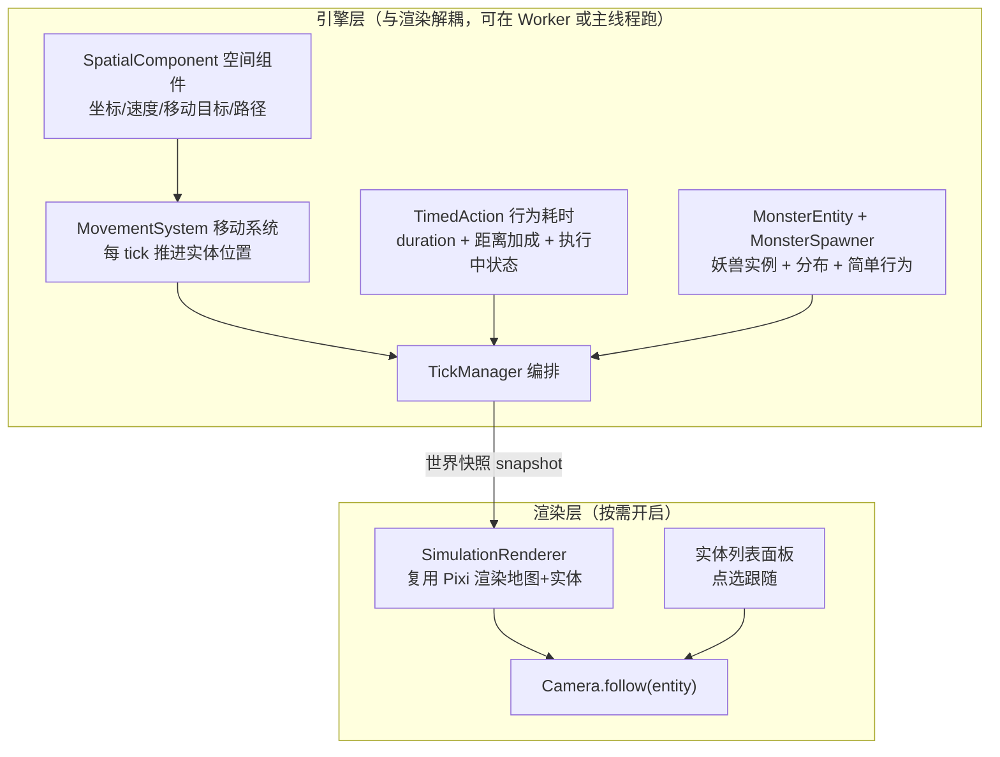

# 空间移动、行为耗时、实时渲染与妖兽分布设计

> 最后更新：2026-05-29
> 状态：设计草案（待实施）
> 关联 ADR：`docs/decisions/adr-006-spatial-movement-and-timed-actions.md`

## 1. 背景与目标

当前世界模拟存在三类缺陷：

1. **行为与距离/时间脱节**：所有 action 在 1 个 tick（=1 游戏日）内瞬间完成；NPC 无坐标、不移动；势力攻伐/贸易只看关系值不看地理邻接。
2. **没有"边模拟边渲染"的入口**：`index.html` 是主角玩法，`simulation.html` 是纯数据面板（无地图画面）。
3. **妖兽只是静态百科**：`monsters.json` 未被加载、未实例化到地图，没有任何分布。

本次升级目标（用户已确认的方案）：

- **NPC/妖兽拥有精确坐标，按速度逐格/逐 tick 移动**（完整移动模型）。
- **行为引入 `duration`（基础耗时）+ 距离加成**，跨多个 tick 执行，期间实体处于"执行中"状态。
- **不再以主角玩法为主入口**；保留 `index.html` 代码不删，新主入口是"带渲染的自动模拟"。
- **`simulation.html` 增加"开启渲染"开关**：默认纯数据跑（快），需要看画面时开启 Canvas 渲染，支持调速 + 跟随视角。
- **跟随视角**：提供实体列表（NPC/妖兽），点列表项即跟随，可切换目标。
- **妖兽是"活的"**：按地形/区域/境界梯度合理分布，并具备简单行为（游荡/觅食/攻击路过的低境界 NPC），可被跟随观察。

## 2. 设计总览



## 3. 子系统设计

### 3.1 实体空间层（SpatialComponent）

给 `BaseEntity` 增加可选的空间组件（组合模式，遵循单一职责）：

```js
// js/engine/abstract/spatial-component.js（新增）
class SpatialComponent {
  x, y;                 // 当前精确坐标（浮点，渲染插值用）
  tileX, tileY;         // 当前所在格子（整数）
  speed;                // 每 tick 可移动的格数（来自境界/属性）
  path;                 // 当前路径（格子坐标数组）
  pathIndex;            // 路径推进下标
  destination;          // 目标格子 {x, y} | null
  moving;               // 是否在移动中
}
```

- `BaseEntity` 增加 `this.spatial = null`，并提供 `initSpatial(config)`、`hasSpatial()`。
- **势力不需要 SpatialComponent**（用 `headquarters` + `territory` 表达），保持现状。
- NPC 与妖兽创建时 `initSpatial`。NPC 初始坐标 = 所属势力 `headquarters`（散修随机分布在非敌对区域）。
- `snapshot()` 增加 `spatial` 字段，供渲染层读取。

**速度来源**：境界越高速度越快。基础速度配置在 `data/balance/movement.json`（新增），按 `rankId` 映射，妖兽按 `grade` + `attributes.speed` 映射。

### 3.2 移动系统（MovementSystem）

```js
// js/engine/world/movement-system.js（新增）
class MovementSystem {
  // 每 tick 对所有有 destination 的实体推进 speed 格
  tickMove(entity, worldContext) { ... }
  // A* 寻路（复用 game-manager 的 BFS/A* 思路，避开不可通行地形 river）
  computePath(fromXY, toXY, tileIndex) { ... }
}
```

- 寻路避开 `passable: false` 的地形（如 river），沼泽 `moveCost` 高。
- 当实体接到一个需要"去某地"的行为时，设置 `destination`，由 MovementSystem 逐 tick 推进。
- 到达后，行为进入"执行阶段"（见 3.3）。

> **复用提示**：`game-manager.js` 第 186–238 行已有玩家 BFS 寻路逻辑，可抽取为通用 `pathfinding` 工具复用，避免重复实现。

### 3.3 行为耗时层（TimedAction）

扩展 `Action` 数据结构与执行流程：

**JSON 新增字段**（`npc-actions.json` / `faction-actions.json` / `world-rules.json`）：

| 字段 | 含义 | 默认 |
|------|------|------|
| `duration` | 基础耗时（游戏日），到达目标地点后执行行为本身需要的天数 | `1` |
| `requiresTravel` | 是否需要先移动到目标地点 | `false` |
| `targetResolver` | 目标地点解析方式（如 `faction_hq`、`secret_realm`、`nearest_monster`、`self`） | `self` |
| `distanceCostPerTile` | 每格移动折算的天数系数（与速度配合，用于耗时估算/GOAP weight） | `0` |

**执行模型**（在 `BehaviorSystem` 引入"行为执行进度"）：

```
某 action 被选中 →
  阶段1 TRAVELING（若 requiresTravel）：设 destination，MovementSystem 每 tick 推进，到达前 action 不结算
  阶段2 EXECUTING：到达后，剩余 duration 天逐 tick 递减
  阶段3 DONE：duration 归零，调用 action.execute() 结算 effects/items，推进 GOAP 计划下一步
```

- 实体在阶段 1/2 期间状态为 `busy`（新增 `state.actionStatus`），不重新规划（与现有"已有计划不重新规划"语义一致，见 `base-entity.js` 第 104 行）。
- `duration` 也参与 GOAP `weight`（耗时越长代价越高），让规划更真实。
- **向后兼容**：未声明 `duration`/`requiresTravel` 的 action 行为不变（duration=1、瞬间结算）。

**修复 `checkAdjacentEnemy`**：本次顺带修复 `tick-manager.js` 第 263–282 行——攻伐前应基于 territory 几何或距离判断"够得着"，而非只看关系值。攻伐改为需要 `requiresTravel`（部队开赴目标领地）。

### 3.4 妖兽分布与实例化（Monster）

```js
// js/engine/monster/monster-entity.js（新增，继承 BaseEntity）
// js/engine/monster/monster-spawner.js（新增，生成分布）
// js/engine/monster/monster-actions.js（新增，简单行为执行器）
```

**分布算法**（`MonsterSpawner`，生成时或初始化时运行）：

1. 按地图区域划"危险带 / 境界梯度"：边缘+近势力总部 → 低阶（1–3 阶）；北方山脉/深处/远离总部 → 高阶（4–9 阶）。
2. 按 `monsters.json` 的 `habitat` 过滤可出现地形；河流改为"邻河格"判定（避开不可通行格）。
3. 灵脉格附近提高稀有妖兽概率（与"夺宝/守脉"叙事一致）。
4. 控制总量与密度（配置在 `data/balance/monster-spawn.json`，新增）。

**妖兽简单行为**（`monster-actions.js`，复用现有 GOAP/Action 框架，最小集）：

- `monster_wander`：在 `habitat` 范围内随机游荡（移动）。
- `monster_hunt`：感知范围内出现境界低于自己的 NPC → 移动并攻击。
- `monster_rest`：原地休整恢复。

妖兽接入 `config-loader.js`（当前未加载 `monsters.json`）、`EntityRegistry`（新增 type `'monster'`）、`TickManager`（新增妖兽 tick 阶段）。

### 3.5 实时渲染入口（SimulationRenderer）

**入口形态**（用户选择"单一入口 + 开启渲染开关"）：

- `simulation.html` 增加 `<canvas>` 容器（默认隐藏）+ "开启渲染"开关 + 已有速度滑条复用。
- 默认：纯 DOM 数据模式（现状，最快）。
- 开启渲染：挂载 `SimulationRenderer`（复用 `js/renderer/` 的 Pixi 渲染：tile-renderer、camera、fog 可选关闭），每 tick 后用 `engine.getWorldSnapshot()` 的实体坐标绘制 NPC/妖兽/势力领地。

**调速**：复用现有 `ticksPerSecond` + `setInterval`；渲染开启时用 `requestAnimationFrame` 做坐标插值，使移动平滑。

**跟随视角**（用户选择"实体列表"）：

- 新增实体列表面板（NPC / 妖兽分组，显示名称/境界/状态）。
- 点列表项 → `camera.follow(entityId)`，相机每帧 `centerOn` 该实体当前坐标；显示该实体状态面板（境界、当前行为、移动目标）。
- 可点"取消跟随"恢复自由拖拽。

**Camera 扩展**（`camera.js` 当前无 follow）：新增 `follow(getPosFn)` / `stopFollow()`，在 ticker 内若处于跟随态则持续 `centerOn`。

**线程注意**：`simulation.html` 当前在主线程跑引擎（便于调试）。渲染开启后仍主线程即可（模拟与渲染同线程，靠调速控制帧预算）；不强制改 Worker，避免扩大改动面。

## 4. 数据与配置新增

| 文件 | 用途 |
|------|------|
| `data/balance/movement.json` | 各境界/妖兽阶位的移动速度 |
| `data/balance/monster-spawn.json` | 妖兽分布密度、境界梯度、区域规则 |
| `npc-actions.json` 等 | 各 action 增加 `duration`/`requiresTravel`/`targetResolver` 字段 |
| `npcs.json` | 可选：NPC 初始坐标（缺省则用势力 HQ） |

所有新增数据文件需同步更新 `docs/data/data-config-rules.md`（项目规则要求）。

## 5. 向后兼容与风险

- **存档兼容**：`snapshot()` 新增 `spatial` 字段为可选，旧存档读入时为 null（视为无坐标，回退到原行为）。
- **性能**：300×300 地图 + 大量 NPC/妖兽逐格移动 + A* 寻路，需控制寻路频率（缓存路径、低频重算）与妖兽总量。
- **GOAP 兼容**：`duration` 进入 weight 不破坏 A* 正确性（仍为正代价）。
- **渲染解耦**：引擎层不得 import 渲染层；渲染层只读 snapshot（单向依赖）。

## 6. 验收标准

1. simulation 页面默认纯数据跑，开关开启后能看到地图与移动的 NPC/妖兽。
2. NPC 执行"去坊市交任务"等行为时，能看到它先移动再行动，耗时跨多天。
3. 点实体列表中某个妖兽，相机跟随它游荡/觅食。
4. 妖兽分布呈现"近势力/边缘弱、深山/远处强"的梯度。
5. 速度滑条可调；纯数据模式与渲染模式结果一致（同 seed 同演化）。
6. 旧 `index.html` 仍可打开不报错（保留但非主入口）。

## 7. 实现与验收结果（2026-05-29）

全部标准通过验证：

- **Agent A 空间层**：`SpatialComponent` + 通用 A\* `pathfinding` + `MovementSystem` 接入 `BaseEntity`/`WorldEngine`/`TickManager`；NPC 出生于势力总部、按境界速度逐 tick 移动（脚本验证：NPC 从远点寻路到达目标）。
- **Agent B 耗时层**：`Action` 增 `duration/requiresTravel/targetResolver/distanceCostPerTile`；`BehaviorSystem` 实现 `TRAVELING → EXECUTING → DONE` 三阶段生命周期（脚本验证：probe 行为 `traveling×6 → executing → plan_complete`，到点才结算）；修复 `checkAdjacentEnemy`/`attackEnemy` 增加地理可达判定（`attackReachDistance`）。
- **Agent C 妖兽**：`MonsterEntity`/`MonsterStaticData`/`MonsterState` + `MonsterSpawner`（确定性 seed，按地形 habitat / 距势力危险梯度 / 北部深山 / 灵脉稀有加权）。脚本验证：400 只、0 只落水、近势力均 1.37 阶 / 远处 3.79 阶 / 北部 2.44 阶，运行期出现 wander/hunt/rest 与猎杀。
- **Agent D 渲染**：`simulation.html` 加"渲染画面"开关与实体跟随面板；`SimulationRenderer`（视口地形+实体绘制+插值）复用 `Camera`（新增 `follow/stopFollow`）。浏览器验证：地形/实体上色正确、NPC 行为状态含 `traveling`、点击妖兽列表项相机持续跟随移动、调速滑条生效、控制台零报错。

> 备注：当前妖兽猎杀偏猛（百日 NPC 存活 ~50%），属 `monster-spawn.json` / 攻击系数的平衡范畴，后续单独调参。
