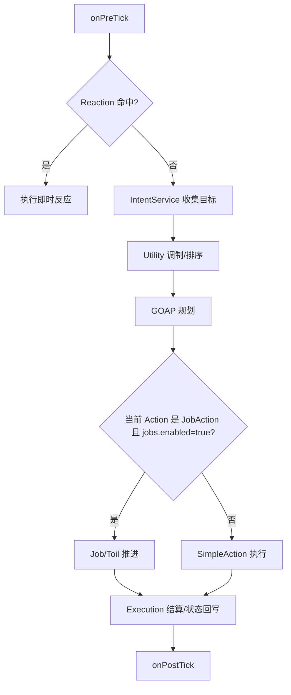

# 系统设计：行为树与四层 AI

> 最后更新：2026-06-05  
> 架构决策：ADR-018、ADR-021、ADR-022、ADR-023、ADR-048、ADR-049、ADR-050

## 概述

当前 AI 的默认关闭路径由四层组成：

```text
Reaction → Utility / Intent → GOAP → Execution
```

ADR-050 的首批 Job/Toil 运行时已接入。`ai-config.npc.jobs.enabled=false` 时，本页四层说明仍是运行事实；`ai-config.npc.jobs.enabled=true` 时，复杂 JobAction 会在 GOAP 与 Execution 之间进入 Job/Toil 执行层，形成 `Reaction → Utility / Intent → GOAP → Job / Toil → Execution`。详细规格见 `job-toil-ai-spec.md`。

| 层 | 职责 | 代表代码 |
|----|------|----------|
| Reaction | 消费被攻击等即时刺激，可抢占当前行为 | `abstract/bt/reactions.js`、`reaction-actions.json` |
| Utility / Intent | 汇总需求、执念、关系、机会点、动态事件，选择目标 | `npc/intent-service.js`、`npc/npc-utility.js` |
| GOAP | 为选中目标规划行为链 | `abstract/goap-planner.js`、`abstract/behavior-system.js` |
| Execution | 推进移动、耗时、结算、打断与重规划 | `BehaviorSystem`、各 ActionExecutor |

开启 Jobs 时新增的执行层：

| 层 | 职责 | 代表代码 |
|----|------|----------|
| Job / Toil | 对复杂 Action 做多步骤编排，例如绑定动态事件、移动、等待阶段、标记准备或参与 | `abstract/job-system.js`、`pools/job-pool.js`、`pools/toil-pool.js`、`npc/toils/*.js` |

GOAP 仍只规划 Action ID，不直接规划 Toil ID；Job/Toil 只在执行当前 JobAction 时推进。

## 目标来源

NPC 的候选目标来自多个系统：

| 来源 | GoalSource | 说明 |
|------|------------|------|
| 常驻需求 | `NEED` | 修炼、疗伤、任务、经济、职责等 |
| 执念 | `OBSESSION` | 复仇、夺宝、养老、传承、夺权等 |
| 关系 | `RELATIONSHIP` | 护短、报恩、师徒、宿敌等 |
| 机会点 | `OPPORTUNITY` | 秘境、尸骸、拍卖、天材地宝等 |
| 动态事件 | `DYNAMIC` | 未来事件准备、事件窗口参与、关系伤亡等 |

`BehaviorSystem.plan()` 会合并常驻需求和 extra goals，按 `score()` 与 `urgencyScore()` 排序，再交给 GOAP。

## NPC 行为流程



## 动态事件与打断

ADR-049 新增动态目标接入：

1. `WorldEventSystem` 推进事件阶段。
2. `WorldContextBuilder.knownDynamicEventsFor(entity)` 暴露 NPC 可见事件。
3. `EventAwareness` 同步已知事件。
4. `DynamicGoalProvider.collect()` 产出 `GoalSource.DYNAMIC`。
5. `InterruptPolicy.decide()` 判断是否 `interrupt_now`、`after_step`、`keep_current_queue` 或 `ignore`。

打断策略只决定时机，不执行行为；行为仍由 GOAP 选出的 Action 完成。当前 Action 是 JobAction 时，Reaction 会暂停 Job，Reaction 行为结束后再恢复或重规划；关闭 Jobs 时仍按四层 SimpleAction 路径执行。

## GOAP 职责边界

GOAP 只回答“怎么达成目标”，不负责：

- 风险/收益偏好。
- 情绪和上头。
- 事件生命周期。
- 是否打断当前行为。
- 世界观语义判断。

这些逻辑分别在 Utility、WorldEventSystem、InterruptPolicy 和具体执行器中处理。

## 妖兽行为树

妖兽按阶位分档：

| 档位 | grade | BT 文件 | 特性 |
|------|-------|---------|------|
| tier1 | 1-2 | `monster-tier1.json` | 本能觅食、休整、追杀、逃跑 |
| tier2 | 3-4 | `monster-tier2.json` | 领地、巡逻、呼群协作 |
| tier3 | 5+ | `monster-tier3.json` | 初级智慧、仇恨、情绪、领地 |

运行时也可使用 `monster-bt-presets.js` 中的代码侧预设。

## 数据配置

| 文件 | 说明 |
|------|------|
| `data/behavior-trees/npc-default.json` | NPC 默认行为树 |
| `data/behavior-trees/faction-default.json` | 势力默认行为树 |
| `data/behavior-trees/monster-tier*.json` | 妖兽分级行为树 |
| `data/balance/utility.json` | Utility considerations |
| `data/balance/reward.json` | 期望收益 |
| `data/balance/reaction.json` | Reaction 阈值 |
| `data/goals/dynamic-goals.json` | 动态目标 |

## 验证

常用脚本：

- `node tools/test-bt.mjs`
- `node tools/test-goal-equivalence.mjs`
- `node tools/test-utility.mjs`
- `node tools/test-utility-divergence.mjs`
- `node tools/test-dynamic-goals.mjs`
- `node tools/test-interrupt-policy.mjs`

行为和平衡结论以真实模拟观察为准，重点看目标分布、行为链、死亡原因、资源流动和关系事件是否合理。
