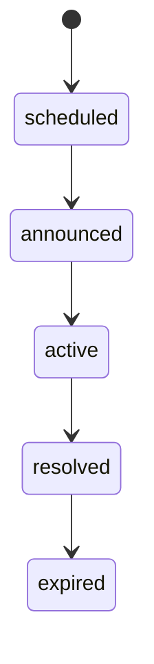

# 系统设计：事件系统

> 最后更新：2026-06-05

## 概述

当前事件体系由三类机制组成：

1. **世界规则**：`actions/world-rules.json` + `world-rules.js`，每 tick 执行资源恢复、修正器生成/衰减、天灾等规则。
2. **信息与机会点**：`world/news.json`、`world/opportunities.json`，把事件转成消息、传播和可争夺机会。
3. **动态世界事件**：`world/dynamic-events.json` + `goals/dynamic-goals.json`，表达有时间窗口的事件，并临时产出 NPC 动态目标。

早期的独立规则 JSON / 预设事件 JSON 方案已不再是游戏运行时入口。

## 世界规则

| 数据 | 代码 | 职责 |
|------|------|------|
| `apps/game/data/actions/world-rules.json` | `apps/game/js/engine/world/world-rules.js` | 注册世界级 ActionExecutor |
| `apps/game/data/world/modifiers.json` | `WorldEntity` / `ModifierSpawnExecutor` | 世界修正器模板 |
| `apps/game/data/balance/economy.json` | `ResourceRegenExecutor` | 资源恢复、消耗、薪俸、大阵维护 |

当前世界规则执行器：

- `world_modifier_spawn`
- `world_modifier_decay`
- `world_natural_disaster`
- `world_resource_regen`

## 信息与机会点

相关文档：`systems/opportunity-system.md`、`systems/item-covet.md`。

## 动态世界事件

动态事件用于表达“未来会发生或正在发生、NPC 可提前准备/窗口参与”的事件。

### 数据

- `apps/game/data/world/dynamic-events.json`：事件日程、可见范围、坐标、价值、风险。
- `apps/game/data/goals/dynamic-goals.json`：事件类型/阶段 → 动态 Goal。
- `apps/game/data/actions/npc-actions.json`：动态事件准备/参与行为。

### 代码

| 组件 | 文件 | 职责 |
|------|------|------|
| `WorldEventSystem` | `engine/world/world-event.js` | 事件生命周期、可见窗口、参与/准备标记 |
| `EventAwareness` | `engine/npc/event-awareness.js` | NPC 已知事件 |
| `DynamicGoalProvider` | `engine/npc/dynamic-goals.js` | 已知事件转成临时 Goal |
| `InterruptPolicy` | `engine/npc/interrupt-policy.js` | 是否打断当前行为 |
| 动态事件行为 | `engine/npc/actions/dynamic-event-actions.js` | 准备事件、参与事件 |

## 与四层 AI 的关系

- Reaction：处理被攻击、濒死等即时刺激。
- Dynamic Goal：处理秘境、大比、高手陨落、关系伤亡等事件窗口。
- GOAP：只规划如何达成目标，不判断事件生命周期。
- Execution：执行行为，并按 `InterruptPolicy` 处理打断。

架构决策见 `docs/decisions/adr-049-dynamic-goal-interrupt-policy.md`。
