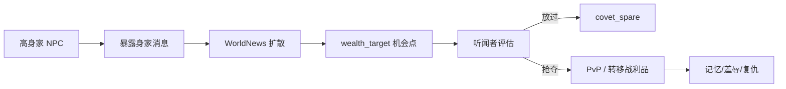

# 系统设计：实物系统与怀璧其罪

> 最后更新：2026-06-05  
> 架构决策：ADR-025、ADR-043、ADR-044、ADR-045、ADR-046

## 概述

物品系统让 NPC 和势力真实持有可转移物品；怀璧其罪让高身家角色被目击后成为江湖热点，其他 NPC 会按实力、身份、恩义、关系和性格决定抢夺或放过。

## 物品数据

当前可持有物品位于 `apps/game/data/items/`，按 category 拆分：

| 文件 | 内容 |
|------|------|
| `currency.json` | 灵石货币 |
| `material.json` | 灵草、矿材、妖丹、妖材、精血、灵果 |
| `pill.json` | 修炼、突破、疗伤、恢复丹药 |
| `artifact.json` | 法宝、古宝、灵宝等 |
| `talisman.json` | 遁地符和其他符箓 |
| `technique.json` | 功法秘籍 |

加载器会合并为 `itemDefs.items`，下游统一由 `ItemRegistry` 使用。

## 常用字段

| 字段 | 说明 |
|------|------|
| `category` / `subCategory` | 大类与子类 |
| `grade` / `gradeName` | 品阶 |
| `value` | 身家估值、机会收益和抢夺吸引力 |
| `transferable` | 是否可转移或被抢夺 |
| `combatBonus` | 装备法宝后的战力加成 |
| `effects` | 服用或使用时挂载的通用 GE spec |
| `grantsAbilities` | 授予 GA 能力，如遁地符 |

## 怀璧其罪闭环

## 配置

`apps/game/data/balance/covet.json`：

- `expose`：暴露阈值、目击距离、暴露概率。
- `covet`：起贪念所需身家、实力安全系数、勇敢阈值。
- `spare`：同门、职位、恩义、道侣、正义、外交等放过权重。
- `rob`：转移灵石比例、胜利后杀人概率、失败负伤。

## 代码接入

- `ItemDefinition` / `ItemRegistry`：物品定义与查询。
- `Inventory`：实体持有与转移。
- `rollAndGrantReward`：收益发放。
- `computeAssetScore`：灵石、物品、装备、功法估值。
- `InfoCoordinator`：暴露、传播、觊觎、抢夺或放过。

## 验证

- `node tools/test-info-propagation.mjs`
- `node tools/test-quest-reward-economy.mjs`
- `node tools/test-monster-resource-loop.mjs`
- 长程模拟观察：暴露次数、抢夺次数、放过次数、战利品转移、复仇链是否产生。
