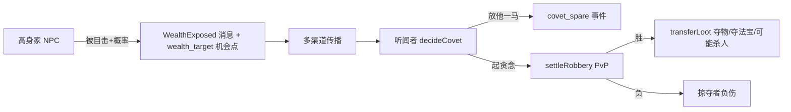

# 系统设计：实物系统与怀璧其罪

> 最后更新：2026-05-30
>
> 架构决策见 ADR-025。

## 概述

让 NPC 真实持有可转移物品（法宝/材料/丹药），并实现"财不露白、宝物招祸"的怀璧其罪场景：高身家修士被目击 → 消息扩散 → 听闻者按实力/身份/恩义/性格决定抢夺或放过。

## 实物系统

### data/items/items.json

每项含：`id` / `name` / `category`（material/pill/artifact）/ `grade` / `value`（身家估值）/ `transferable` / `combatBonus`（可选，装备战力加成）。

### 关键接入

- `ItemDefinition`（`js/engine/items/item-definition.js`）把领域字段并入 `properties`。
- NPC state 新增 `equippedArtifactId`，进 assetScore 并通过 `_artifactCombatFactor` 加成战力。
- 掉落改用 `rollAndGrantReward`：outcome 带 `itemId` 则发实物入背包。
- `computeAssetScore`：灵石 + Σ物品 value + 法宝 value + 功法品阶×800。

## 怀璧其罪闭环（data/balance/covet.json）

### 配置段

- `expose`：exposeThreshold / witnessDistance / exposeChancePerDay。
- `covet`：minAssetScore / powerSafetyFactor / courageThreshold / minGreedScore。
- `spare`：spareThreshold 及各权重（同门/受保护职位/恩义/道侣/正义/外交），protectedRoles。
- `rob`：lootStoneRatio / killChanceOnWin / loserInjuryOnLoss。

### 放他一马的判定逻辑

按权重累加 `spareScore`，≥ `spareThreshold` 即放过：

| 因素 | 来源 |
|------|------|
| 同门 | seeker 与 target 同 factionId |
| 受保护职位 | target 为 leader/heir/elder |
| 恩义 | seeker.relationships.getGratitude(target) |
| 道侣 | seeker.daoCompanionId === target.id |
| 正义/外交 | seeker.personality.justice / diplomacy |

体现身份与人情对掠夺的约束（参考凡人修仙传 同门情面、报恩）。

## 战利品转移

`transferLoot`：转移所有 `transferable` 物品 + `lootStoneRatio` 比例灵石 + 夺取已装备法宝（robber 已有装备则入背包）。被抢者记 `humiliated` 记忆，可触发后续复仇执念（打通 ADR-019/020 恩怨闭环）。

## 零漂移

- `covet.json enabled=false` 时不计算 assetScore、不暴露、不抢夺。
- `equippedArtifactId` 默认 null → 战力系数 1。
- 验证：`test-info-propagation` 单元 3/4 覆盖估值与决策；禁用态零信息事件。
