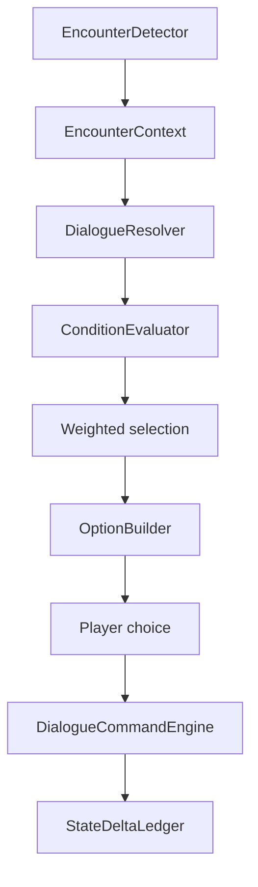

# 系统设计：玩家相遇与 NPC 对话

> 最后更新：2026-06-09
> 架构决策：ADR-058

## 定位

玩家相遇与 NPC 对话系统负责在玩家附近检测 NPC、构建相遇上下文、选择对白、展示选项并提交副作用。对话文本、触发条件、选项、成本、权重和副作用命令必须配置化。

## 流程

## 相遇上下文

相遇上下文至少包含：

- 玩家位置、已知情报、近期选择、背包。
- NPC 身份、境界、保真等级、当前 Job、近期 episode。
- 地点类型、归属势力、危险度、事件窗口。
- 双方关系、阵营关系、境界差和战力差。
- 剧情包状态、对话冷却、上次相遇记录。

## 对话副作用边界

UI 只展示对白和选项，不直接改世界状态。选项点击后只提交命令：

| 命令 | 写入 |
|---|---|
| `relationship.applyEvent` | 关系账本 |
| `inventory.transfer` | 物品/交易底座 |
| `quest.*` | 任务系统 |
| `drama.patchPackage` | 剧情包运行状态 |
| `npc.pauseJob/resumeJob/abortJob` | NPC Job 快照 |
| `combat.startEncounter` | 战斗管线 |
| `memory.record` | 记忆与情绪系统 |
| `log.emit` | 日志、传闻、月志 |

## 与月压缩的关系

Cold 月压缩生成的 `recentEpisodes` 会进入相遇上下文。玩家之后遇到该 NPC 时，对话可以引用其远处经历，例如突破、受伤、完成任务、亲友死亡、获得宝物或与某势力冲突。

如果剧情需要玩家选择，月压缩不能自动代替玩家选择，只能把剧情包停在等待玩家接触的状态。

