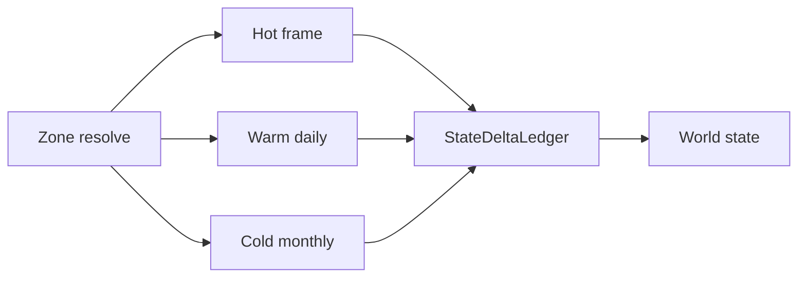

# 系统设计：分层模拟与月压缩

> 最后更新：2026-06-09
> 架构决策：ADR-058

## 定位

分层模拟系统负责决定实体使用哪种时间粒度运行：

- Hot 实时域：玩家附近逐帧运行。
- Warm 日域：玩家附近外圈和重要对象按日 Tick。
- Cold 月压缩域：远处对象按月批处理。

本系统不替代 `TickManager`、`BehaviorSystem`、关系底座、交易底座、修为服务或剧情对话系统，而是调度这些系统在不同时间域下执行。

月压缩中每类状态如何结算见 `docs/architecture/world-simulation/07-月压缩关键状态结算细节.md`；当前项目的新增模块和接口见 `docs/architecture/world-simulation/08-项目落地接口与改造路线.md`。

## 组件

| 组件 | 职责 |
|---|---|
| `TimeDomainScheduler` | 统一调度 frame、day、month 三种 pipeline。 |
| `SimulationZoneResolver` | 根据玩家位置、神识、标记、事件和重要度把实体分配到 Hot/Warm/Cold。 |
| `NpcFidelityPolicy` | 计算 NPC 保真等级，重要 NPC 保留更多 episode 和日志。 |
| `MonthlyCompressionEngine` | 执行远处月压缩阶段流水线。 |
| `StateDeltaLedger` | 收集、校验并提交跨系统状态变化。 |
| `HydrationPolicy` | Cold/Warm 实体进入玩家附近时，把摘要状态恢复为可实时执行状态。 |

## 阶段流水线

## 与现有 Tick 的关系

当前 `TickManager.tick()` 是 Warm 日域的事实入口。正式实现时：

- Warm 日域继续沿用日 Tick 顺序。
- Hot 实时域只处理玩家附近的帧级体验，并在日结算点与 Tick 状态对齐。
- Cold 月压缩域不得直接调用 `multiTick(30)` 作为正式实现，而应执行月压缩 pipeline。

## NPC 状态要求

远处月压缩至少要产出：

- 最终坐标和 `visitedPlaces`。
- 当前或已完成 Job 快照。
- 修为、真气、境界、伤势变化。
- 背包、装备、交易账本变化。
- 关系、记忆、情绪、执念变化。
- 任务、动态事件、剧情包状态变化。
- 个人月志、玩家可见传闻和重要事件日志。

## 存档与恢复边界

完整世界存档必须保存：

- 当前时间域分配结果。
- 子日时钟和当前游戏日/月。
- Job/Toil 内部上下文。
- Cold 月压缩摘要、episode、RNG 流和已提交 delta。
- 剧情包状态和等待玩家接触的节点。

UI 层自建快照不能作为完整引擎恢复的长期方案。

## 验证

验证以真实长程模拟观察为准：

- 多种子、多月份后，NPC 的关系、背包、修为、位置、任务、死亡和日志均有合理变化。
- 玩家靠近远处 NPC 后，恢复到实时域时状态连续。
- 重要 NPC 有可解释的 episode，不获得免死、锁血或无限资源等特权。
